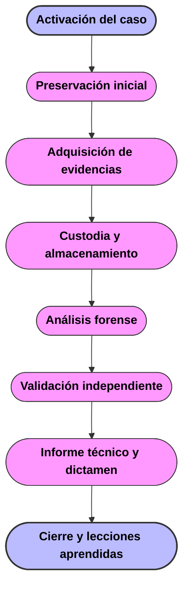
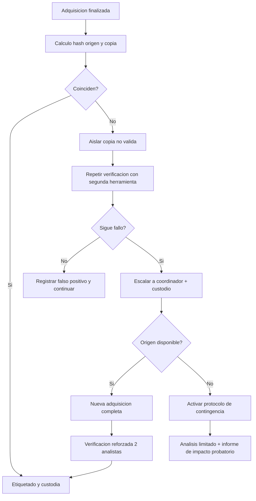

# Metodología Propia para Recogida, Almacenamiento y Análisis de Evidencias Digitales.

## 1. Introducción

En este documento se desarrolla una metodología propia para una consultora de ciberseguridad que se encarga de investigar incidentes en entornos corporativos. La propuesta aquí recogida, está diseñada para ser operativa en el día a día y, al mismo tiempo, suficientemente sólida para soportar revisiones de auditoría, procedimientos disciplinarios y, cuando proceda, procesos judiciales.

## 2. Fuentes y alcance normativo

La base documental utilizada combina tanto recursos docentes, normas UNE, guías técnicas y el marco jurídico español.

### 2.1.Fuentes principales

A continuación, se enumeran las fuentes principales:

- RFC 3227: directrices para recopilación y almacenamiento de evidencia digital.
- UNE 71505-1: vocabulario y principios del SGEE.
- UNE 71505-2: buenas prácticas para gestión segura de evidencias.
- UNE 71505-3: formatos y mecanismos técnicos (firma, sello temporal, contenedores).
- UNE 71506: metodología forense (preservación, adquisición, documentación, análisis y presentación).
- Guía práctica de INCIBE para toma de evidencias en Windows.
- UNE 197001 para requisitos formales de informes/dictámenes periciales.
- Marco BOE de apoyo: ENS y EN

### 2.2. Alcance de aplicación de la metodología

En base al objetivo demandado, se ha optado por una metodología propia, denominada **MIREA-DF** (Metodología Integrada de Recogida, Evidencias y Análisis Digital Forense). En esta metodología se combina los marcos complementarios y la justificación de qué se adopta, qué se adapta y qué se descarta en función de tres condiciones:

1. La presión del tiempo en las primeras horas del incidente.
2. El riesgo legal ante la pérdida de integridad o trazabilidad.
3. La necesidad de traducir los hallazgos técnicos a decisiones de negocio.

Con esto, **MIREA-DF** será aplicable a endpoints y servidores on-premise, infraestructura virtualizada, entornos cloud (IaaS, PaaS, SaaS), y en la investigación de fraude interno e incidentes de fuga de información.

No pretende sustituir los planes de continuidad o contención del incidente, si no integrarse con ellos para garantizar que la respuesta técnica no destruya evidencia ni comprometa la investigación posterior.

### 2.3. Marco legal

En una consultora española, la calidad técnica del análisis no es suficiente si no va acompañada de licitud en el tratamiento de datos personales. En términos prácticos, una evidencia impecable desde el punto de vista forense puede perder valor o generar responsabilidad para la organización si se obtuvo con un alcance excesivo, sin base jurídica adecuada o sin salvaguardas acordes.

Es por esto que **MIREA-DF** incorpora un control legal obligatorio antes de ampliar el alcance en cualquier investigación donde exista un tratamiento de datos personales tanto de empleados, clientes o terceros.

#### 2.3.1. Principios RGPD que limitan el análisis forense

Hay que tener siempre presente que el analista no trabaja en un vacío forense, sino que debe operar bajo principios que condicionan qué se puede recoger, durante cuánto tiempo y con qué nivel de detalle: 
1. Licitud, lealtad y transparencia: toda actuación debe apoyarse en una base jurídica válida y en políticas internas conocidas por el personal.
2. Limitación de la finalidad: los datos recolectados para investigar un incidente no se reutilizan para fines distintos que no sean compatibles.
3. Minimización de datos: se captura solo lo necesario para responder al objeto del caso; no “todo el disco” por inercia si es suficiente con artefactos concretos.
4. Exactitud: cualquier atribución personal debe basarse en evidencia contrastada y no en inferencias débiles.
5. Limitación del plazo de conservación: la evidencia personal no se conserva indefinidamente; MIREA-DF exige el seguimiento de un calendario de retención y cierre.
6. Integridad y confidencialidad: cumpliendo con un cifrado, control de acceso por rol y trazabilidad de consulta.
7. Responsabilidad proactiva: la organización debe poder demostrar que aplicó controles adecuados, no solo declararlos.

#### 2.3.2. Base de legitimación y test de proporcionalidad

En investigaciones corporativas, **MIREA-DF** exige que el equipo jurídico deje registrada la base principal de tratamiento antes del análisis profundo:

1. Cumplimiento de obligación legal (por ejemplo, obligaciones de seguridad y cooperación regulatoria).
2. Interés legítimo del responsable para prevenir fraude, proteger activos y garantizar continuidad operativa, siempre con ponderación previa.
3. Ejecución de la relación laboral/contractual cuando la actuación esté vinculada a obligaciones profesionales y seguridad corporativa

Además, en los supuestos N2/N3 se documenta un test de proporcionalidad, con el que se busca cumplir con los siguientes puntos:

1. Idoneidad: la medida propuesta permite realmente investigar el hecho.
2. Necesidad: no existe alternativa menos invasiva con eficacia equivalente.
3. Proporcionalidad estricta: el beneficio de la medida supera el impacto en privacidad.

Si esto, **MIREA-DF** no permitirá ampliar el alcance a fuentes especialmente sensibles.

#### 2.3.3. Regla operativa para investigaciones de Insider Threat

Ante un escenario de fuga de información, siendo este el más delicado en lo que aprotección de datos se refiere, hay que tener presente que se mezcla tanto seguridad coporativa, como datos laborales y una posible información privada.

**MIREA-DF** establece una regla de tres niveles ante esta situación:

1. Nivel de metadatos:
- Primero se analizan metadatos y trazas de actividad (accesos, volúmenes, horarios, dispositivos, dominios de destino).
- No se abre contenido personal si la hipótesis puede validarse con datos de contexto.
2. Nivel de contenido profesional acotado:
- Si los indicios son consistentes, se accede solo a carpetas y repositorios corporativos relacionados con el incidente.
- Se excluye de forma expresa todo espacio etiquetado como “Personal/Privado” en tanto no exista habilitación reforzada.
3. Nivel de contenido sensible/personal:
- Solo procede con autorización jurídica reforzada y justificación escrita de necesidad.
- Se recomienda presencia de doble control interno (por ejemplo, Jurídico + RRHH/Compliance) para reducir riesgo de extralimitación.
- Si existe requerimiento judicial o autoridad competente, se actúa conforme a dicho mandato.

**Regla explícita MIREA-DF**: En investigaciones de Insider Threat, el analista no accede a carpetas identificadas como "Personal" ni a contenido privado de comunicaciones salvo que la base legal, la proporcionalidad y la autorización reforzada queden documentadas en expediente.

#### 2.3.4. Derechos digitales en el ámbito laboral y deber de información

La LOPDGDD reconoce derechos específicos en el entorno laboral digital. En la práctica esto se traduce en una obligación a que la consultora y su cliente tengan políticas previas claras sobre el uso de medios corporativos y monitorización de seguridad.

Los controles que MIREA-DF exige en este punto son:

1. Verificar que existe política interna de uso aceptable y seguridad comunicada al personal.
2. Comprobar si el canal o dispositivo analizado es corporativo, mixto o personal (BYOD).
3. Respetar el secreto de comunicaciones y limitar acceso a contenido cuando sea posible trabajar con metadatos.
4. Coordinar con DPO/DPD en incidentes que impliquen alto impacto en derechos.

En el supuesto de que no exista política previa o el marco legal sea ambiguo, **MIREA-DF** obligará a elevar el caso a la dirección jurídica antes de iniciar cualquier análisis profundo.

#### 2.3.5. Salvaguardas técnicas y organizativas obligatorias en MIREA-D

Para aterrizar la RGPD/LOPDGDD en acciones concretas, se aplican las siguites medidas:
1. Control de acceso por rol: solo analistas asignados pueden abrir evidencias personales.
2. Segmentación de evidencia: separar datos técnicos necesarios de datos personales no relevantes.
3. Pseudonimización en informes intermedios: usar identificadores internos en lugar de nombres completos cuando no sea imprescindible.
4. Registro de consulta: cada apertura de evidencia personal debe generar log de quién, cuándo y por qué.
5. Redacción/masking de anexos: ocultar datos irrelevantes antes de compartir resultados fuera del equipo forense.
6. Retención limitada: al cierre del caso, conservar solo lo legalmente necesario y eliminar excedentes con acta.
   
Estas medidas ayudarán a reducir el riesgo de que la investigación, aun siento técnicamente correcta, vulnere principios de minimización o confidencialidad 

#### 2.3.6. Gestión de cloud y trasnferencias internacionales

En investigaciones sobre SaaS/IaaS es frecuente que logs y evidencias residan fuera del EEE. **MIREA-DF** añade un control específico ante estas situaciones:

1. Identificar la región de almacenamiento de evidencias.
2. Verificar mecanismo de transferencia internacional aplicable (cláusulas contractuales tipo, decisiones de adecuación u otro marco válido).
3. Evitar exportaciones masivas de datos personales si basta con extractos técnicos.
4. Documentar en cadena de custodia cuándo una evidencia sale o se replica fuera de la jurisdicción principal

#### 2.3.7. Checklist legal previo análisis profundo

| Pregunta de control legal                               | Sí                                    | No      | Acción                                       |
| ------------------------------------------------------- | ------------------------------------- | ------- | -------------------------------------------- |
| ¿Existe base jurídica identificada para el tratamiento? | Continuar                             | Parar   | Escalar a Jurídico                           |
| ¿La finalidad del análisis está definida por escrito?   | Continuar                             | Parar   | Definir alcance antes de adquirir más datos  |
| ¿Se puede resolver con metadatos en vez de contenido?   | Priorizar metadatos                   | Revisar | Justificar por qué se requiere contenido     |
| ¿Hay riesgo de acceso a datos personales no necesarios? | Aplicar minimización y masking        | Revisar | Ajustar filtros y permisos                   |
| ¿El caso implica transferencias internacionales?        | Documentar mecanismo de transferencia | Revisar | No exportar hasta validación legal           |
| ¿Se ha definido plazo de conservación y cierre?         | Continuar                             | Parar   | Establecer retención antes de emitir informe |

Este bloque convierte el marco jurídico (RGPD/LOPDGDD) en decisiones conretas auditables dentro del flujo técnico. En términos de consultoría se traduciría en la protección de la validez del dictámen y de la posición legal del cliente y el proveedor.

## 3. Análisis comparativo avanzado de normativas

A la hora de escalar de un análisis descriptivo a un análisis de valor de consutoría, se comparan los marcos por criterio operativo.

### 3.1. Matriz comparativa

| Criterio                              | RFC 3227 [1] | UNE 71505-1 [2] | UNE 71505-2 [3] | UNE 71505-3 [4] | UNE 71506 [5] | INCIBE [6] | UNE 197001 [7] |
| ------------------------------------- | ------------ | --------------- | --------------- | --------------- | ------------- | ---------- | -------------- |
| Utilidad en primera respuesta         | Muy alta     | Baja            | Media           | Baja            | Alta          | Muy alta   | Baja           |
| Definición de roles y gobernanza      | Baja         | Media           | Muy alta        | Media           | Media         | Baja       | Baja           |
| Detalle técnico de adquisición        | Media        | Baja            | Media           | Alta            | Alta          | Muy alta   | Baja           |
| Cadena de custodia/documentación      | Alta         | Media           | Muy alta        | Alta            | Muy alta      | Alta       | Alta           |
| Requisitos criptográficos/formato     | Baja         | Baja            | Media           | Muy alta        | Media         | Baja       | Baja           |
| Estructura formal de informe pericial | Baja         | Baja            | Media           | Baja            | Alta          | Media      | Muy alta       |
| Adaptación a entorno empresa española | Media        | Alta            | Muy alta        | Alta            | Alta          | Alta       | Alta           |

La lectura que se saca de esta matriz esla siguiente: 
- Si el objetivo es actuar rápido al inicio del incidente, RFC 3227 e INCIBE son mejores puntos de partida.
- Si el objetivo es institucionalizar un sistema de evidencias repetible en empresa, UNE 71505-2 es la base más fuerte.
- Si el objetivo es blindar interoperabilidad e integridad técnica, UNE 71505-3 aporta el mayor valor.
- Si el objetivo final es un informe defendible en sede pericial, UNE 197001 y UNE 71506 son complementarias.

### 3.2. Qué se adopta, qué se adapta y qué se descarta

**Adopción directa**
1. Orden de volatilidad y mínima alteración de RFC 3227.
2. Ciclo de vida y atributos de confiabilidad del SGEE (autenticación, integridad, disponibilidad, completitud).
3. Separación de fases forenses de UNE 71506.
4. Requisitos de firma/sello temporal y estructura de contenedor de UNE 71505-3.

**Adaptación justificada**
1. Modelo de carga administrativa por niveles de incidente:
- Nivel 1 (bajo impacto): documentación compacta y checklist simplificado.
- Nivel 2 (impacto medio): documentación completa estándar.
- Nivel 3 (alto impacto/legal): documentación reforzada, doble revisión y control jurídico.

Esta adaptación reduce burocracia en incidentes frecuentes sin perder rigor en casos críticos.

2. Roles UNE 71505-2 simplificados para equipos pequeños:
- En consultoría mediana, algunos roles pueden recaer en la misma persona, pero se fuerza segregación entre adquisición y validación final para evitar conflicto metodológico.

3. Uso combinado de contenedores:
- No se impone un único formato para todo tipo de evidencia. Se elige según fuente y objetivo probatorio.

**Elementos descartados**
1. Requisitos de formalismo documental máximo en todos los casos. Se reservan para N2/N3, porque aplicarlos siempre penaliza tiempos de respuesta.
2. Dependencia de herramientas propietarias cuando exista alternativa abierta validada y reproducible.

### 3.3. Principios rectores finales de MIREA-DF

Los principios por los que se rige **MIREA-DF** buscan un equilibrio entre el rigor técnico-legal y la agilidad operativa.

1. Legalidad y proporcionalidad: solo se captura lo necesario para el objeto del caso.
2. Preservación primero: ante conflicto entre adquirir y analizar, se prioriza adquirir.
3. Integridad verificable: todo traspaso de evidencia se verifica con hash y trazabilidad.
4. Reproducibilidad: otro analista debe poder repetir pasos y validar resultados.
5. Segregación funcional: no hay cierre de caso sin revisión independiente.
6. Trazabilidad temporal: toda marca de tiempo se normaliza para correlación.

## 4. Metodología

### 4.1. Fases macro

### 4.2. Niveles de incidente y profundidad de evidencias

| Nivel | Criterio de activación                                  | Objetivo principal                 | Exigencia documental                                 |
| ----- | ------------------------------------------------------- | ---------------------------------- | ---------------------------------------------------- |
| N1    | Incidente acotado sin impacto legal previsto            | Contención y diagnóstico rápido    | Checklist y acta breve                               |
| N2    | Afectación a servicio crítico o posible sanción interna | Reconstrucción técnica completa    | Registro estándar + cadena de custodia completa      |
| N3    | Impacto legal, regulatorio o reputacional alto          | Evidencia defendible judicialmente | Trazabilidad reforzada, revisión jurídica y pericial |

Esta clasificación lo que hace es permitir la justificación, en términos de negocio, de por qué no todos los incidentes requieren la misma carga de trabajo sin comprometer la validez de los casos relevantes.

### 4.3. Roles mínimos y RACI operativo

| Actividad                 | Coordinador caso | Primer respondedor | Analista forense | Custodio evidencia | Jurídico/Compliance | Revisor independiente |
| ------------------------- | ---------------- | ------------------ | ---------------- | ------------------ | ------------------- | --------------------- |
| Definir alcance inicial   | R                | C                  | C                | I                  | C                   | I                     |
| Preservación en campo     | C                | R                  | I                | I                  | I                   | I                     |
| Adquisición forense       | I                | R                  | C                | C                  | I                   | I                     |
| Custodia y transferencias | I                | C                  | C                | R                  | I                   | I                     |
| Análisis técnico          | I                | C                  | R                | I                  | I                   | C                     |
| Revisión y cierre         | C                | I                  | C                | I                  | C                   | R                     |

*R= Responsable, C= Consultado, I= Informado*

## 5. Procedimiento de recolección con profundidad técnica

### 5.1 Preparación previa al incidente

MIREA-DF establece que la organización debe estar preparada antes de cualquier incidente. Improvisar aumenta el riesgo de contaminación de evidencias y errores en la cadena de custodia. Se recomienda:

- Kit forense validado y versionado.
- Medios de arranque limpio y de solo lectura.
- Plantillas de actas y cadena de custodia listas.
- Procedimiento de autorización técnica-jurídica.
- Sincronización horaria mediante NTP y registro de referencia de tiempo.

Esto asegura decisiones rápidas y defensibles durante la fase crítica.

### 5.2 Intervención inicial en sistema encendido

Cuando el activo está encendido, se prioriza evidencia volátil porque puede desaparecer en segundos o al apagar el equipo.

### Qué se busca en memoria RAM y por qué

La captura de RAM no se hace “porque sí”. Se hace porque en memoria pueden existir artefactos que no llegan a disco o que un atacante elimina antes de que el equipo se apague:

- Procesos ocultos o inyectados (malware fileless).
- Claves de cifrado activas (útiles para descifrar volúmenes montados).
- Conexiones de red en curso y sockets efímeros.
- Comandos recientes, scripts cargados y módulos en ejecución.
- Credenciales en memoria o tokens de sesión.

Si esta fase falla, la investigación posterior puede reconstruir parte del incidente, pero puede perder la prueba más valiosa sobre el vector real de ejecución.

**Secuencia mínima recomendada:**

1. Documentar pantalla, usuario, hora y conectividad.
2. Tomar snapshot de procesos y conexiones antes de acciones intrusivas.
3. Capturar memoria RAM con herramienta validada.
4. Recolectar artefactos temporales críticos (ARP, rutas, sesiones).
5. Solo después pasar a adquisición de evidencia persistente.

### 5.3 Intervención en sistema apagado

- No arrancar desde el sistema comprometido.
- Usar entorno controlado de adquisición (boot limpio).
- Priorizar imagen forense completa para preservar metadatos y evidencia crítica.

### 5.4 Recolección en entornos cloud

**Objetivos:**

- Capturar eventos de identidad (autenticación, MFA, cambios de rol).
- Preservar logs de plano de control y de datos.
- Congelar estados relevantes de recursos (snapshots, configuraciones, políticas IAM).
- Registrar dependencias multi-región y cuentas asociadas.

**Riesgos específicos:**

- Retención corta de logs nativos.
- Autoscaling y automatizaciones que sobrescriben estados.
- Evidencia distribuida en múltiples servicios y proveedores.

> La primera acción en cloud es **preservar logs y estados**, no analizarlos, para asegurar trazabilidad.

### 5.5 Recolección en casos de Insider Threat

En fuga de información interna, la evidencia crítica no siempre es malware; muchas veces son secuencias de acciones legítimas mal utilizadas.

Se prioriza:

1. Registros de acceso a repositorios documentales.
2. Historial de descargas masivas o exportaciones.
3. Uso de dispositivos USB y sincronización con nubes personales.
4. Correo saliente y comparticiones anómalas.
5. Cambios de permisos previos a la salida del empleado.

La clave en estos casos es contextualizar técnicamente sin invadir privacidad más allá de lo proporcional y autorizado por Jurídico/RRHH.

## 6. Procedimiento de almacenamiento, cadena de custodia y mecanismos criptográficos

### 6.1 Decisión técnica de formatos de contenedor

La UNE 71505-3 enfatiza interoperabilidad y mecanismos de integridad [4]. En práctica, MIREA-DF usa un modelo mixto:

| Tipo de evidencia               | Formato preferente                                                    | Justificación                                                                                                              |
| ------------------------------- | --------------------------------------------------------------------- | -------------------------------------------------------------------------------------------------------------------------- |
| Imagen de disco forense         | `E01`/`Ex01`                                                          | Permite metadatos, compresión, segmentación y hash integrado; útil para custodia operativa.                                |
| Volcado de memoria              | `AFF4` o `RAW` + manifiesto firmado                                   | `AFF4` facilita empaquetado/metadata; `RAW` puede usarse por compatibilidad, pero siempre acompañado de manifiesto y hash. |
| Archivos/logs exportados        | Contenedor firmado (ZIP/TAR + manifiesto JSON + firma + sello tiempo) | Aporta trazabilidad de lote y verificación posterior sin depender de una sola herramienta.                                 |
| Copia bit a bit de contingencia | `dd` plano                                                            | Se mantiene como fallback por simplicidad y universalidad cuando no hay soporte de formato enriquecido.                    |

**Por qué no usar solo `dd`**: `dd` es excelente para copia cruda, pero no incorpora de forma nativa metadatos forenses, gestión de fragmentación ni evidencias de cadena de custodia. Por eso se usa como formato de contingencia, no como estándar único.

### 6.2 Política de hash, firma y sellado temporal

1. Hash mínimo: SHA-256; en N3 se añade SHA-512.
2. Firma de manifiestos por responsable de adquisición.
3. Sellado temporal para evidencias clave o transferencias críticas.
4. Verificación de hash en tres momentos: post-adquisición, recepción en custodia y pre-análisis.

### 6.3 Flujo detallado ante fallo de hash

### 6.4 Protocolo de contingencia si el original se daña

Si el soporte original sufre daño durante adquisición:

1. Detener inmediatamente la intervención y preservar estado del soporte.
2. Registrar incidente técnico con hora, operador y acción que lo precede.
3. Notificar coordinador, custodia y jurídico.
4. Evaluar recuperación en laboratorio especializado con procedimiento documentado.
5. Declarar explícitamente limitaciones de fiabilidad en informe final.

Este punto no solo es técnico; es de transparencia pericial. Ocultar un fallo metodológico destruye credibilidad completa del caso.

### 6.5 Cadena de custodia reforzada

Cada transferencia debe incluir:

- Identificador único de evidencia.
- Persona que entrega y persona que recibe.
- Motivo de transferencia.
- Hash verificado en recepción.
- Firma y hora normalizada.

Además, el repositorio lógico mantiene registro de acceso por rol.

## 7. Metodología de análisis forense avanzada

### 7.1 Modelo analítico por hipótesis

MIREA-DF evita el enfoque de “buscar todo” sin dirección. Se trabaja por hipótesis:

1. Hipótesis inicial basada en indicios de detección.
2. Evidencias esperadas que deberían existir si la hipótesis es cierta.
3. Evidencias de refutación (qué hallazgo la invalidaría).
4. Iteración hasta cerrar con nivel de confianza.

Esto reduce sesgo de confirmación y mejora trazabilidad del razonamiento.

### 7.2 Fases operativas de análisis en MIREA-DF

1. **Triage forense**: validar integridad de entradas, clasificar evidencias y priorizar por valor probatorio.
2. **Análisis de artefactos**: sistema, red, identidad, aplicaciones, persistencia y actividad de usuario.
3. **Correlación multi-fuente**: timeline unificado y mapeo de causalidad.
4. **Validación cruzada**: segundo analista reproduce hitos críticos.
5. **Síntesis**: hechos, inferencias, limitaciones y nivel de confianza.

### 7.3 Análisis de Registro de Windows (subproceso técnico)

En incidentes Windows, el Registro aporta contexto de ejecución, persistencia y actividad de usuario incluso cuando faltan logs de eventos.

| Clave/artefacto              | Qué evidencia aporta                                                       | Uso en MIREA-DF                                                |
| ---------------------------- | -------------------------------------------------------------------------- | -------------------------------------------------------------- |
| `Run` / `RunOnce`            | Programas configurados para ejecución automática al iniciar sesión/sistema | Confirmar persistencia o arranque de malware tras reinicio     |
| `UserAssist`                 | Programas ejecutados por el usuario y frecuencia aproximada de uso         | Relacionar actividad interactiva del usuario con el incidente  |
| `ShellBags`                  | Historial de carpetas exploradas, incluidas rutas de red/USB               | Soportar hipótesis de acceso a rutas de exfiltración           |
| `RecentDocs` / MRU           | Documentos recientes y patrones de acceso                                  | Identificar posible preparación de fuga de información         |
| `USBSTOR` y claves asociadas | Conexión histórica de dispositivos USB                                     | Correlacionar extracción local con ventanas de tiempo críticas |

**Aplicación práctica**:

1. Extraer hives relevantes (`SYSTEM`, `SOFTWARE`, `NTUSER.DAT`, `USRCLASS.DAT`).
2. Parsear con herramientas reproducibles y exportar resultados en CSV/JSON.
3. Normalizar timestamps y cruzar con otros artefactos (prefetch, logs, correo, proxy).
4. Marcar hallazgos de alta confianza cuando convergen dos o más fuentes independientes.

### 7.4 Análisis de artefactos de ejecución (Prefetch, Amcache, Shimcache)

Cuando un atacante borra eventos o rota logs, los artefactos de ejecución permiten sostener la reconstrucción temporal.

| Artefacto                  | Qué demuestra                                                                         | Limitaciones                                | Valor en MIREA-DF                                             |
| -------------------------- | ------------------------------------------------------------------------------------- | ------------------------------------------- | ------------------------------------------------------------- |
| Prefetch                   | Evidencia de ejecución de binarios y frecuencia aproximada                            | Puede estar deshabilitado o limpiado        | Muy útil en N1/N2 para triage rápido                          |
| Amcache                    | Rastros de archivos ejecutables vistos por el sistema (ruta, hash parcial, metadatos) | No equivale siempre a ejecución interactiva | Útil para confirmar presencia y contexto de malware           |
| Shimcache (AppCompatCache) | Historial de ejecutables observados por subsistema de compatibilidad                  | Semántica dependiente de versión de Windows | Clave en N3 para soporte pericial combinado con otras fuentes |

**Procedimiento técnico**:

1. Extraer artefactos en copia forense, nunca en original.
2. Parsear con dos herramientas cuando el caso sea N3 (control de calidad).
3. Correlacionar con MFT/USN Journal y Registro para elevar confianza.
4. Construir secuencia: descarga/creación del binario, primera observación, ejecución, persistencia.

Este subproceso permite justificar ejecución de malware incluso sin Event Logs completos.

### 7.5 Análisis de navegadores y correo en casos Insider Threat

En investigaciones de fuga interna, el objetivo no es solo detectar malware, sino reconstruir la intención y el flujo de datos.

**Navegadores**

Se extrae, según disponibilidad y marco legal aprobado:

1. Historial de URLs y búsquedas.
2. Descargas y rutas de destino.
3. Cookies/sesiones activas (servicios de almacenamiento o correo web).
4. Autocompletado y formularios recientes.

**Correo**

Se analiza:

1. Metadatos de envío/recepción (remitente, destinatario, hora, asunto).
2. Adjuntos y huellas hash.
3. Reglas de reenvío o auto-forward.
4. Actividad inusual en buzón (descargas masivas, accesos fuera de patrón).

**Integración en dictamen**

Los resultados no se presentan como hechos aislados. Se enlazan en un hilo temporal: apertura de documentación sensible, compresión/copia, acceso web/correo y salida de información.

### 7.6 Construcción de timeline y gestión de skew horario

La correlación temporal es uno de los problemas más críticos en forense. Un mismo evento puede aparecer en UTC, hora local o con relojes desajustados.

### Procedimiento de normalización temporal

1. Definir referencia única de caso: UTC.
2. Identificar la Zona Horaria original de cada fuente.
3. Medir desviación de reloj (skew) cuando sea posible:
    - Comparar timestamps de eventos comunes entre sistemas.
    - Revisar logs de sincronización NTP.
1. Crear tabla de offsets por fuente.
2. Convertir todos los eventos a UTC y conservar timestamp original como campo adicional.
3. Marcar eventos con incertidumbre temporal cuando no exista offset fiable.

### Ejemplo práctico

- Firewall: UTC.
- Servidor de aplicaciones: UTC+1.
- Endpoint usuario: UTC+1 con retraso real de 4 minutos.

Sin corregir skew, parecería que el endpoint actúa “después” del bloqueo del firewall. Al corregir, se comprueba que la ejecución local ocurre antes y desencadena la conexión saliente observada.

### 7.7 Gestión de técnicas anti-forense

Una metodología madura debe asumir adversarios que intentan borrar huellas.

### Indicadores anti-forense a revisar

1. Borrado selectivo o truncado de logs.
2. Limpieza con utilidades tipo CCleaner/BleachBit.
3. Timestomping (manipulación de MAC times en archivos).
4. Uso anómalo de compresión cifrada o esteganografía.
5. Eliminación segura (wiping) en momentos cercanos al incidente.
6. Desactivación o alteración de agentes EDR/SIEM.

### Respuesta metodológica

1. Triangulación entre fuentes: si falta un log local, contrastar con firewall, proxy, EDR, correo, cloud.
2. Búsqueda de “huecos” temporales y discontinuidades.
3. Recuperación de artefactos residuales y metadatos secundarios.
4. Clasificación del impacto anti-forense en la confianza de conclusiones.

La conclusión no debe ocultar la incertidumbre: si hay evidencia de anti-forense, se reporta explícitamente y se cuantifica su efecto.

## 8. Casos de uso aplicados (originalidad metodológica)

### 8.1 Caso A: compromiso de cuenta cloud con exfiltración

**Situación**: alerta por descarga masiva en almacenamiento cloud fuera de horario laboral.

**Aplicación de MIREA-DF**:

1. Activación N2 y preservación de logs de identidad y auditoría cloud.
2. Exportación inmediata de eventos IAM, MFA y API calls.
3. Snapshot de políticas y estados de buckets/objetos implicados.
4. Correlación entre autenticación, cambio de privilegios y descarga.
5. Validación de origen geográfico y agente de acceso.

**Valor añadido**: evita la pérdida de evidencias por retención corta de logs nativos y permite reconstruir cadena de acciones del atacante.

**Resultados esperados del caso**:

| Artefactos clave encontrados                                                                                 | Conclusión del dictamen                                                                 |
| ------------------------------------------------------------------------------------------------------------ | --------------------------------------------------------------------------------------- |
| Logs IAM con login exitoso desde IP no habitual, cambio de rol y `GetObject` masivo en ventana de 18 minutos | Compromiso de credenciales con escalado de privilegios y exfiltración efectiva de datos |
| Ausencia de MFA o bypass puntual documentado                                                                 | Debilidad de control de identidad como causa contribuyente                              |

### 8.2 Caso B: fuga de información por empleado (Insider Threat)

**Situación**: sospecha de extracción de documentación antes de baja voluntaria.

**Aplicación de MIREA-DF**:

1. Activación N3 por posible impacto legal/laboral.
2. Coordinación temprana con Jurídico y RRHH para delimitar proporcionalidad.
3. Recolección de accesos a repositorios, correo saliente y uso de USB.
4. Revisión de picos de descarga y compartición no habitual.
5. Línea temporal de eventos con evidencias de intención (secuencia de acciones).

**Valor añadido**: transforma indicios de conducta en trazabilidad técnica verificable sin exceder el marco legal de privacidad.

**Resultados esperados del caso**:

| Artefactos clave encontrados                                                                                                   | Conclusión del dictamen                                                            |
| ------------------------------------------------------------------------------------------------------------------------------ | ---------------------------------------------------------------------------------- |
| `UserAssist` y `RecentDocs` con acceso repetido a carpetas sensibles, conexión `USBSTOR` y envío de adjuntos a dominio externo | Existió acción coordinada de extracción y transferencia de información corporativa |
| Historial de navegador con acceso a almacenamiento personal en nube en la misma ventana temporal                               | Indicios técnicos de fuga por canal web complementario al correo                   |

### 8.3 Caso C: ransomware en entorno híbrido

**Situación**: cifrado simultáneo en servidores on-prem y sincronización cloud.

**Aplicación de MIREA-DF**:

1. Preservación de memoria en nodos afectados para recuperar artefactos de ejecución y potenciales claves.
2. Imagen forense de sistemas críticos priorizados por impacto de negocio.
3. Captura de telemetría de red para identificar propagación lateral.
4. Correlación de IOC entre endpoint, AD y cloud.
5. Informe de causa raíz y ventana temporal de compromiso.

**Valor añadido**: acelera decisiones de contención/recuperación y mantiene trazabilidad para acciones legales o aseguradoras.

**Resultados esperados del caso**:

| Artefactos clave encontrados                                                                                 | Conclusión del dictamen                                                    |
| ------------------------------------------------------------------------------------------------------------ | -------------------------------------------------------------------------- |
| Prefetch/Amcache de binario dropper, eventos de creación masiva de archivos cifrados y conexiones C2 previas | Ejecución confirmada de cadena ransomware con fase previa de acceso remoto |
| Telemetría de red con movimiento lateral y cuentas de servicio comprometidas                                 | Alcance extendido a varios nodos por abuso de credenciales internas        |

## 9. Presentación de resultados y alineamiento con UNE 197001

La UNE 197001 no dice la técnica forense, pero sí la forma del dictamen. Por eso esta metodología separa dos documentos:

1. **Informe técnico operativo** (seguridad/TI).
2. **Dictamen pericial estructurado** (cuando aplique).

### 9.1 Estructura del dictamen alineada con UNE 197001

1. **Identificación**:
- Datos del perito/equipo.
- Identificador de expediente.
- Solicitante y objeto del dictamen.

2. **Declaración de tachas**:
- Manifestación de independencia, conflictos de interés y limitaciones.

3. **Juramento o promesa**:
- Declaración formal de veracidad técnica según procedimiento interno y marco legal.

4. **Índice general**:
- Estructura del documento y anexos.

5. **Cuerpo del informe**:
- Alcance.
- Material examinado.
- Metodología aplicada.
- Actuaciones realizadas.
- Hallazgos objetivos.
- Discusión técnica.
- Conclusiones.

6. **Anexos**:
- Cadena de custodia.
- Inventario de evidencias.
- Hashes.
- Logs relevantes.
- Capturas y scripts.
- Tabla de normalización temporal.

### 9.2 Reglas de redacción probatoria

1. Diferenciar siempre hecho observado de inferencia técnica.
2. Incluir limitaciones de análisis (por ejemplo, logs no disponibles).
3. Expresar grado de confianza de cada conclusión.
4. Referenciar evidencia concreta que sustenta cada afirmación.

## 10. Herramientas y criterios de validación

La metodología no depende de una única marca o herramientas concretas. Define un kit base de referencia para garantizar repetibilidad entre casos.

### 10.1 Kit forense recomendado por fase

| Fase                  | Herramienta                             | Tipo                                | Uso principal en MIREA-DF                                                  | Nivel recomendado  | Justificación técnica                                                          |
| --------------------- | --------------------------------------- | ----------------------------------- | -------------------------------------------------------------------------- | ------------------ | ------------------------------------------------------------------------------ |
| Adquisición           | FTK Imager                              | Comercial (free edition disponible) | Imagen de discos/volúmenes y exportación de artefactos                     | N1-N3              | Muy extendida, estable y aceptada para cadena de custodia operativa            |
| Adquisición           | Magnet RAM Capture                      | Comercial/freeware                  | Captura de memoria volátil en sistemas Windows                             | N1-N3              | Baja fricción en campo y rápida ejecución en primera respuesta                 |
| Adquisición           | `dd`                                    | Open Source / sistema               | Copia bit a bit de contingencia                                            | N2-N3              | Universal y verificable; útil cuando no hay interfaz forense disponible        |
| Adquisición           | Guymager                                | Open Source                         | Imagen forense en Linux con hashing integrado                              | N2-N3              | Rápido y reproducible, buena opción para laboratorios con presupuesto ajustado |
| Análisis              | Autopsy                                 | Open Source                         | Análisis de sistema de archivos, timeline y artefactos                     | N1-N3              | Buen equilibrio entre profundidad y trazabilidad de resultados                 |
| Análisis              | Eric Zimmerman Tools (EZ Tools)         | Open Source                         | Parsing masivo de artefactos Windows (registro, prefetch, shellbags, etc.) | N1-N2 (y apoyo N3) | Muy alta velocidad en triage, ideal para reducir tiempo de diagnóstico inicial |
| Análisis              | Volatility                              | Open Source                         | Análisis de memoria RAM y detección de procesos ocultos/inyecciones        | N2-N3              | Referencia en análisis profundo cuando hay sospecha de malware avanzado        |
| Análisis              | KAPE                                    | Open Source                         | Recolección/triage rápido de artefactos priorizados                        | N1-N2              | Estandariza capturas rápidas y acelera respuesta en incidentes frecuentes      |
| Gestión de integridad | HashCalc / utilidades hash equivalentes | Freeware                            | Verificación de hash (SHA-256/SHA-512)                                     | N1-N3              | Control inmediato de integridad en adquisición y transferencia                 |
| Gestión de evidencia  | GnuPG                                   | Open Source                         | Firma de manifiestos y verificación criptográfica                          | N2-N3              | Permite no repudio técnico y trazabilidad documental sólida                    |

### 10.2 Criterios de uso por nivel de incidente

1. N1: priorizar velocidad y estandarización (KAPE + EZ Tools + hash rápido).
2. N2: mantener triage rápido y añadir profundidad de correlación (Autopsy + Volatility cuando sea necesario).
3. N3: doble validación de artefactos críticos, firma de manifiestos y revisión independiente obligatoria.

### 10.3 Criterios de aceptación y validación anual

1. Uso reconocido en comunidad forense.
2. Repetibilidad de resultados.
3. Trazabilidad de versión y parámetros.
4. Capacidad de exportación a distintos formatos.
5. Evidencia de validación interna anual mediante casos de prueba.

## 11. Control de calidad y mejora continua

### 11.1 Indicadores de desempeño (KPIs)

1. Porcentaje de evidencias con cadena de custodia completa.
2. Tiempo medio detección-preservación.
3. Porcentaje de transferencias con verificación hash sin incidencias.
4. Número de no conformidades metodológicas por trimestre.
5. Tiempo medio de emisión de informe por nivel de incidente.

### 11.2 Ciclo de revisión

1. Revisión post-incidente (lecciones aprendidas).
2. Revisión semestral de plantillas y checklist.
3. Reentrenamiento anual de analistas y primeros respondedores.
4. Simulacros N3 para validar preparación jurídica y técnica.

## 12. Plan de implementación en la consultora (90 días)

### Fase 1: Gobernanza (semana 1-2)

- Aprobar política MIREA-DF.
- Definir niveles N1/N2/N3 y responsables.
- Establecer canal único de activación de casos.

### Fase 2: Operativa documental (semana 3-4)

- Crear plantillas normalizadas.
- Definir nomenclatura de evidencias.
- Configurar cadena de custodia digital.

### Fase 3: Base técnica (semana 5-8)

- Validar kit de herramientas por tipo de sistema.
- Definir formatos de contenedor por caso.
- Configurar repositorio seguro con control de acceso.

### Fase 4: Capacitación y validación (semana 9-10)

- Formación de roles.
- Simulación de incidente cloud y de insider threat.

### Fase 5: Auditoría y ajuste (semana 11-12)

- Auditoría interna de cumplimiento.
- Corrección de brechas de proceso.
- Aprobación final para operación continua.

## 13. Conclusiones

La metodología propuesta no se limita a un enfoque teórico, sino que plantea una forma de implementación práctica en una consultoría. Su valor principal es integrar de forma coherente tres niveles que suelen estar desconectados en la práctica:

1. Respuesta técnica inicial: rápida, orientada a volatilidad y preservación.
2. Gobernanza de evidencia: roles, controles, trazabilidad y custodia.
3. Defendibilidad pericial: estructura formal, transparencia metodológica y límites declarados.

MIREA-DF aporta además elementos de madurez que elevan su calidad frente a modelos básicos:

- Adaptación por niveles de incidente.
- Protocolo formal ante fallo de hash y daño de sporte.
- Procedimientos específicos para cloud e insider threat.
- Tratamiento explícito de técnicas anti-forense y correlación temporal con skew.

Por ello, MIREA-DF presenta una propuesta sólida y completa para la gestión de incidentes de ciberseguridad en entornos profesionales.

## 14. Bibliografía

1. IETF. RFC 3227: *Guidelines for Evidence Collection and Archiving*.

2. UNE 71505-1:2013. *Tecnologías de la Información (TI). Sistema de Gestión de Evidencias Electrónicas (SGEE). Parte 1: Vocabulario y principios generales*.

3. UNE 71505-2:2013. *Tecnologías de la Información (TI). Sistema de Gestión de Evidencias Electrónicas (SGEE). Parte 2: Buenas prácticas en la gestión de las evidencias electrónicas*.

4. UNE 71505-3:2013. *Tecnologías de la Información (TI). Sistema de Gestión de Evidencias Electrónicas (SGEE). Parte 3: Formatos y mecanismos técnicos*.

5. UNE 71506. *Tecnologías de la Información (TI). Metodología para el análisis forense de las evidencias electrónicas*.

6. INCIBE. *Toma de evidencias en entornos Windows* y contenidos asociados de INCIBE-CERT sobre recopilación de evidencias.

7. UNE 197001:2011. *Criterios generales para la elaboración de informes y dictámenes periciales*.

8. Real Decreto 311/2022, de 3 de mayo, por el que se regula el Esquema Nacional de Seguridad. BOE-A-2022-7191.

9. Real Decreto 4/2010, de 8 de enero, por el que se regula el Esquema Nacional de Interoperabilidad. BOE-A-2010-1331.

10. Reglamento (UE) 2016/679 (RGPD).

11. Ley Orgánica 3/2018, de Protección de Datos Personales y garantía de los derechos digitales (LOPDGDD).

12. Real Decreto 43/2021, de 26 de enero, sobre seguridad de redes y sistemas de información.

13. Documentación docente de investigación de incidentes y cadena de custodia (material de clase incluido en los recursos del proyecto).

14. Real Decreto Legislativo 2/2015, de 23 de octubre, por el que se aprueba el texto refundido de la Ley del Estatuto de los Trabajadores.

## 15. Anexo A: plantilla mínima de cadena de custodia

| ID evidencia | Fecha/hora recogida (UTC) | Origen     | Tipo      | Hash SHA-256 | Entrega  | Recepción | Motivo           | Observaciones    |
| ------------ | ------------------------- | ---------- | --------- | ------------ | -------- | --------- | ---------------- | ---------------- |
| EVD-2026-001 | 2026-03-03 09:12:55       | SRV-APP-01 | RAM       | abc...       | A. Pérez | L. Martín | Análisis malware | Sin incidencias  |
| EVD-2026-002 | 2026-03-03 09:24:17       | SRV-APP-01 | Disco E01 | def...       | A. Pérez | L. Martín | Imagen forense   | Sellado correcto |

## 16. Anexo B: checklist operativo abreviado por fase

### Preservación

- ¿Existe autorización de intervención?
- ¿Se registró hora de referencia y estado inicial?
- ¿Se evitó ejecución de herramientas no controladas?

### Adquisición

- ¿Se aplicó orden de volatilidad?
- ¿Se registró herramienta, versión y parámetros?
- ¿Se calculó hash y se verificó coincididencia?

### Custodia

- ¿Evidencia etiquetada con ID único?
- ¿Transferencia firmada por entrega y recepción?
- ¿Acceso restringido por rol y necesidad de conocer?

### Análisis

- ¿Hechos e inferencias separados?
- ¿Cada conclusiñon tiene evidencia asociada?
- ¿Se incluyen limitaciones y nivel de confianza?

## 17. Anexo C: glosario técnico (alineado con UNE 71505-1)

**Activo**: cualquier bien con valor para la organización, incluyendo sistemas, datos y evidencias.

**Adquisición forense**: proceso de captura de evidencias manteniendo la inalterabilidad de la fuente y documentando método, herramienta y operador.

**Cadena de custodia**: trazabilidad controlada de la evidencia desde su recogida hasta su presentación final, registrando transferencias, responsables y condiciones.

**Completitud**: cualidad de una evidencia que representa de forma suficiente el hecho investigado dentro del alcance definido.

**Hash**: huella criptográfica de longitud fija calculada sobre un dato; se usa para detectar alteraciones y verificar integridad.

**Imagen forense**: copia exacta, normalmente bit a bit, de un soporte digital, obtenida para analizar sobre copia y preservar el original.

**Integridad**: garantía de que la evidencia no ha sido modificada de forma no autorizada durante su ciclo de vida.

**Preservación**: conjunto de acciones iniciales para evitar pérdida, alteración o contaminación de evidencia antes y durante la adquisición.

**SGEE (Sistema de Gestión de Evidencias Electrónicas)**: marco organizativo de políticas, procesos, controles y roles para generar, custodiar y explotar evidencias de forma segura.

**Trazabilidad**: capacidad de reconstruir quién hizo qué, cuándo, cómo y sobre qué evidencia en todo el ciclo del caso.

