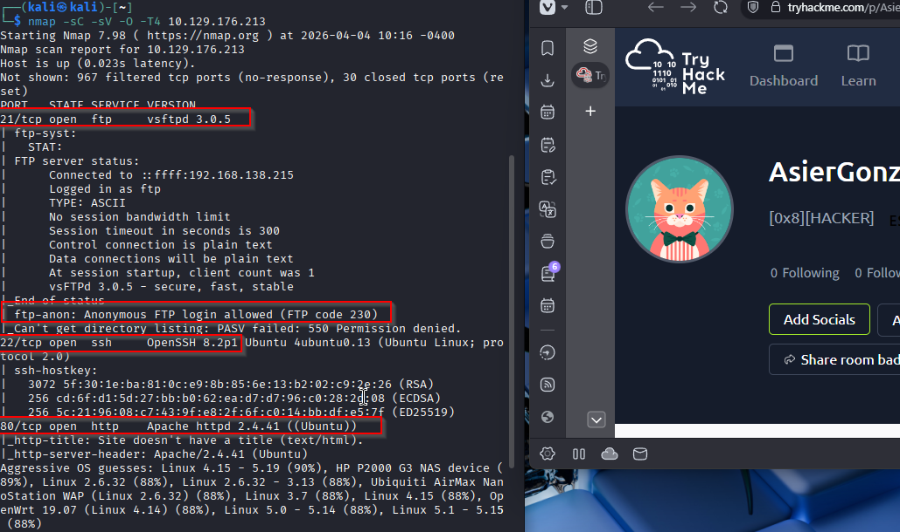
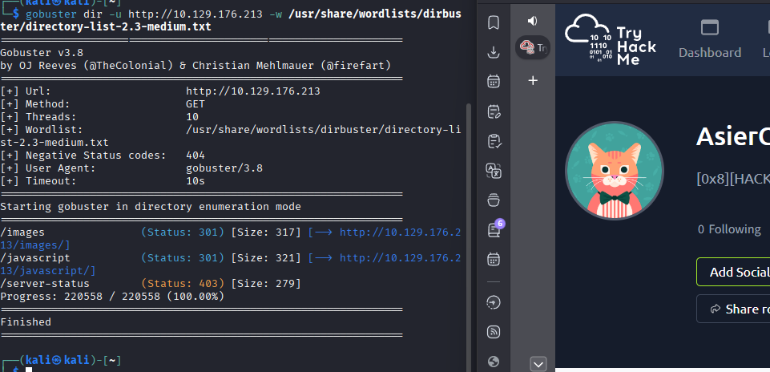
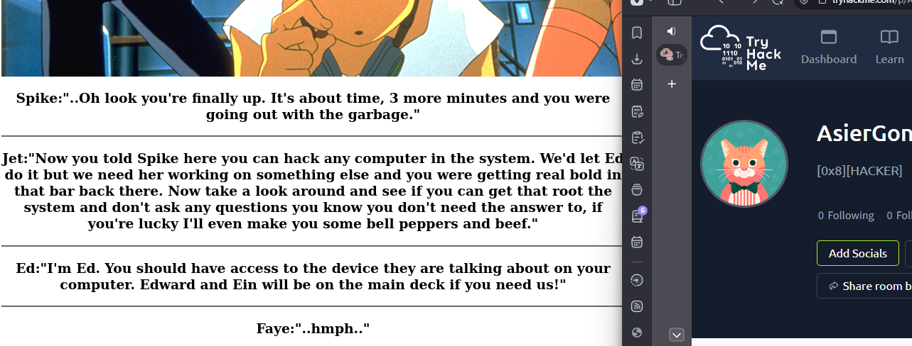
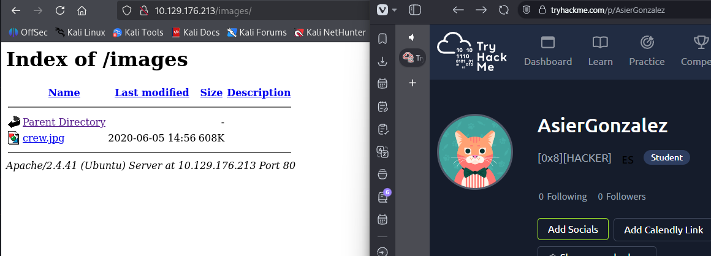
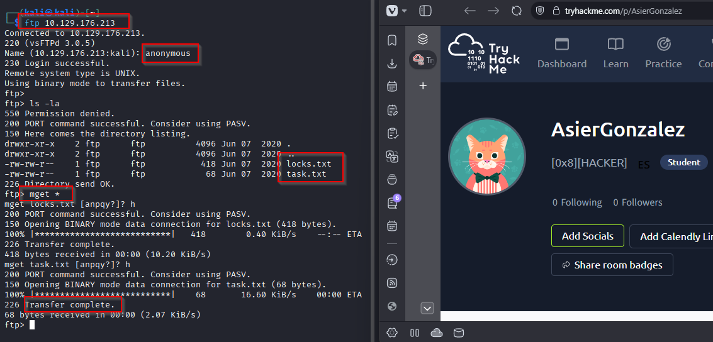
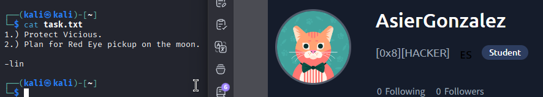
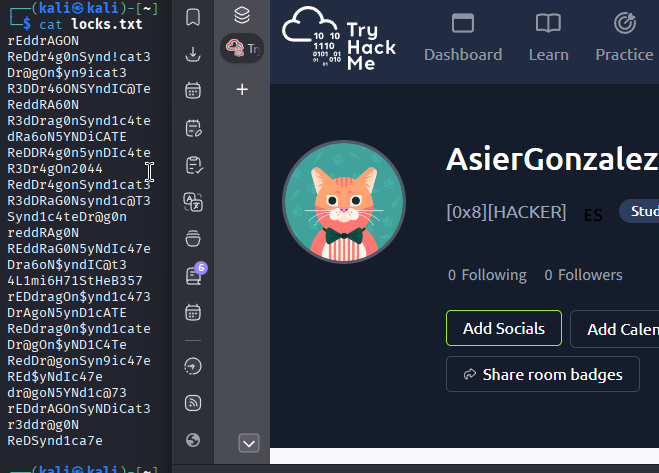
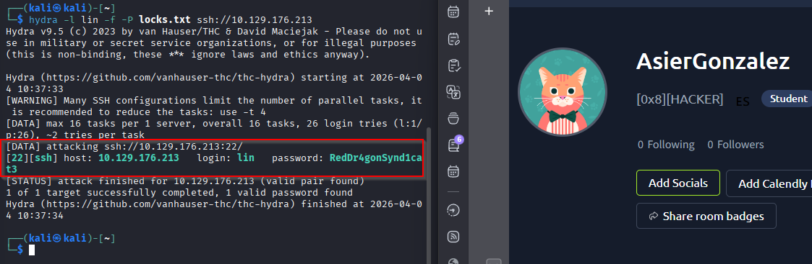
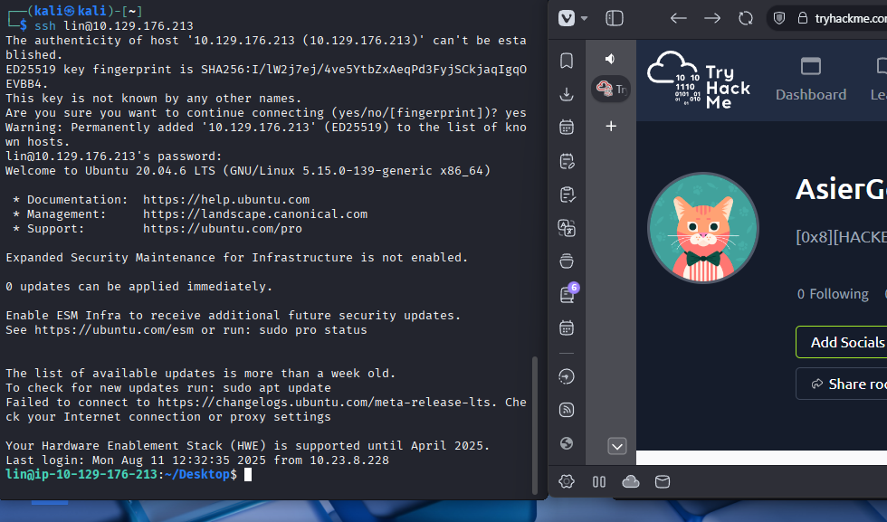
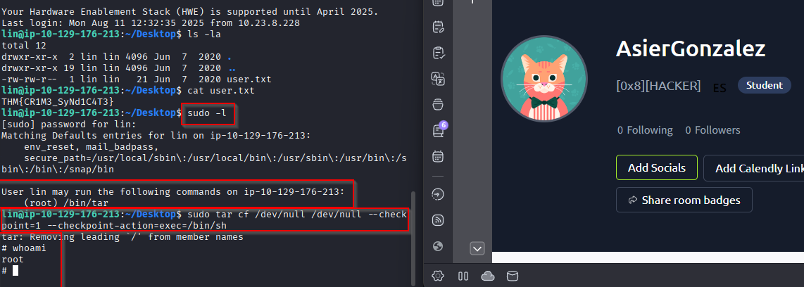

# Write-up Bounty Hacker

## Enumeracion

### Escaneo inicial

Empiezo con un escaneo para identificar puertos, servicios y sistema operativo:

`nmap -sC -sV -O -T4 IP`

Puertos encontrados:

- 21/tcp FTP - acceso `anonymous` permitido
- 22/tcp SSH
- 80/tcp HTTP - `Apache 2.4.41`

### Enumeracion web

Lanzo `gobuster` para ver si hay directorios interesantes:

`gobuster dir -u http://IP -w /usr/share/wordlists/dirbuster/directory-list-2.3-medium.txt`

Encuentro:

- `/images/`
- `/javascript/`

### Revision de la web

#### Pagina principal

En la home veo una imagen con un texto. Mi primera idea es que el propio texto pueda ocultar alguna pista, pero en ese momento no saco nada claro.

#### Directorio `/images/`

Tambien veo que se puede listar el directorio `/images/` de Apache.

Lo dejo como posible vector por si no encontrase nada mejor, pero de momento no parece lo mas prometedor.

### Acceso por FTP

Como el servicio permite acceso anonimo, me conecto por FTP y enumero los archivos disponibles.

Encuentro dos ficheros:

- `locks.txt`
- `task.txt`

Me los descargo con:

`mget *`

Al leerlos saco estas conclusiones:

- `locks.txt` parece una lista pensada para fuerza bruta.
- `task.txt` esta firmado por un tal `lin`, asi que probablemente sea un usuario valido.

## Explotacion

### Fuerza bruta por SSH contra `lin`

Con el posible usuario y el listado de passwords del FTP, pruebo fuerza bruta por SSH:

`hydra -l lin -f -P locks.txt ssh://IP`

Encuentro esta credencial:

- Usuario: `lin`
- Password: `RedDr4gonSynd1cat3`

### Acceso por SSH

Ya con las credenciales validas, me conecto:

`ssh lin@IP`

## Post-explotacion

### Enumeracion como `lin`

Una vez dentro, confirmo que he entrado como `lin` y reviso los archivos del directorio:

`ls -la`

Encuentro la flag de usuario en `user.txt`.

Despues reviso que puede ejecutar con `sudo`:

`sudo -l`

Veo que este usuario puede ejecutar `/bin/tar` como `root`.

## Escalado de privilegios

### Abuso de `tar` con `sudo`

Voy a `GTFOBins`, busco `tar` y encuentro una tecnica para lanzar una shell como `root` aprovechando ese permiso.

El comando es:

`tar cf /dev/null /dev/null --checkpoint=1 --checkpoint-action=exec=/bin/sh`

Lo ejecuto y, efectivamente, consigo una shell como `root`.

## Resultado

Consigo acceso total a la maquina aprovechando el acceso anonimo al FTP para obtener una lista de passwords y un posible usuario, despues hago fuerza bruta por SSH contra `lin` y, una vez dentro, escalo a `root` abusando de `sudo` sobre `tar`.

## Resumen de comandos hasta root

- `nmap -sC -sV -O -T4 IP`
- `gobuster dir -u http://IP -w /usr/share/wordlists/dirbuster/directory-list-2.3-medium.txt`
- `ftp IP`
- `mget *`
- `hydra -l lin -f -P locks.txt ssh://IP`
- `ssh lin@IP`
- `ls -la`
- `sudo -l`
- `tar cf /dev/null /dev/null --checkpoint=1 --checkpoint-action=exec=/bin/sh`
