# Write-up Anthem

**Autor**: Asier González

## Reconocimiento

Empiezo con un escaneo básico para identificar puertos y servicios:

```bash
nmap -sC -sV -p- -Pn IP
```

Los puertos que encuentro son:

- `80/tcp` (HTTP)
- `3389/tcp` (RDP)

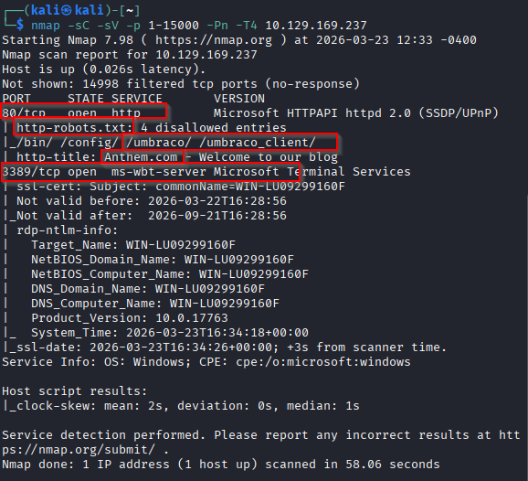

Después enumero directorios web con `gobuster`:

```bash
gobuster dir -u http://IP -w /usr/share/wordlists/dirb/common.txt
```

Las rutas más interesantes son:

- `robots.txt`
- `sitemap`

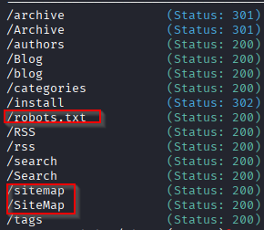

## Enumeración

Al revisar `robots.txt`, me encuentro dos pistas bastante claras:

- Una posible contraseña: `UmbracoIsTheBest!`
- La ruta `/umbraco/`

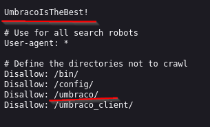

Después inspecciono la web principal. En el artículo `We are hiring` aparece una usuaria llamada `Jane Doe` y se muestra su correo:

- `JD@anthem.com`

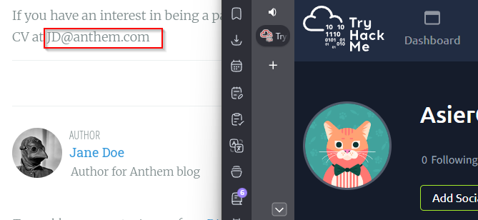

En otro artículo comentan que el administrador escribe poesía. Buscando esa referencia, veo que el autor es `Solomon Grundy`, así que deduzco que el usuario probablemente sea:

- `SG`
- `SG@anthem.com`

## Explotación

Con la contraseña encontrada en `robots.txt`, pruebo acceso al panel de Umbraco:

- Usuario: `SG`
- Contraseña: `UmbracoIsTheBest!`

Consigo entrar en `/umbraco`, pero desde ahí no encuentro una vía directa para comprometer el sistema.

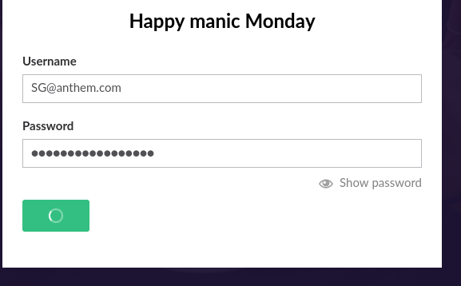

Como el puerto `3389` también está abierto, pruebo acceso por RDP. El formato `SG@anthem.com` no me funciona, pero con el usuario `SG` sí consigo entrar:

- Usuario RDP: `SG`
- Contraseña: `UmbracoIsTheBest!`

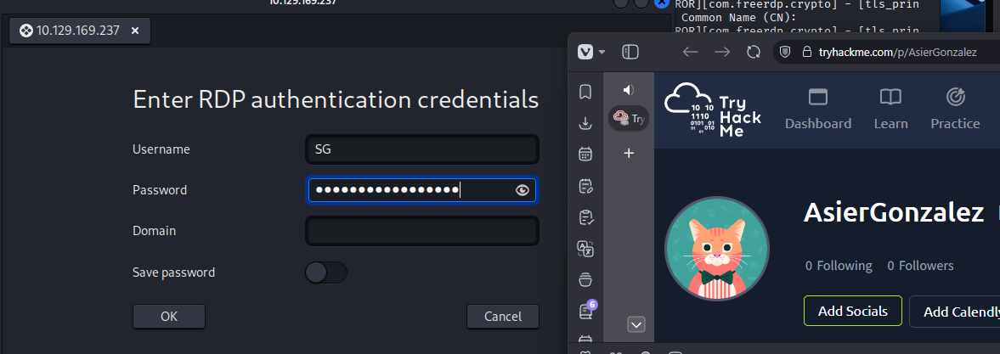

## Post-explotación

Una vez dentro del sistema, empiezo a revisar el contenido del equipo y encuentro una carpeta oculta llamada:

- `backups`

Dentro hay un archivo llamado:

- `restore`

Al principio no tengo permisos para abrirlo.

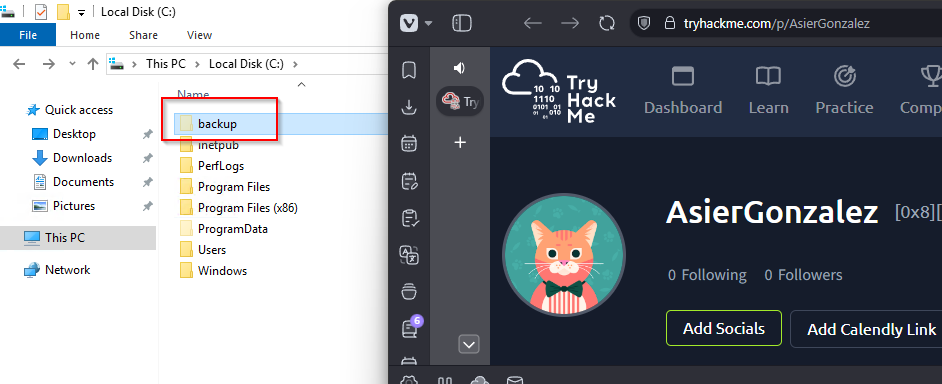

La forma de resolverlo es modificar los permisos del archivo desde:

- `Propiedades > Security > Edit > Add`

Ahí añado el usuario `SG`, pulso en `Check Names` y le doy permisos de lectura y ejecución.

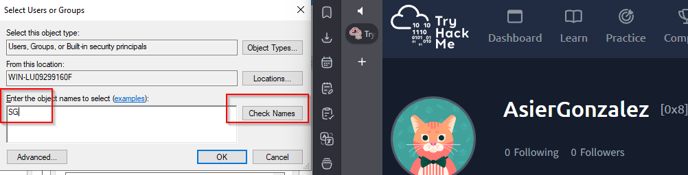
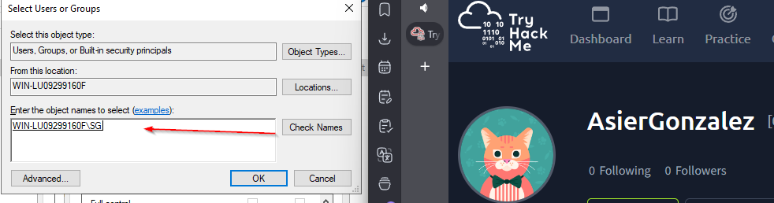
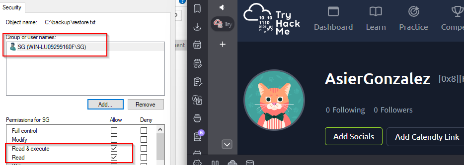

Después ya puedo abrir `restore`, y dentro aparece una nueva credencial:

- `ChangeMeBaby1MoreTime`

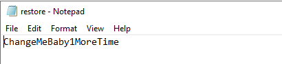

## Escalada de privilegios

Entiendo que esa contraseña puede pertenecer al administrador. Pruebo a abrir una PowerShell con privilegios elevados e introduzco esa credencial.

La autenticación funciona y consigo una PowerShell como administrador.

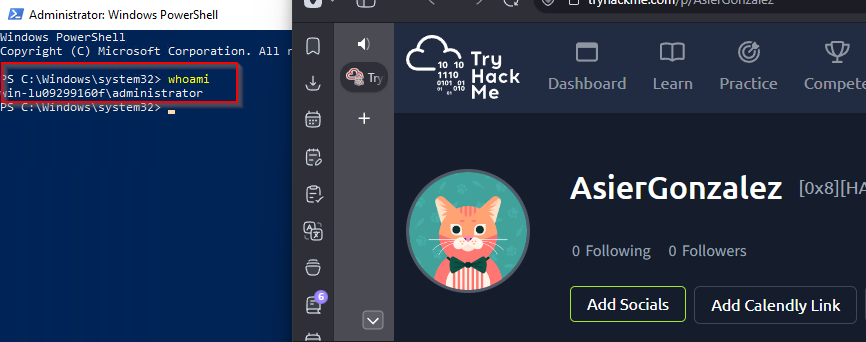

## Resultado

La máquina se compromete reutilizando una contraseña expuesta en `robots.txt`. Primero accedo a Umbraco y luego por RDP como `SG`. Después, al modificar los permisos sobre `restore`, recupero una credencial adicional que me permite abrir una PowerShell elevada.

## Resumen de comandos directo a SYSTEM/root

1. `nmap -sC -sV -p- -Pn IP`
2. `gobuster dir -u http://IP -w /usr/share/wordlists/dirb/common.txt`
3. Revisar `http://IP/robots.txt` y extraer `UmbracoIsTheBest!`
4. Identificar el usuario `SG` en la web
5. `xfreerdp /u:SG /p:'UmbracoIsTheBest!' /v:IP`
6. En la víctima: ir a `C:\backups\restore`, añadir permisos al usuario `SG` y leer el archivo
7. Recuperar la contraseña `ChangeMeBaby1MoreTime`
8. `runas /user:Administrator powershell`
9. Introducir `ChangeMeBaby1MoreTime`
10. `whoami`
