# Write-up Blaster

**Autor**: Asier González

## Reconocimiento

Empiezo con un escaneo bastante completo para ver qué servicios tiene expuestos la máquina:

```bash
nmap -sC -sV -p- -T4 --script vuln -Pn IP
```

Veo que el puerto `80` está abierto, así que decido abrir la IP en el navegador. La web que aparece es la típica página por defecto de Microsoft IIS.

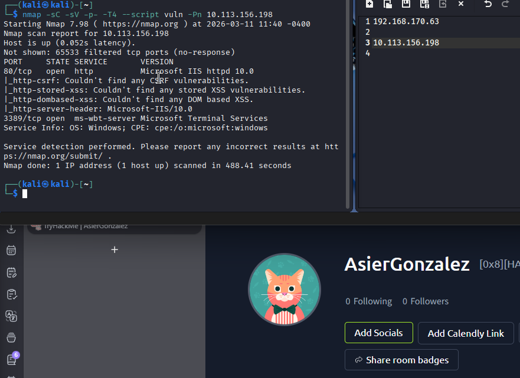

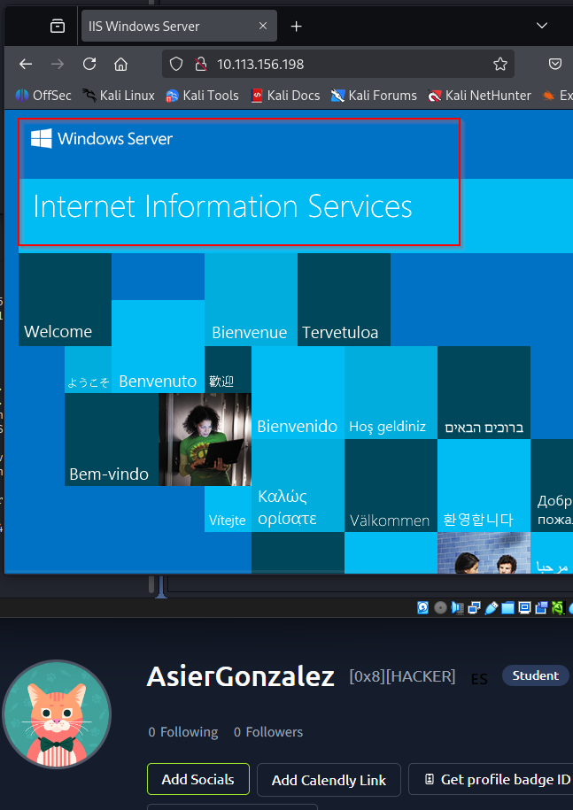

Pruebo con `/robots`, pero no encuentro nada interesante. Así que paso a enumerar directorios con `gobuster`:

```bash
gobuster dir -u http://10.113.156.198 -w /usr/share/wordlists/dirbuster/directory-list-2.3-medium.txt
```

El escaneo devuelve dos rutas:

`/retro`

`/Retro`

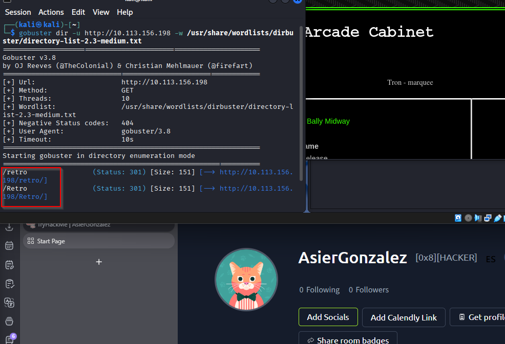

Al entrar en `/retro`, veo una página temática de juegos retro.


## Enumeracion

Revisando los posts, veo que están escritos por un usuario llamado `Wade`.

En uno de esos posts comenta que siente una conexión fuerte con el protagonista y que todavía usa el nombre de su avatar cuando intenta iniciar sesión. Esa pista ya huele a credenciales débiles o reutilizadas.

Buscando un poco la referencia a Wade en *Ready Player One*, encuentro que el protagonista es `Wade Owen Watts` y que su nombre en OASIS es `Parzival`.

Con eso en mente, empiezo a pensar que el usuario o la contraseña pueden estar relacionados con esos nombres.

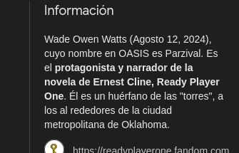

## Explotacion

Pruebo acceso por RDP con Microsoft Remote Desktop.

Primero intento usar `Watts` como contraseña, pero no funciona. Después pruebo con `parzival` y esta vez sí consigo entrar.

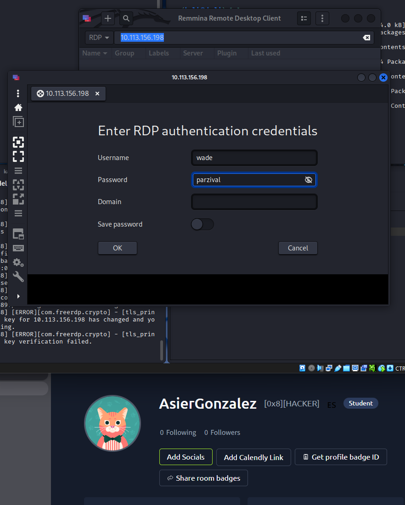
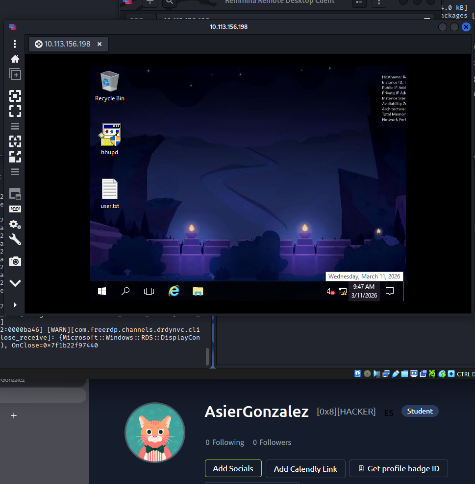

Una vez dentro, encuentro el archivo `user.txt` con la primera flag:

```text
THM{HACK_PLAYER_ONE}
```

## Post-Explotacion

Ya con acceso al sistema, abro una PowerShell y saco información básica del host con `systeminfo`:

```powershell
systeminfo
```

Los datos importantes que obtengo son estos:

```text
Microsoft Windows Server 2016 Standard
OS Version: 10.0.14393 N/A Build 14393
```

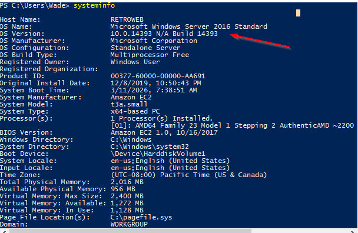

También reviso mis privilegios con:

```powershell
whoami /priv
```

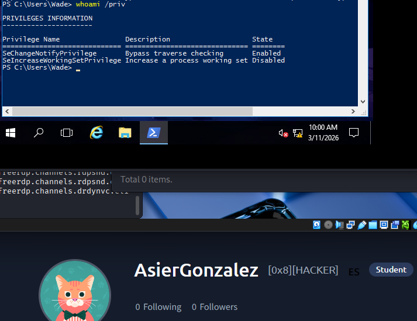

Veo que sigo siendo un usuario normal, así que me toca enumerar más a fondo para encontrar una vía clara de escalada.

### Enumeracion con WinPEAS

Decido pasar `winPEAS` desde mi Kali. Para eso levanto un servidor HTTP simple desde la carpeta donde tengo el binario:

```bash
python3 -m http.server 8000
```

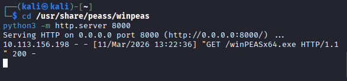
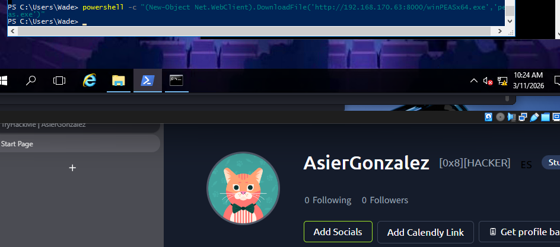

Ya en la víctima, lo ejecuto y guardo la salida en un archivo para revisarla con calma:

```powershell
peas.exe > peas.txt
```

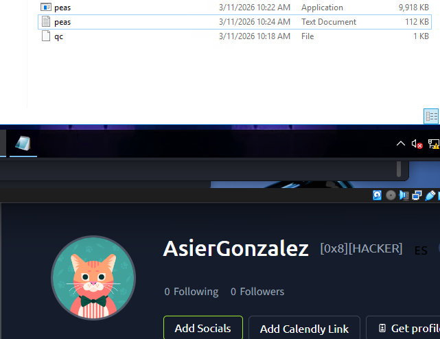

Después de revisar el resultado, encuentro una referencia bastante clara a la vulnerabilidad:

```text
CVE-2019-1388
```

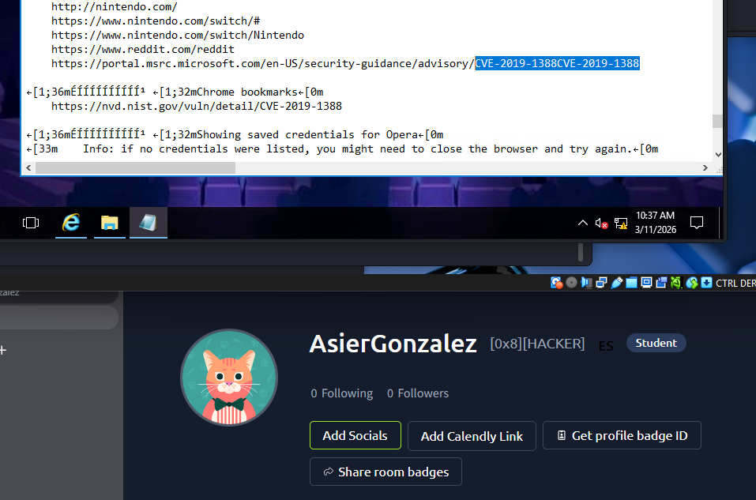

Buscando información sobre esa CVE, confirmo una de certificados que encaja con la máquina.

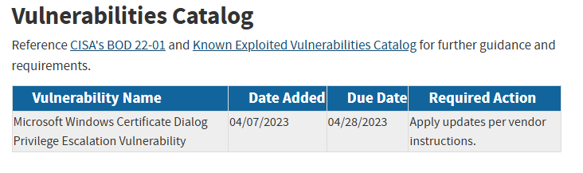

## Escalada de privilegios

En el escritorio veo un archivo llamado `hhupd`. Si lo ejecuto como administrador, se puede inspeccionar el certificado del publisher.

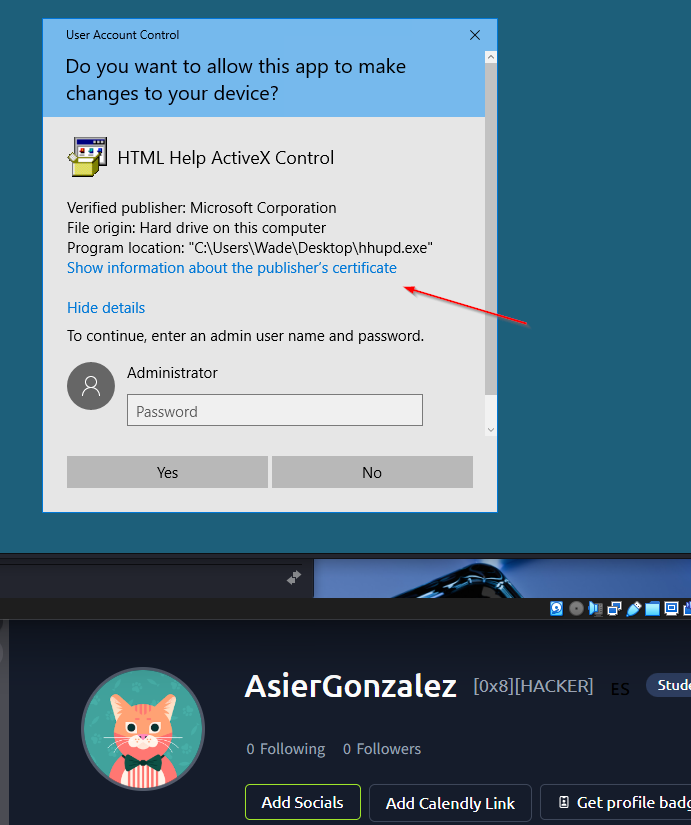

Desde ese cuadro se puede abrir el enlace del publisher, lo que lanza Internet Explorer con la página correspondiente. Aquí viene la parte interesante: si intento guardar la página con `Ctrl + S` o desde `File > Save as...`, aparece una ventana de guardado junto con un mensaje de error.

Le doy a `OK` en ese mensaje:

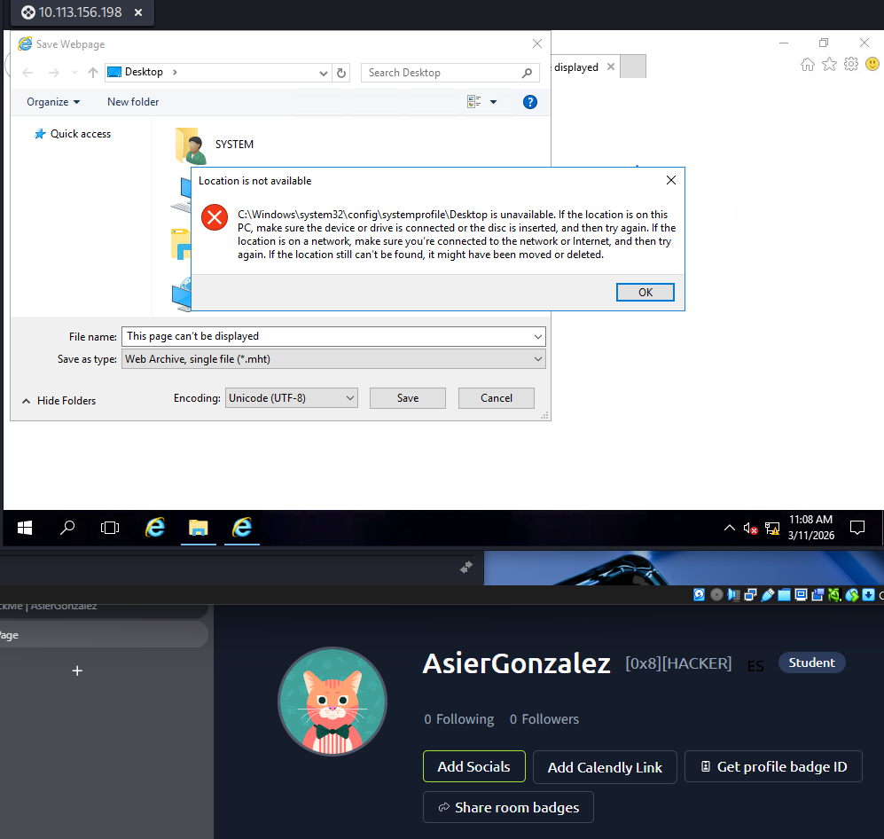

Después, en la ventana de guardado, voy a la barra donde se escriben rutas, pongo `cmd` y pulso Enter. Eso abre una consola con privilegios elevados.

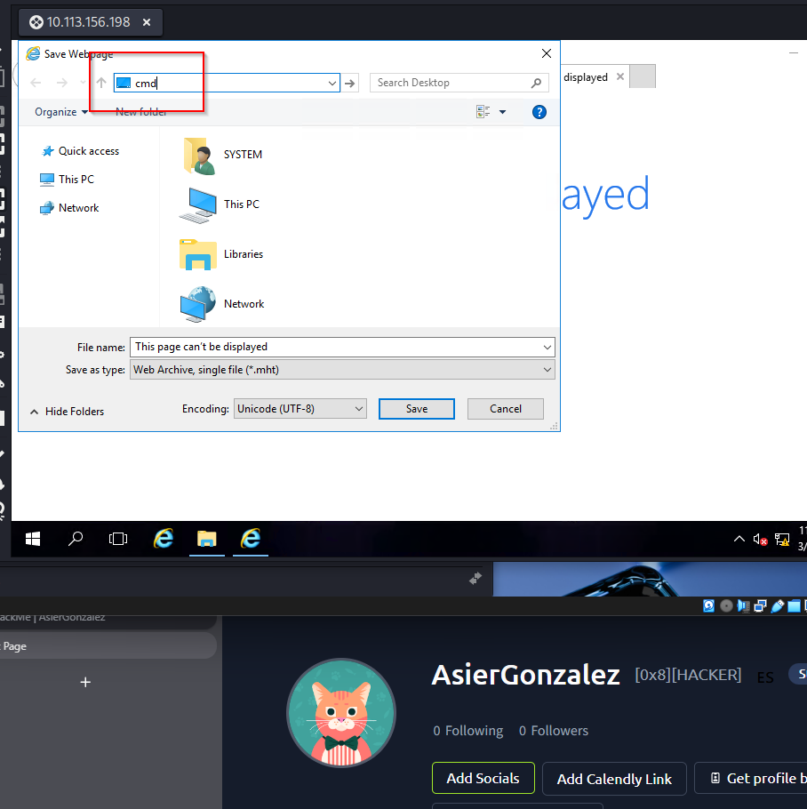

Al comprobar el contexto, veo que ya estoy como `NT AUTHORITY\SYSTEM`.

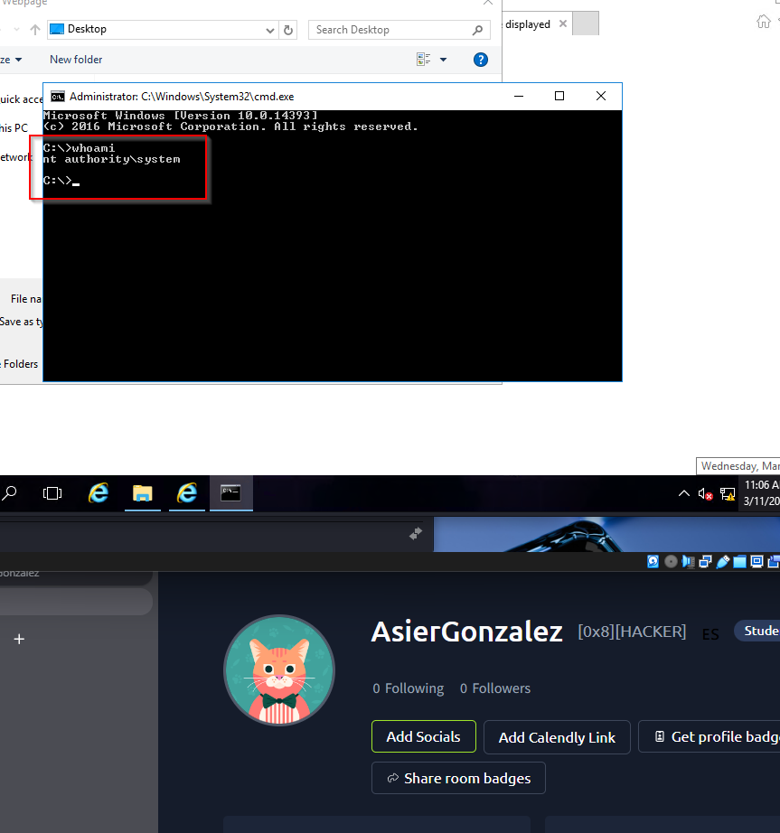

## Resultado

Con esto consigo comprometer la máquina: primero obtengo acceso por RDP reutilizando la pista de `Wade / Parzival`, y después escalo privilegios explotando `CVE-2019-1388` hasta llegar a `SYSTEM`.
